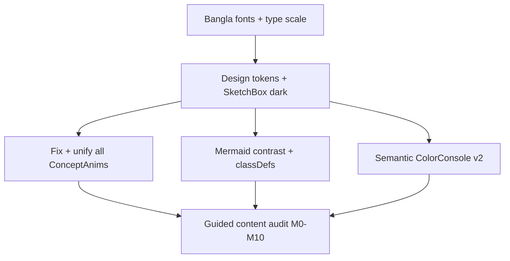

# Bangla Interactive LLM Resource — UX & Content Overhaul

Prior plans ([golden_visual_system](.cursor/plans/golden_visual_system_1c7bb8b1.plan.md), [modern_interactive_polish](.cursor/plans/modern_interactive_polish_08c60519.plan.md)) shipped the skeleton (49 lessons, playgrounds, ConceptAnim registry). **Quality is still weak:** Inter has no Bangla subset, most anims ignore the design system, Mermaid often invisible/low-contrast, Softmax/Attention anims mislead, lessons duplicate visuals and leak author notes.

**Default visual direction:** modern, clean, colorful learning UI (pastel fills, solid 2px borders, clear hierarchy)—**not** heavy Excalidraw hachure as the primary look. Keep light sketch accents only where they help. **3D only** for embedding space (Module 6); everything else stays clear 2D Motion.



---

## Phase 1 — Typography and design system

**Bangla fonts** ([`app/layout.tsx`](app/layout.tsx)):
- Load **Noto Sans Bengali** (or Hind Siliguri) via `next/font/google` with `subsets: ['bengali', 'latin']`
- Pair with Inter (or Noto Sans) for English/code; set CSS variables:
  - `--font-bn` for body/Bangla prose
  - `--font-mono` for code / token chips
- Set `html lang="bn"` (or `bn-BD`) and apply `font-family: var(--font-bn), var(--font-sans)` in [`app/global.css`](app/global.css)
- Mermaid `fontFamily` in [`diagram-theme.ts`](components/mdx/diagram-theme.ts) must include the Bangla stack so diagram labels render correctly

**Design tokens** (extend [`diagram-ui.tsx`](components/diagrams/diagram-ui.tsx) + `global.css`):
- Replace cream dashed “paper” ConceptFrame with: `rounded-2xl border-2 bg-white/dark:bg-slate-900`, soft colored left accent, readable caption
- Complete **dark-mode** sketch/palette CSS (today tokens are light-only → pastel-on-dark fails)
- Unify accents: one primary (indigo) + semantic greens/ambers—drop random indigo rings fighting Excalidraw blues
- `SketchBox`: default fill = **solid**; hachure/cross-hatch only as optional `fillStyle` for emphasis—not every step

---

## Phase 2 — Fix animations (read lesson → teach one idea)

**Bugs to fix first:**
- [`SoftmaxBarsAnim.tsx`](components/diagrams/SoftmaxBarsAnim.tsx) — stop stacking logit+prob bars; show side-by-side or morph logits → probs in two clear phases
- [`AttentionFlowAnim.tsx`](components/diagrams/AttentionFlowAnim.tsx) — start scan at (0,0); clear timers; use example tokens; dark-readable chips
- [`NextTokenAnim.tsx`](components/diagrams/NextTokenAnim.tsx) — clear timeouts on unmount; stabilize `options` deps; SketchBox + 72/18/10 labels
- [`BlackBoxGlassAnim.tsx`](components/diagrams/BlackBoxGlassAnim.tsx) — inactive side readable (opacity ≥ 0.85), not 0.65

**Unify all 42 anims:**
- Migrate remaining ~36 anims to `SketchBox` / shared chips / Bangla `DataLabel` (`bn` = Bangla, `en` = English term)
- Every anim: `paused` + cleanup; `min-h` stable; step dots where multi-step; fruit corpus data from [`shared-data.ts`](components/diagrams/shared-data.ts)
- **One ConceptAnim per lesson** — remove second ConceptAnim / duplicate Mermaid when anim already teaches it

**3D (only where needed):**
- Add `EmbeddingSpace3D` (CSS `perspective` first) on Module 6.1 only — 4–5 fruit word points so “similar words near each other” is spatial. No R3F unless CSS fails QA.

---

## Phase 3 — Mermaid diagrams (visible + colorful)

[`mermaid.tsx`](components/mdx/mermaid.tsx) + [`diagram-theme.ts`](components/mdx/diagram-theme.ts) + [`sketch-svg.ts`](components/mdx/sketch-svg.ts):
- Dark edges/arrowheads must use theme colors (stop hardcoding `#495057`)
- Expand `DARK_CLASSDEFS` + map for `bad|good|fail|success|scalar|vector|embed|layer|…`
- Soften or gate `handDrawn` if it hurts label clarity; keep high-contrast pastel fills + dark text
- Bulk-normalize MDX `classDef` to Excalidraw-readable presets (script already partially does this)
- Add Mermaid to lessons that lack it (roadmap, what-is-llm, dataset, encoding, etc.) with **text labels**, not emoji nodes
- Index Mermaid: remove fake `:::done` green ([`content/docs/index.mdx`](content/docs/index.mdx))

---

## Phase 4 — Interactive code output (understand by color)

[`ColorConsole.tsx`](components/playground/ColorConsole.tsx) + playground snippets:
- Token-aware row styling: **section headers** indigo, **labels** violet, **numbers/arrays** emerald, **errors** red, **warns** amber (keep heuristics; tighten so plain prose stays slate)
- Optional light-theme console matching editor (or keep dark terminal but with stronger contrast legend)
- Update key playground sources in [`playgrounds.ts`](components/playground/playgrounds.ts) / part registries to use `log.step` / `log.data` so output teaches the topic (e.g. tokenizer: Input / Tokens / Vocab size as colored sections)
- Strip `export` already handled; ensure remaining CodeRun snippets are learner-runnable and commented in Bangla where helpful

---

## Phase 5 — Guided content audit (all modules)

**Learner journey:**
- Home CTA → Module 0.1 (not mid-tokenizer) — [`app/(home)/page.tsx`](app/(home)/page.tsx)
- Docs index: “শুরু করো” primary card → 0.1; remove “see PRD.md” for learners
- Roadmap: link Modules 0–10; honest status copy; colorful path Mermaid

**Per-lesson template (enforce):**
```
H1 (minimal emoji)
→ one ConceptAnim
→ Bangla explanation
→ optional one Mermaid OR MathLesson (not both if redundant)
→ Playground/CodeRun if code lesson
→ তুমি কী শিখলে? (short bullets)
→ next link
```

**Concrete content fixes:**
- Remove author leaks (`Sketch styles:` in [`03-tokenizer.mdx`](content/docs/part-01-tokenizer/03-tokenizer.mdx))
- Fill empty sections (`## আমাদের Tokenizer`)
- Stop pointing learners at `code/shared/data.ts` ([`02-dataset.mdx`](content/docs/part-01-tokenizer/02-dataset.mdx))
- Fix wrong refs (“Part 3” for char tokenization → Neural LM)
- Bangla-ize English-only sections (e.g. heatmap reading in self-attention)
- Tone down H1/Callout/StepReveal emoji; keep English technical terms
- Unify probs 72/18/10; Module naming consistency
- Dual ConceptAnim pages (e.g. `01-llm-kivabe-kaj-kore`) → single primary + optional pipeline-zoom only if unique

**PRD** ([`PRD.md`](PRD.md)): update §7.5/§8/§12 — Bangla font, modern colorful (not sketch-first), Mermaid completeness honest, content template; checklist rows for UX v3.

---

## Delivery order

1. Fonts + design tokens + ConceptFrame/SketchBox dark (immediate visual win)
2. Critical anim bugs + Softmax/Attention/NextToken + SketchBox migration wave
3. Mermaid contrast + classDef + missing diagrams
4. ColorConsole + playground log.step rewrite for M1–M2 then rest
5. Content/guidance pass M0→M10 + home/docs index
6. EmbeddingSpace3D on M6.1; full QA (`types:check`, `build`, dark/light, mobile)

**Out of scope:** new curriculum modules; Nodepod; rewriting Mini GPT training algorithm.
