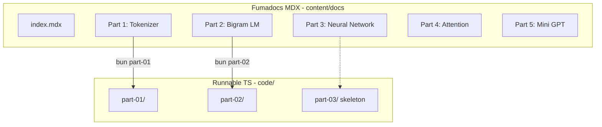
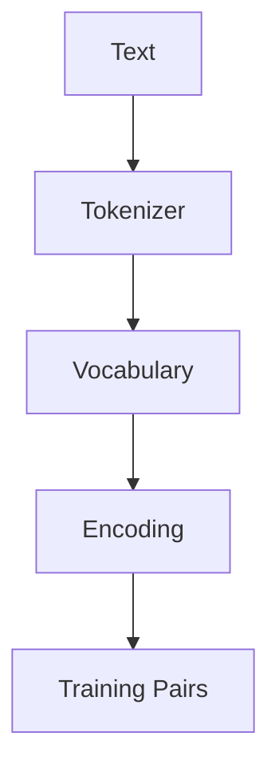

# Bangla SLM Learning Resource — Implementation Plan

## Goal

তোমার existing [Next.js + Fumadocs](package.json) প্রজেক্টকে একটি **hands-on Bangla LLM tutorial site**-এ রূপান্তর করা। প্রতিটি lesson-এ:
- বাংলায় ব্যাখ্যা (technical term ইংরেজিতে রেখে)
- Mermaid flowchart/graph
- LaTeX math (softmax, loss, gradient)
- runnable TypeScript code (`bun part-01`, `bun part-02`)

Dataset: [chat-gpt.md](chat-gpt.md)-এর **English fruit sentences** (~12 vocabulary words)।

[tiny-llm.ts](tiny-llm.ts) কে Part 3-এর neural network reference হিসেবে adapt করা হবে (character-level → word-level)।

---

## Architecture



---

## 1. Infrastructure Setup

### Mermaid + KaTeX (Fumadocs official plugins)

[`source.config.ts`](source.config.ts) আপডেট:

```ts
import remarkMath from 'remark-math';
import rehypeKatex from 'rehype-katex';
import { remarkMermaid } from 'fumadocs-core/mdx-plugins';

mdxOptions: {
  remarkPlugins: [remarkMath, remarkMermaid],
  rehypePlugins: (v) => [rehypeKatex, ...v],
}
```

[`app/layout.tsx`](app/layout.tsx)-এ `import 'katex/dist/katex.min.css'` যোগ।

Dependencies (`bun add`):
- `remark-math`, `rehype-katex`, `katex`, `mermaid`
- Bun native TypeScript runner — `bun code/part-01/index.ts` (tsx দরকার নেই)

### Branding

[`lib/shared.ts`](lib/shared.ts): `appName = 'নিজের LLM বানাও'`

[`app/(home)/page.tsx`](app/(home)/page.tsx): Bangla landing — course intro, `/docs` link, learning path diagram।

---

## 2. Docs Structure (Part 1–5 skeleton + Part 1–2 full)

```
content/docs/
├── meta.json
├── index.mdx                          # Course overview + roadmap mermaid
├── part-01-tokenizer/
│   ├── meta.json
│   ├── index.mdx                      # Part overview
│   ├── 01-llm-kivabe-kaj-kore.mdx    # "next token prediction" concept
│   ├── 02-dataset.mdx
│   ├── 03-tokenizer.mdx
│   ├── 04-vocabulary.mdx
│   ├── 05-encoding.mdx
│   └── 06-training-pairs.mdx
├── part-02-bigram/
│   ├── meta.json
│   ├── index.mdx
│   ├── 01-bigram-concept.mdx
│   ├── 02-count-model.mdx
│   ├── 03-predict.mdx
│   ├── 04-generate.mdx
│   └── 05-sampling-vs-argmax.mdx
├── part-03-neural-network/
│   ├── meta.json
│   └── index.mdx                      # skeleton: Embedding, Loss, Backprop preview
├── part-04-attention/
│   ├── meta.json
│   └── index.mdx                      # skeleton: Q/K/V, Self-Attention roadmap
└── part-05-mini-gpt/
    ├── meta.json
    └── index.mdx                      # skeleton: Transformer block diagram
```

### `meta.json` navigation example

Root [`content/docs/meta.json`](content/docs/meta.json):

```json
{
  "title": "শুরু করো",
  "pages": [
    "index",
    "---",
    "part-01-tokenizer",
    "part-02-bigram",
    "part-03-neural-network",
    "part-04-attention",
    "part-05-mini-gpt"
  ]
}
```

### Content style (সব lesson-এ)

- Opening: কেন এই step দরকার (যেমন chat-gpt.md-এর tone)
- Mermaid pipeline diagram
- Code block → `code/part-XX/` ফাইলের exact snippet
- "Run করো" section: terminal command + expected output
- Math: KaTeX blocks যেখানে দরকার (Part 2-তে probability formula)

**উদাহরণ LaTeX (Part 2):**

$$P(\text{next} \mid \text{current}) = \frac{\text{count(current, next)}}{\sum_w \text{count(current, w)}}$$

**উদাহরণ Mermaid (Part 1):**



### Part 1–2 সম্পূর্ণ content source

[chat-gpt.md](chat-gpt.md) lines ~138–1500 থেকে lesson ভাগ করে rewrite — raw chat format সরিয়ে polished MDX, প্রতিটি step-এ "তুমি কী শিখলে" summary।

[`content/docs/test.mdx`](content/docs/test.mdx) মুছে দেওয়া (placeholder)।

---

## 3. Runnable Code (`code/`)

```
code/
├── shared/
│   └── data.ts              # fruit sentences dataset (single source of truth)
├── part-01/
│   ├── tokenizer.ts
│   ├── vocabulary.ts
│   └── index.ts             # encode/decode demo
└── part-02/
    ├── bigram.ts            # BigramModel class (train, predict, generate)
    └── index.ts             # full demo with console output
```

### Part 1 code (from chat-gpt.md ~707–950)

- `data.ts`: 10 fruit sentences
- `tokenize()`: whitespace split
- `buildVocab()`: unique words → `{word: id}`
- `encode()` / `decode()`
- `buildTrainingPairs()`: `(word_i → word_{i+1})` for each sentence

### Part 2 code (from chat-gpt.md ~1264–1500)

`BigramModel` class:
- `train()` — `Map<string, Map<string, number>>` counter
- `predict(word)` — argmax
- `probabilities(word)` — normalized counts
- `generate(start, maxLen)` — autoregressive loop
- `sample(word)` — random sampling (temperature-free)

### Root [`package.json`](package.json) scripts

```json
"part-01": "bun code/part-01/index.ts",
"part-02": "bun code/part-02/index.ts"
```

### `tiny-llm.ts` handling

Root-এর [`tiny-llm.ts`](tiny-llm.ts) → `code/part-03/neural-char.ts`-এ সরানো (Part 3 skeleton-এ reference link)। Character-level neural net logic Part 3-এ word-level-এ port করা হবে পরের phase-এ।

---

## 4. Key Lessons Content Outline

### Part 1 — "LLM আসলে কী করে?"

| Lesson | Topic | Code file |
|--------|-------|-----------|
| 01 | Next token prediction machine concept | — |
| 02 | Dataset / corpus | `data.ts` |
| 03 | Tokenizer (split) | `tokenizer.ts` |
| 04 | Vocabulary (Set → id map) | `vocabulary.ts` |
| 05 | Encode / Decode | `index.ts` |
| 06 | Training pairs তৈরি | `index.ts` |

### Part 2 — "প্রথম Language Model"

| Lesson | Topic | Code |
|--------|-------|------|
| 01 | Bigram = এক word দেখে পরেরটা | diagram |
| 02 | Count-based training | `bigram.ts train()` |
| 03 | Predict (argmax) | `predict()` |
| 04 | Sentence generate | `generate()` |
| 05 | Sampling vs argmax (কেন LLM random) | `sample()` |

Expected output after `bun part-02`:

```
i → like (P=1.0)
like → apple (P=0.5)
---
Generated: i like apple is fruit is healthy
```

### Part 3–5 skeleton pages

প্রতিটিতে:
- "এই Part-এ কী শিখবে" Bangla summary
- Mermaid roadmap node highlight
- chat-gpt.md থেকে key concept preview (1–2 paragraph)
- `Coming soon` callout — কোনো broken code নয়

Part 3 preview topics: Embedding matrix, Softmax, Cross-entropy loss, Gradient descent (tiny-llm.ts math)  
Part 4: Self-Attention, Q/K/V  
Part 5: Transformer block → Mini GPT

---

## 5. Files to Modify / Create

| Action | File |
|--------|------|
| Modify | `source.config.ts`, `app/layout.tsx`, `package.json`, `lib/shared.ts`, `app/(home)/page.tsx` |
| Delete | `content/docs/test.mdx` |
| Create | `content/docs/meta.json` + 5 part folders (~18 MDX files) |
| Create | `code/shared/data.ts`, `code/part-01/*`, `code/part-02/*` |
| Move | `tiny-llm.ts` → `code/part-03/neural-char.ts` |

---

## 6. Verification

```bash
bun install
bun types:check    # MDX + TS compile
bun part-01        # tokenizer output
bun part-02        # bigram train + generate
bun dev            # browse /docs, check mermaid + math render
```

---

## Content Tone Example (প্রতিটি page-এর মতো)

> যদি তুমি **LLM-এর ভেতরের কাজ সত্যিই বুঝতে চাও**, তাহলে আমি **LangChain, Ollama, OpenAI API** দিয়ে শুরু করতে বলব না। ওগুলো LLM *ব্যবহার* করা শেখায়, LLM *কীভাবে কাজ করে* সেটা শেখায় না।
>
> এই lesson-এ আমরা **Tokenizer** বানাবো — মানে text কে number-এ convert করা। Model কখনো `"apple"` string দেখে না, শুধু `2` দেখে।

Technical terms ইংরেজিতে, ব্যাখ্যা বাংলায় — কোনো artificial translation নয় (`টোকেনাইজার` নয়, `Tokenizer`).
