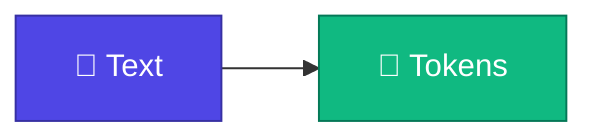
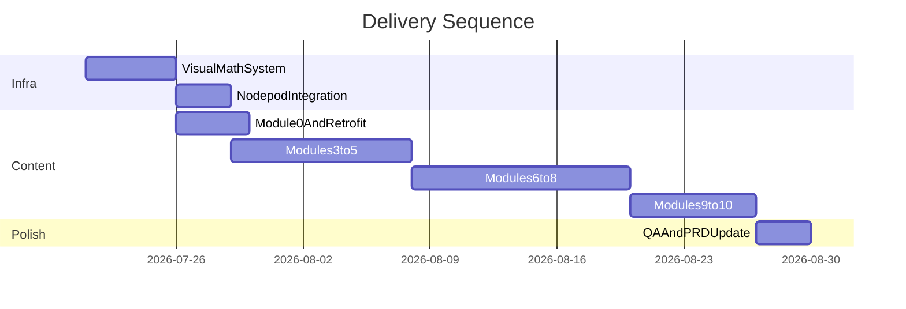
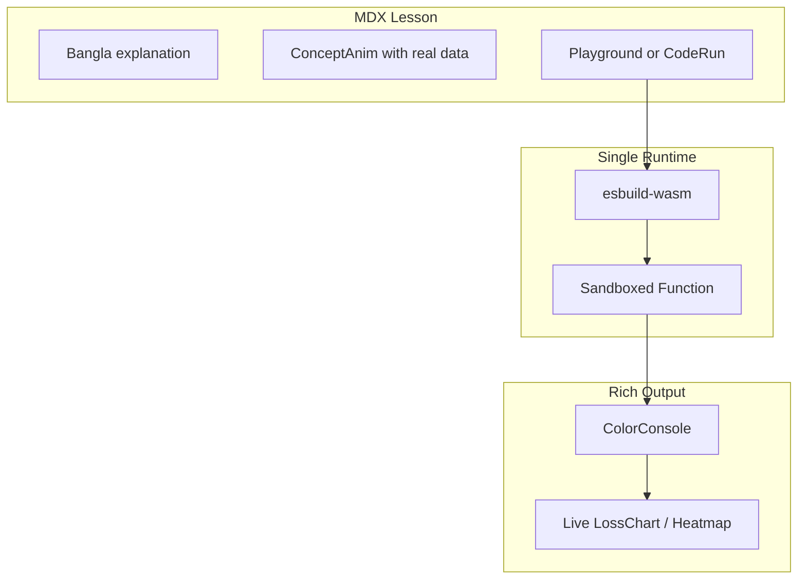

# Complete Interactive LLM Learning Platform

## Current State vs PRD Target

| Area | Done | Remaining |
|------|------|-----------|
| Lessons | 17 MDX files (M1–M2 mostly complete) | **32 lessons** (M0 + M3–M10) |
| Playgrounds | 8 (`part-01/*`, `part-02/*`) | **29 more** in [`playgrounds.ts`](components/playground/playgrounds.ts) |
| Modules in nav | 5 folders (old 5-part structure) | **10 modules** per [PRD.md](PRD.md) |
| Visual layer | Basic Mermaid + sparse KaTeX | Color themes, illustrations, animations, math blocks |
| Runtime | esbuild-wasm (M1–M2 OK) | Nodepod for M6+ training loops |

**Keep stable URLs:** [`part-01-tokenizer`](content/docs/part-01-tokenizer) and [`part-02-bigram`](content/docs/part-02-bigram) — do not rename. Add new folders for Modules 0, 3–10.

---

## Architecture Overview

```mermaid
flowchart TB
    subgraph content [Content Layer - 49 MDX lessons]
        m0[Module0 Intro]
        m1[Module1 DataPipeline]
        m2[Module2 Bigram]
        m3[Module3 Math]
        m4[Module4 Autograd]
        m5[Module5 NN]
        m6[Module6 NeuralLM]
        m7[Module7 Attention]
        m8[Module8 Transformer]
        m9[Module9 MiniGPT]
        m10[Module10 Bridge]
    end

    subgraph visual [Visual and Math Layer - NEW]
        theme[MermaidColorThemes]
        illust[SVG Illustrations]
        anim[StepAnimations]
        math[MathLesson blocks]
        viz[Visualizer charts]
    end

    subgraph runtime [Runtime Layer]
        esbuild[esbuild-wasm Phase1]
        nodepod[Nodepod Phase2plus]
    end

    content --> visual
    m1 --> esbuild
    m2 --> esbuild
    m3 --> esbuild
    m4 --> nodepod
    m5 --> nodepod
    m6 --> nodepod
    m7 --> viz
    m8 --> viz
    m9 --> nodepod
```



---

## Phase 0: Visual and Math Design System (build once, use everywhere)

Before writing 32 new lessons, add reusable MDX components and register them in [`components/mdx.tsx`](components/mdx.tsx).

### 0.1 Colorful Mermaid themes

Extend [`components/mdx/mermaid.tsx`](components/mdx/mermaid.tsx):

- Add `diagram-theme.ts` with **per-module palettes** (e.g. M1 blue, M2 green, M3 purple, M7 orange)
- Pass `theme: 'base'` + custom `themeVariables` (primaryColor, secondaryColor, lineColor, fontFamily)
- Document a **Mermaid style snippet** for lesson authors:



Every lesson gets at least one diagram with `classDef` colors + emoji node labels where helpful.

### 0.2 Illustration components

Create `components/illustrations/` — lightweight inline SVG React components (no image CDN dependency):

| Component | Used in |
|-----------|---------|
| `TokenPipeline` | M1 tokenizer flow |
| `BigramWindow` | M2 context window |
| `MatrixGrid` | M3 matmul |
| `NeuronDiagram` | M5 neuron/layer |
| `AttentionMap` | M7 Q/K/V |
| `TransformerBlock` | M8 block assembly |

Register as `<Illustration name="token-pipeline" />` in MDX.

### 0.3 Animation primitives

Use **CSS + Tailwind** (no new dependency initially) in `components/mdx/animate/`:

- `<StepReveal steps={[...]} />` — staggered fade/slide for pipeline steps
- `<HighlightPulse target="token" />` — draws attention during explanation
- `<TokenFlow animation />` — animated token moving through pipeline (CSS `@keyframes`)

Upgrade to `motion` (framer-motion) only if StepReveal proves insufficient for M7 attention animations.

### 0.4 Math pedagogy blocks

Create `components/mdx/math/` with a **4-step formula pattern** every math lesson must follow:

```mdx
<MathLesson title="Softmax">
  <MathIntuition>Logits বড় হলে probability বেশি — কিন্তু sum = 1 রাখতে normalize করতে হবে</MathIntuition>
  <SymbolTable symbols={[{ sym: "z_i", meaning: "logit for token i" }, ...]} />
  <Formula>$$\text{softmax}(z_i) = \frac{e^{z_i}}{\sum_j e^{z_j}}$$</Formula>
  <WorkedExample>
    Input: z = [2, 1, 0] → softmax ≈ [0.665, 0.245, 0.090]
  </WorkedExample>
  <CodeLink>Playground-এ same numbers run করো ↓</CodeLink>
</MathLesson>
```

KaTeX is already wired in [`source.config.ts`](source.config.ts) — enforce this structure in M3–M9 instead of bare `$$` blocks.

### 0.5 Visualizer components (Phase 3 infra, stub now)

`components/visualizer/`:

- `LossChart` — line chart for training (M6, M9)
- `AttentionHeatmap` — QK^T weights (M7)
- `MatrixViz` — colored cells for matmul (M3)

Props-driven, read-only, registered in MDX alongside `<Playground>`.

### 0.6 Updated lesson template

Extend PRD Section 6 template:

```mdx
# 🔤 Lesson Title

<Callout type="idea">💡 One-line hook in Bangla</Callout>

<Illustration name="..." />

<StepReveal>...</StepReveal>

```mermaid
flowchart TD
  ... colored classDef ...
```

<MathLesson>...</MathLesson>   <!-- when math present -->

<Playground id="part-XX/slug" />

## ✅ তুমি কী শিখলে?
```

Update [PRD.md](PRD.md) Section 8 with emoji/visual rules (strategic use in headings, callouts, diagram nodes — not every sentence).

---

## Phase 1: Finish Foundation (Modules 0–2 retrofit)

### 1.1 Module 0 — Introduction (NEW: 3 lessons)

Create `content/docs/part-00-intro/`:

| File | Content |
|------|---------|
| `01-what-is-llm.mdx` | Next-token prediction, `<Illustration name="llm-predict" />`, animated token flow |
| `02-why-from-scratch.mdx` | API vs internals comparison diagram |
| `03-roadmap.mdx` | Full 10-module colorful roadmap mermaid |

### 1.2 Retrofit Modules 1–2 (11 existing lessons)

Apply new template to all files under [`part-01-tokenizer`](content/docs/part-01-tokenizer) and [`part-02-bigram`](content/docs/part-02-bigram):

- Add colorful `classDef` to existing mermaid blocks
- Add `<MathLesson>` where formulas exist (e.g. [`02-count-model.mdx`](content/docs/part-02-bigram/02-count-model.mdx) already has bare KaTeX)
- Add illustrations + 1 `<StepReveal>` per lesson
- Add emoji callouts (`💡`, `⚡`, `🎯`) in section headers

### 1.3 Navigation update

Update [`content/docs/meta.json`](content/docs/meta.json) to 10-module structure while preserving M1/M2 paths.

---

## Phase 2: Math + Autograd + Neural Network (Modules 3–5)

**Runtime:** Integrate Nodepod before Module 4 (autograd needs longer scripts).

### 2.1 Nodepod integration

Per PRD Appendix C:

1. `bun add @scelar/nodepod`
2. Add [`app/__sw__.js/route.ts`](app/__sw__.js/route.ts): `export { GET } from '@scelar/nodepod/next'`
3. Extend [`Playground.tsx`](components/playground/Playground.tsx) with `runtime: 'esbuild' | 'nodepod'` prop
4. Keep same **▶ Run / Reset** toolbar UX

### 2.2 Content folders + 13 lessons + 13 playgrounds

| Folder | Lessons | Key visuals |
|--------|---------|-------------|
| `part-03-math` | 3.1–3.5 (5) | `MatrixViz`, matmul animation, softmax `<MathLesson>` |
| `part-04-autograd` | 4.1–4.4 (4) | Computational graph mermaid + `<StepReveal>` backward pass |
| `part-05-neural-network` | 5.1–5.4 (4) | `NeuronDiagram`, XOR decision boundary viz |

**Code source:** Port logic from [`code/part-03/neural-char.ts`](code/part-03/neural-char.ts) into playgrounds incrementally.

Replace old [`part-03-neural-network/index.mdx`](content/docs/part-03-neural-network/index.mdx) skeleton with redirects or remove after new folders ship.

---

## Phase 3: Neural LM + Attention + Transformer (Modules 6–8)

### 3.1 Module 6 — Neural LM (5 lessons)

Folder: `part-06-neural-lm/`

- Playgrounds: embedding, weight matrix, loss, **200-epoch train loop**, generate
- `<LossChart live />` updates during training output parsing
- Heavy math: cross-entropy `<MathLesson>` with numeric walkthrough

### 3.2 Module 7 — Attention (5 lessons)

Folder: `part-07-attention/`

- `<AttentionHeatmap />` on lesson 7.4 (self-attention)
- Search-engine analogy illustration for Q/K/V
- Animated attention weight flow in `<StepReveal>`

### 3.3 Module 8 — Transformer Block (5 lessons)

Folder: `part-08-transformer/`

- `<Illustration name="transformer-block" />` with residual arrows
- Positional encoding `<MathLesson>` with sin/cos plot (SVG)
- Full block assembly playground

Replace skeleton [`part-04-attention`](content/docs/part-04-attention) when M7 ships.

---

## Phase 4: Mini GPT + Production Bridge (Modules 9–10)

### 4.1 Module 9 — Mini GPT (5 lessons)

Folder: `part-09-mini-gpt/` (migrate from [`part-05-mini-gpt`](content/docs/part-05-mini-gpt))

- ~500-line training playground via Nodepod
- Generate UI with **temperature slider** + **top-k** (custom MDX component `<GenerateControls />`)
- Loss curve + sample output panel

### 4.2 Module 10 — Production Bridge (2 lessons)

Folder: `part-10-bridge/`

- nanoGPT reading guide (no playground)
- Scaling / pretraining overview with roadmap diagram

---

## Phase 5: Polish and PRD sync

- Update [PRD.md](PRD.md): visual guidelines (Section 8), lesson template (Section 6), success metrics (diagram + math coverage)
- Update [`content/docs/index.mdx`](content/docs/index.mdx) homepage: 10-module table, visual previews
- Full QA pass: every code lesson runs, every lesson has colorful diagram + summary
- Performance: lazy-load illustrations/visualizers; Nodepod boot < 3s target

---

## Content Production Workflow (per lesson)

For each of the 32 remaining lessons, follow this checklist:

1. Read mapped section in [`chat-gpt.md`](chat-gpt.md) (Appendix A in PRD)
2. Write Bangla prose + English terms
3. Add colorful mermaid with emoji nodes
4. Add illustration + 1 animation block
5. Add `<MathLesson>` if formulas appear
6. Add playground entry in [`playgrounds.ts`](components/playground/playgrounds.ts)
7. Add matching CLI script in `code/part-XX/` (maintainer only)
8. Link prev/next lessons

**Estimated volume:** ~32 lessons × ~150 lines MDX + ~80 lines playground TS ≈ 7,000 lines of content code.

---

## Recommended Delivery Order



---

## Key Files to Create/Modify

| Action | Path |
|--------|------|
| NEW | `components/mdx/diagram-theme.ts` |
| NEW | `components/mdx/math/MathLesson.tsx` |
| NEW | `components/mdx/animate/StepReveal.tsx` |
| NEW | `components/illustrations/*.tsx` |
| NEW | `components/visualizer/LossChart.tsx`, `AttentionHeatmap.tsx` |
| MODIFY | [`components/mdx/mermaid.tsx`](components/mdx/mermaid.tsx), [`components/mdx.tsx`](components/mdx.tsx) |
| MODIFY | [`components/playground/Playground.tsx`](components/playground/Playground.tsx) — Nodepod runtime |
| NEW | `app/__sw__.js/route.ts` |
| NEW | 8 content folders (`part-00`, `part-03`–`part-10` except existing 01/02) |
| NEW | 32 MDX lesson files + 29 playground entries |
| MODIFY | [PRD.md](PRD.md) — visual/math guidelines, Phase status |

---

## Risk Mitigations

| Risk | Mitigation |
|------|------------|
| Nodepod SW conflicts with Next.js | Use official `@scelar/nodepod/next` route; test in prod build early in Phase 2 |
| Animation perf on mobile | CSS-only first; `prefers-reduced-motion` respect |
| 49-lesson scope creep | Ship module-by-module; each module is independently usable |
| Math too dense | Mandatory `<MathIntuition>` + `<WorkedExample>` before every formula |
| URL breaks | Never rename `part-01-tokenizer` or `part-02-bigram`; use redirects for old skeleton paths |

---

## Phase 5: Interactive Polish v2 (complete)

Phases 0–4 delivered all 49 lessons. Phase 5 upgraded UX to production-quality interactivity:

| Deliverable | Status |
|-------------|--------|
| Shiki CodeEditor + ColorConsole + Copy/Reset toolbar | Done |
| CodeRun inline runnable snippets | Done |
| Motion ConceptAnim on all 49 lessons | Done |
| Live viz (`viz` prop) for loss, softmax, attention | Done |
| Single esbuild-wasm runtime (Nodepod removed) | Done |
| CLI scripts `part-03` … `part-09` | Done |
| PRD v2.0 + completion checklist | Done |


