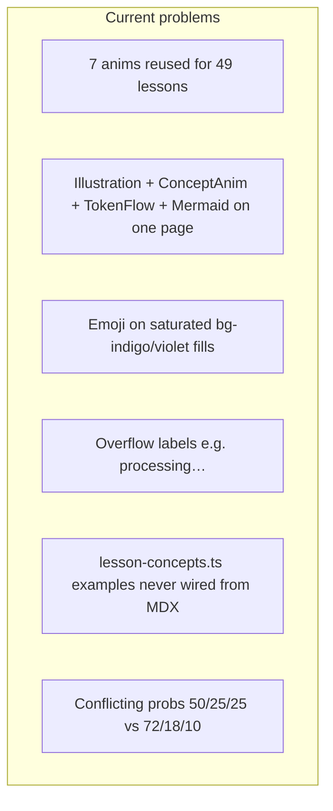
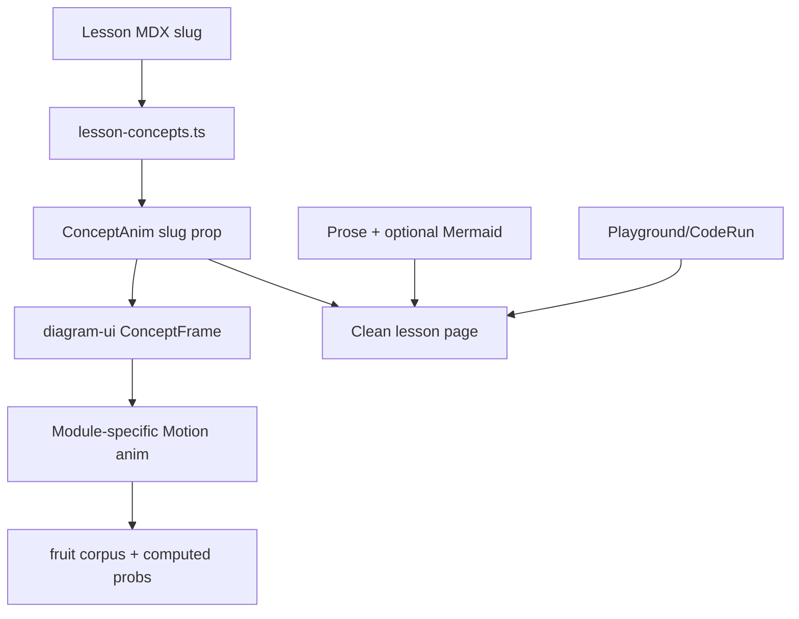

# Golden Concept Visuals — Full Curriculum (M0–M10)

## Diagnosis (from your flagged pages + codebase)

**[`03-roadmap.mdx`](content/docs/part-00-intro/03-roadmap.mdx)** uses `llm-pipeline` (data-flow animation) to teach the *curriculum path*, plus a Mermaid chart with fake green "done" styling and emoji node labels — confusing and visually noisy.

**[`part-01-tokenizer`](content/docs/part-01-tokenizer)** reuses the same 7 generic animations for unrelated ideas:
- Vocabulary lesson → `tokenizer-split` (wrong: splitting, not ID mapping)
- Encoding lesson → `llm-pipeline` (wrong: should show text ↔ numbers)
- Dataset lesson → `llm-pipeline` (wrong: should show corpus)

**Systemic issues:**



| File | Problem |
|------|---------|
| [`PipelineAnim.tsx`](components/diagrams/PipelineAnim.tsx) | Emoji on `bg-indigo-500` etc.; absolute "processing…" breaks height |
| [`ConceptAnim.tsx`](components/diagrams/ConceptAnim.tsx) | Heavy indigo gradient chrome; marketing header chip |
| [`lesson-concepts.ts`](components/diagrams/lesson-concepts.ts) | Correct mappings exist but MDX hardcodes `name` without `example` |
| [`01-what-is-llm.mdx`](content/docs/part-00-intro/01-what-is-llm.mdx) | 4 visuals for one idea (Illustration + ConceptAnim + TokenFlow + Mermaid) |
| [`01-llm-kivabe-kaj-kore.mdx`](content/docs/part-01-tokenizer/01-llm-kivabe-kaj-kore.mdx) | Two ConceptAnims + two Mermaids; misleading `is → 100%` |

---

## Design system (apply everywhere before redrawing lessons)

Create shared primitives in **`components/diagrams/diagram-ui.tsx`**:

- `ConceptFrame` — neutral `bg-fd-card border-fd-border rounded-2xl min-h-[220px]`; caption strip; no gradient marketing header
- `StepChip` — mono text label + Lucide icon on **neutral** surface (never emoji on saturated fill)
- `FlowConnector` — replaces [`FlowArrow`](components/diagrams/ConceptAnim.tsx) overflow issues
- `StepDots` — click/hover to pause autoplay (interactive where helpful)
- `DataLabel` — Bangla helper text + English technical term

**Rules (encode in PRD §7.5):**

1. **One core idea = one primary `<ConceptAnim>`** per lesson. Remove duplicate Illustration / TokenFlow / Mermaid when the anim teaches the same thing.
2. **2D default.** Reserve **3D for one concept only**: embedding vector space (M6) — lightweight CSS 3D or minimal `@react-three/fiber` scatter; attention stays 2D heatmap.
3. **No emoji inside colored pills.** Mermaid nodes: text labels only (module index as `M1`, `M2`, not `1️⃣`).
4. **Stable layout:** fixed figure min-height, reserved bottom padding for active-step hints (no absolute overflow).
5. **Data-bound:** all fruit examples from [`code/shared/data.ts`](code/shared/data.ts); probabilities computed from counts (**72% / 18% / 10%** for `P(apple | i like)`).
6. **Auto-wire:** add optional `slug` prop to `ConceptAnim` → lookup [`lesson-concepts.ts`](components/diagrams/lesson-concepts.ts) for `name`, `caption`, `example`.

Rewrite [`ConceptAnim.tsx`](components/diagrams/ConceptAnim.tsx) chrome to use `ConceptFrame` and register all new animation names.

---

## Animation inventory by module

### Module 0 — Introduction (3 lessons)

| Lesson | New / polished anim | Replaces |
|--------|---------------------|----------|
| 0.1 What is LLM | `next-token` (polish, 72/18/10) | Remove Illustration + TokenFlow + Mermaid duplicate |
| 0.2 Why from scratch | **`blackbox-vs-glass`** | `llm-pipeline` |
| 0.3 Roadmap | **`roadmap-spine`** (4 bands: Intro → Data → Foundations → Architecture → Bridge) | `llm-pipeline` + fake-progress Mermaid |

Content fixes: StepReveal `P(apple \| i like)`; tone down H1 emojis.

### Module 1 — Tokenizer (6 lessons + index)

| Lesson | Anim | Notes |
|--------|------|-------|
| Index | Static Mermaid only (clean module overview) | Rename "Part 1" → "Module 1 — Tokenizer" |
| 1.01 How LLM works | `next-token` + **`pipeline-zoom`** (Part 1 steps lit) | Remove second pipeline Mermaid; fix `is→100%` (label hypothetical or use real corpus stat) |
| 1.02 Dataset | **`corpus-cards`** | Replace `llm-pipeline` |
| 1.03 Tokenizer | `tokenizer-split` (polish 3-step) | Dedupe Mermaid |
| 1.04 Vocabulary | **`vocab-map`** (words → sorted slots → IDs) | Replace wrong `tokenizer-split` |
| 1.05 Encoding | **`encode-decode`** (bidirectional conveyor) | Fill empty `## কোড` with CodeRun |
| 1.06 Training pairs | `bigram-scan` (polish, show 20 pairs) | Dedupe closing Mermaid |

### Module 2 — Bigram (5 lessons)

| Lesson | Anim |
|--------|------|
| 2.1 Concept | **`context-window`** (sliding 1-word window) |
| 2.2 Count model | **`count-table`** (rows = context, cols = next, +1 pulse) |
| 2.3 Predict | `next-token` with count-derived probs |
| 2.4 Generate | **`generate-chain`** (autoregressive token chain) |
| 2.5 Sampling vs argmax | `softmax-bars` + toggle argmax vs sample |

### Module 3 — Math (5 lessons)

| Lesson | Anim |
|--------|------|
| 3.1 Scalar/vector | **`vector-axis`** (2D arrows on grid) |
| 3.2 Matrix | **`matrix-grid`** (highlight row/col; reuse polish from [`MatrixGrid`](components/illustrations/MatrixGrid.tsx) style) |
| 3.3 Dot product | **`dot-geometry`** (projection / angle intuition) |
| 3.4 Matmul | **`matmul-visual`** (row × col highlight sweep) |
| 3.5 Softmax | `softmax-bars` (already good; sync with playground output) |

Replace all `llm-pipeline` / misplaced `attention-flow` on math lessons.

### Module 4 — Autograd (4 lessons)

| Lesson | Anim |
|--------|------|
| 4.1 Comp graph | **`comp-graph`** (nodes + edges, forward highlight) |
| 4.2 Value | **`value-tape`** (data + grad slots) |
| 4.3 Backprop | **`backprop-flow`** (reverse edge pulse) |
| 4.4 Gradient descent | **`gd-step`** (W moves downhill on loss curve) |

Retire generic `train-loop` misuse on autograd lessons.

### Module 5 — Neural Network (4 lessons)

| Lesson | Anim |
|--------|------|
| 5.1 Neuron | **`neuron-sum`** (inputs × weights → activation) |
| 5.2 Layer | **`layer-stack`** |
| 5.3 MLP | **`mlp-forward`** (layer-by-layer signal) |
| 5.4 XOR | **`xor-plot`** (2D decision boundary + loss bars) |

Dedupe Illustration + ConceptAnim pairs on neuron/layer lessons.

### Module 6 — Neural LM (5 lessons)

| Lesson | Anim | Dimension |
|--------|------|-----------|
| 6.1 Embedding | **`embedding-lookup`** (matrix row highlight) | 2D |
| 6.2 Weight matrix | **`logits-matmul`** (E × W → scores) | 2D |
| 6.3 Loss | `softmax-bars` + cross-entropy callout | 2D |
| 6.4 Train | `train-loop` (polish) + Playground `viz="loss"` | 2D |
| 6.5 Generate | `generate-chain` | 2D |

**Optional 3D add-on** on 6.1 only: **`embedding-space-3d`** — 4–5 fruit word vectors in sparse 3D (CSS `perspective` first; upgrade to R3F only if CSS insufficient).

### Module 7 — Attention (5 lessons)

| Lesson | Anim |
|--------|------|
| 7.1 Why attention | **`dependency-lines`** (long-range arcs between tokens) |
| 7.2 Q/K/V | **`qkv-split`** (one embedding → three projections) |
| 7.3 Scaled dot-product | **`attention-scores`** (Q·K matrix fill) |
| 7.4 Self-attention | `attention-flow` (fix matrix bug; sync with playground heatmap) |
| 7.5 Multi-head | **`multi-head-parallel`** (h heads side by side) |

### Module 8 — Transformer (5 lessons)

| Lesson | Anim |
|--------|------|
| 8.1 Positional | **`positional-sine`** (position waves added to embed) |
| 8.2 Layer norm | **`layernorm-scale`** (mean/var normalize) |
| 8.3 FFN | **`ffn-expand`** (d → 4d → d) |
| 8.4 Residual | **`residual-skip`** (x + sublayer(x) skip line) |
| 8.5 Block | **`transformer-block`** (assemble sublayers; align with [`TransformerBlock`](components/illustrations/TransformerBlock.tsx) but animated) |

### Module 9 — Mini GPT (5 lessons)

| Lesson | Anim |
|--------|------|
| 9.1 Architecture | **`gpt-stack`** (N blocks + heads) |
| 9.2 Train | `train-loop` + loss viz |
| 9.3 Generate | `generate-chain` |
| 9.4 Temperature | `softmax-bars` with temperature slider sync |
| 9.5 Top-k | **`topk-filter`** (bars grayed below threshold) |

### Module 10 — Bridge (2 lessons)

| Lesson | Anim |
|--------|------|
| 10.1 nanoGPT map | **`code-map`** (course module → nanoGPT file) |
| 10.2 What's next | **`scale-ladder`** (fruit model → GPT scale) |

---

## Content accuracy pass (all 49 lessons)

Run a structured audit while updating MDX:

- **Unify probabilities:** `P(apple|i like) = 72%`, banana 18%, mango 10% (from fruit counts)
- **Fix conditioning:** never `P(apple|like)` when context is `i like`
- **Naming:** "Module N" everywhere; Module 1 = **Tokenizer** (not "Data Pipeline")
- **Roadmap table:** link each row to module index; remove fake "all ✅ Ready" if misleading — use neutral "available" styling
- **Empty stubs:** `## কোড` with no body → CodeRun or remove heading ([`05-encoding.mdx`](content/docs/part-01-tokenizer/05-encoding.mdx))
- **Dedupe visuals:** target ≤1 ConceptAnim + ≤1 static diagram (Mermaid OR Illustration, not both) per lesson
- **StepReveal:** replace emoji step numbers with `1 · 2 · 3` text chips where cleaner

---

## UI / lesson layout cleanup

**Per-lesson template (consistent feel):**

```
H1 (minimal emoji)
→ ConceptAnim (primary visual)
→ Bangla explanation prose
→ MathLesson / table / callout as needed
→ Playground or CodeRun (code lessons only)
→ "তুমি কী শিখলে?" summary
→ prev/next link
```

**Global tweaks:**

- [`app/global.css`](app/global.css) — keep motion utilities; remove unused `token-flow` if TokenFlow retired
- [`components/mdx/mermaid.tsx`](components/mdx/mermaid.tsx) + [`diagram-theme.ts`](components/mdx/diagram-theme.ts) — softer module palettes; document author snippet without emoji nodes
- Module index pages ([`part-01-tokenizer/index.mdx`](content/docs/part-01-tokenizer/index.mdx)) — clean card grid, one overview diagram, no redundant Cards block

---

## PRD updates

Update [`PRD.md`](PRD.md) §7.5 and §12 checklist:

- Golden visual rules (one anim per idea, no emoji-on-fill, 2D default, 3D only for embedding space)
- ConceptAnim `slug` auto-wiring
- Retire TokenFlow as primary teaching surface (optional legacy)
- Checklist row: "Concept visuals lesson-specific" → Done after this pass

Sync [`lesson-concepts.ts`](components/diagrams/lesson-concepts.ts) as single source of truth; update [`scripts/patch-lessons.ts`](scripts/patch-lessons.ts) to inject `slug` on ConceptAnim tags.

---

## Architecture



---

## Delivery order (recommended)

1. **Foundation** — `diagram-ui.tsx`, ConceptAnim chrome, `slug` wiring, polish shared anims (`next-token`, `tokenizer-split`, `bigram-scan`, `softmax-bars`, `train-loop`, `attention-flow`, `PipelineAnim` emoji removal)
2. **M0–M1** — new anims + content fixes (your flagged URLs first for QA)
3. **M2–M3** — data + math visual family
4. **M4–M5** — autograd + NN family
5. **M6–M7** — LM + attention (optional 3D embedding)
6. **M8–M10** — transformer + GPT + bridge
7. **Content sweep** — all 49 MDX dedupe + accuracy
8. **PRD + QA** — dark/light, mobile height, reduced-motion, `bun run build`

**Estimate:** ~3–4 weeks for full M0–M10 with ~22 new animation components + 7 polished existing ones + 49-lesson content pass.

**Out of scope:** Playground/Shiki/CodeRun (already done); changing curriculum structure or adding new lessons.
