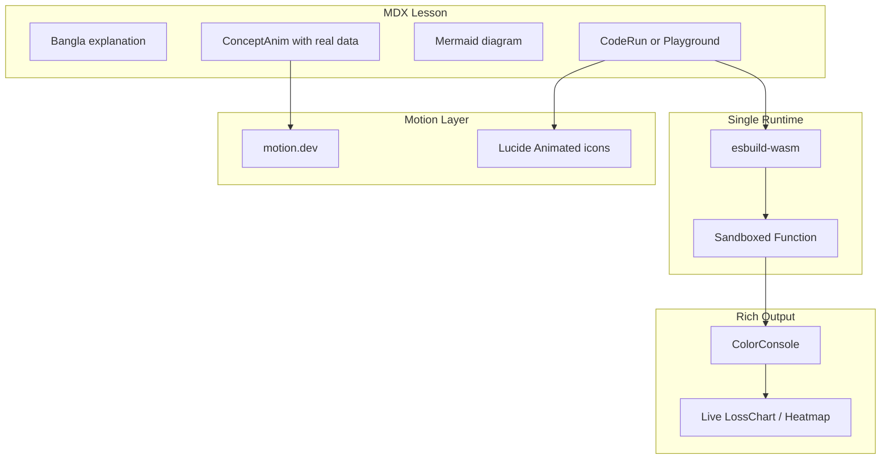

# Modern Interactive LLM Platform — v2 Polish Plan

## Is it a complete LLM learning system?

**Short answer:** The **curriculum skeleton is complete** (10 modules, 49 lessons, 37 playgrounds). It is **not yet a polished, production-grade interactive system**. Content exists; UX consistency, runnable inline code, and lesson-specific visualizations are still incomplete.

```mermaid
flowchart LR
    subgraph done [Done]
        C1[49 MDX lessons]
        C2[37 Playground registry entries]
        C3[10-module nav]
        C4[MathLesson + Mermaid + ConceptAnim base]
    end
    subgraph partial [Partial]
        P1[ConceptAnim on 7 lessons only]
        P2[Diagrams generic not data-bound]
        P3[Plain textarea editor]
        P4[Monochrome console]
    end
    subgraph missing [Missing]
        M1[35 static ts fences not runnable]
        M2[Copy button on code blocks]
        M3[Motion + Lucide Animated UI]
        M4[Live viz from playground output]
        M5[CLI scripts modules 3-10]
    end
    done --> partial
    partial --> missing
```



---

## Completion checklist (current vs target)

### Curriculum and content

| Item | Status | Notes |
|------|--------|-------|
| Module 0–10 lesson files | Done | 64 MDX files incl. indexes |
| 49 lesson curriculum per [PRD.md](PRD.md) | Done | All modules present |
| Bangla prose + English terms | Done | Consistent across modules |
| Prev/next navigation | Done | Per-lesson links |
| Theory-only lessons (12) | Done by design | M0, 1.1, 1.2, 2.1, 4.1, 7.1, 9.1, M10 |

### Interactive code

| Item | Status | Notes |
|------|--------|-------|
| Full-lesson `<Playground>` | Done | 37/37 code lessons wired |
| Static ` ```ts ` blocks runnable | **Missing** | ~35 files still show dead code fences |
| Copy button on code | **Missing** | No copy on Playground or fences |
| Syntax-highlighted editor | **Missing** | Plain `<textarea>` in [Playground.tsx](components/playground/Playground.tsx) |
| Colorful semantic console | **Missing** | All logs same color |
| Single runtime (esbuild-wasm) | Done | Nodepod removed from runtime; still in [package.json](package.json) — remove |

### Visual learning

| Item | Status | Notes |
|------|--------|-------|
| Mermaid on lessons | Done | ~55 blocks across docs |
| Mermaid visibility fix | Done | `not-prose`, contrast, error state |
| `<ConceptAnim>` | **Partial** | 8 usages / 49 lessons |
| Diagrams use **actual lesson data** | **Partial** | e.g. tokenizer anim yes; most mermaid still generic |
| `<AttentionHeatmap>` / `<LossChart>` | Partial | Static props in MDX, not live from Run output |
| Motion.dev animations | **Missing** | `motion` is transitive via fumadocs-ui, not used in our components |
| Lucide Animated icons | **Missing** | Only static `lucide-react` today |

### Technical / maintainer

| Item | Status | Notes |
|------|--------|-------|
| `bun run build` passes | Done | 199 static pages |
| CLI scripts `code/part-01`, `part-02` | Done | |
| CLI scripts modules 3–10 | **Missing** | Only `code/part-03/neural-char.ts` reference |
| PRD reflects v2 UX | **Outdated** | Still says "all phases complete" without polish gaps |
| Plan file synced | **Outdated** | [.cursor/plans/complete_llm_platform_75ebafef.plan.md](.cursor/plans/complete_llm_platform_75ebafef.plan.md) references Nodepod, old counts |

### Out of scope (per PRD — not missing, by design)

- User accounts / progress saving
- Bengali dataset
- Cloud GPU training
- PyTorch port
- Full production-scale Mini GPT (current M9 is educational simplified TS)

---

## Phase 1: Update PRD and plan docs

Update [PRD.md](PRD.md) to **v2.0** with honest status: **"Structure complete, interactive polish in progress"**.

Add new sections:

- **Section 7.4 — CodeRun UX** (Run, Copy, Reset, colorful console)
- **Section 7.5 — Concept diagram rules** (every diagram must use lesson dataset + animation)
- **Section 12 — Completion checklist** (table above, maintained in repo)
- **Appendix D — Animation stack**: Motion ([motion.dev](https://motion.dev/)) + [Lucide Animated](https://lucide-animated.com/)
- Fix runtime: **esbuild-wasm only**; remove Nodepod references and `@scelar/nodepod` dependency

Update [.cursor/plans/complete_llm_platform_75ebafef.plan.md](.cursor/plans/complete_llm_platform_75ebafef.plan.md):

- Mark Phases 0–4 content as **done**
- Add **Phase 5: Interactive Polish** (this plan) with new todos
- Replace Nodepod architecture with single-runtime diagram

---

## Phase 2: Modern Playground v2 (colorful code + output)

Upgrade [components/playground/Playground.tsx](components/playground/Playground.tsx):

### 2.1 Syntax-highlighted editor (Shiki)

- Add `shiki` as direct dependency (already in lockfile via fumadocs)
- New `components/playground/CodeEditor.tsx` — highlighted TS overlay or split view
- Themes: `github-light` / `github-dark` matching site theme

### 2.2 Toolbar: Run + Copy + Reset

```
[▶ Run] [Copy code] [Reset]
```

- Copy uses `navigator.clipboard.writeText(code)` with toast/label feedback
- Run button uses Lucide Animated `play` icon (hover pulse)

### 2.3 Colorful console

New `components/playground/ColorConsole.tsx`:

| Log pattern | Color | Example |
|-------------|-------|---------|
| `===` headers | indigo bold | Section titles |
| Numbers / arrays | emerald | `[0.665, 0.245]` |
| Labels `word →` | violet | bigram pairs |
| `Error:` | red | compile/runtime errors |
| `⚠` / `✖` | amber/red | warn/error |

Parse each line with simple regex; render as styled `<div>` rows (not plain `<pre>`).

### 2.4 Optional: structured log API

Add helper in playground snippets:

```ts
const log = {
  step: (msg: string) => console.log('=== ' + msg + ' ==='),
  data: (label: string, val: unknown) => console.log(label + ':', val),
};
```

Inject preamble in sandbox so lessons can use colorful sections consistently.

---

## Phase 3: CodeRun — every example runnable

Problem: Lessons like [03-tokenizer.mdx](content/docs/part-01-tokenizer/03-tokenizer.mdx) show a static ` ```ts ` fence **and** a separate `<Playground>` — learners see duplicate, non-runnable snippets.

### Approach (recommended)

Create `components/playground/CodeRun.tsx`:

```mdx
<CodeRun title="Tokenizer function" autoRun>
{`export function tokenize(s: string) { ... }`}
</CodeRun>
```

- Same esbuild-wasm runtime as Playground
- Compact height (~12–20 lines)
- Run + Copy + colorful console
- Register in [components/mdx.tsx](components/mdx.tsx)

### Content migration

For each of ~35 files with static ` ```ts ` blocks:

1. Remove duplicate fence OR replace with `<CodeRun>` using same source as playground registry
2. Prefer **single source**: export snippet from [playgrounds.ts](components/playground/playgrounds.ts) registry helper `getPlaygroundSnippet(id, range?)`

**Rule:** No lesson should show code that cannot be Run.

---

## Phase 4: Motion + Lucide Animated diagrams

### 4.1 Dependencies

```bash
bun add motion
bunx shadcn@latest add https://lucide-animated.com/r/play
bunx shadcn@latest add https://lucide-animated.com/r/arrow-right
bunx shadcn@latest add https://lucide-animated.com/r/brain
bunx shadcn@latest add https://lucide-animated.com/r/sparkles
```

Install icons into `components/icons/` (shadcn CLI pattern from lucide-animated docs).

### 4.2 Migrate ConceptAnim to Motion

Refactor [components/diagrams/](components/diagrams/):

| File | Upgrade |
|------|---------|
| `TokenizerSplitAnim.tsx` | `motion.div` layout transitions; real input `"I Like Apple"` |
| `NextTokenAnim.tsx` | Animate probability bars with `motion` spring |
| `BigramScanAnim.tsx` | Moving scanner dot along `motion.path` |
| `SoftmaxBarsAnim.tsx` | Bar height `animate={{ height }}` |
| `AttentionFlowAnim.tsx` | SVG lines draw-on with `pathLength` |
| `TrainLoopAnim.tsx` | Active step glow + Lucide `activity` icon |
| `PipelineAnim.tsx` | Sequential `AnimatePresence` for each stage |

Replace CSS `@keyframes` in [app/global.css](app/global.css) with Motion where it improves clarity; keep `prefers-reduced-motion` via Motion's `useReducedMotion`.

### 4.3 Lesson-specific diagram data

New pattern — every diagram receives **actual example from lesson**:

```mdx
<ConceptAnim
  name="tokenizer-split"
  caption="Example: I Like Apple → [i, like, apple]"
  example={{ input: "I Like Apple", tokens: ["i", "like", "apple"] }}
/>
```

Extend `ConceptAnim` props so animations are data-driven, not hardcoded.

### 4.4 Coverage target

Add `<ConceptAnim>` or data-bound `<MatrixViz>` / `<AttentionHeatmap>` to **all 49 lessons** (theory lessons get concept-only anims, code lessons get data + playground).

---

## Phase 5: Live visualization from Run output

Connect playground output to visualizers:

- After Run on `part-03/softmax`, parse console numbers → update inline `<SoftmaxBarsAnim>` or `<MatrixViz>`
- After Run on `part-06/train`, parse `loss:` lines → animate `<LossChart data={liveLoss} />`
- After Run on `part-07/self-attention`, parse weight matrix → `<AttentionHeatmap>`

Implementation: optional `viz="softmax-bars"` prop on `<Playground>` that parses last run output.

---

## Phase 6: Content audit + cleanup

- Remove duplicate static ` ```ts ` after CodeRun migration
- Remove `@scelar/nodepod` from package.json
- Delete legacy redirect stubs or keep as permanent redirects ([part-03-neural-network](content/docs/part-03-neural-network/index.mdx))
- Add `code/part-03` … `code/part-09` CLI index scripts (maintainer only)
- Run full QA: every Playground + CodeRun on all 37 code lessons

---

## Architecture (v2 target)



---

## File change summary

| Action | Path |
|--------|------|
| UPDATE | [PRD.md](PRD.md) — v2 status, checklist, CodeRun, Motion stack |
| UPDATE | [.cursor/plans/complete_llm_platform_75ebafef.plan.md](.cursor/plans/complete_llm_platform_75ebafef.plan.md) — Phase 5 polish |
| NEW | `components/playground/CodeEditor.tsx` |
| NEW | `components/playground/ColorConsole.tsx` |
| NEW | `components/playground/CodeRun.tsx` |
| UPDATE | [components/playground/Playground.tsx](components/playground/Playground.tsx) |
| UPDATE | [components/diagrams/*.tsx](components/diagrams/) — Motion migration |
| NEW | `components/icons/` — Lucide Animated icons |
| UPDATE | [components/mdx.tsx](components/mdx.tsx) — register CodeRun |
| UPDATE | 35+ MDX files — replace static ts fences |
| REMOVE | `@scelar/nodepod` from package.json |

---

## Recommended delivery order

1. **PRD + plan sync** (1 day) — honest checklist, single runtime
2. **Playground v2** — Shiki editor, Copy, ColorConsole (2–3 days)
3. **CodeRun component + migrate M1–M2** (2 days)
4. **Motion + Lucide Animated infra** (1 day)
5. **ConceptAnim v2 + all 49 lessons** (4–5 days)
6. **Live viz from output** (2 days)
7. **Full QA pass** (1 day)

**Total estimate:** ~2 weeks for full polish; Playground v2 + CodeRun alone makes the biggest immediate UX win.
