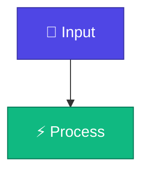

# Product Requirements Document: Interactive LLM Learning Platform

**Project:** নিজের LLM বানাও (Build Your Own LLM)  
**Version:** 2.0  
**Last updated:** 2026-07-20  
**Status:** Structure complete (49 lessons). Interactive polish v2 complete — Shiki editor, CodeRun, Motion diagrams, live viz.

---

## 1. Vision

Build an interactive, browser-first learning platform that teaches CSE engineers how LLMs work from zero — not by using LangChain or OpenAI APIs, but by implementing every component in TypeScript with no ML frameworks.

Learners read Bangla explanations (technical terms stay in English), edit code directly in the browser, run it, and see console output instantly. No terminal required.

**End goal:** By Module 9, the learner has trained and run a Mini GPT (Transformer-based language model) entirely in the browser.

---

## 2. Target User

| Attribute | Description |
|-----------|-------------|
| Background | CSE engineer / student |
| ML knowledge | Minimal — knows programming, basic math |
| Goal | Understand *how* LLMs work internally, not just how to call APIs |
| Constraint | Wants hands-on code, not theory-only |
| Language | Reads Bangla comfortably; expects English technical terms |

---

## 3. Product Principles

1. **Browser-first** — all code runs in-browser; terminal is optional for maintainers only
2. **English terms, Bangla explanation** — write `Tokenizer`, not `টোকেনাইজার`; explain in Bangla
3. **No ML frameworks** — pure TypeScript + matrix math from scratch
4. **Run early, math later** — working Bigram model before Matrix multiplication
5. **Single curriculum** — PRD is the source of truth; `chat-gpt.md` is reference material only
6. **Editable playgrounds** — every code lesson has a live editor; users can experiment

---

## 4. User Stories

| ID | Story | Acceptance |
|----|-------|------------|
| US-1 | As a learner, I want to run code in the browser without installing anything | Playground loads and runs on first page visit |
| US-2 | As a learner, I want to edit code and re-run to see different output | Editor is editable; Run button re-executes |
| US-3 | As a learner, I want Bangla explanation with English technical terms | All lesson prose follows content guidelines |
| US-4 | As a learner, I want to see a visual diagram of each pipeline step | Mermaid diagram on every lesson |
| US-5 | As a learner, I want to reset code if I break it | Reset button restores initial code |
| US-6 | As a maintainer, I want one source of truth for lesson code | `playgrounds/` registry drives both browser and CLI |

---

## 5. Complete Curriculum

### Overview

```
Module 0  Introduction          (3 lessons)   — concept only
Module 1  Data Pipeline         (6 lessons)   — TS console playground
Module 2  Bigram LM             (5 lessons)   — TS console playground
Module 3  Math Foundations      (5 lessons)   — TS + matrix viz
Module 4  Autograd              (4 lessons)   — TS console playground
Module 5  Neural Network        (4 lessons)   — TS + XOR viz
Module 6  Neural LM             (5 lessons)   — TS + loss chart
Module 7  Attention             (5 lessons)   — TS + heatmap viz
Module 8  Transformer Block     (5 lessons)   — TS + block diagram
Module 9  Mini GPT               (5 lessons)   — train + generate UI
Module 10 Production Bridge      (2 lessons)   — reading guide
```

**Total: 49 lessons**

---

### Module 0: Introduction

| ID | Lesson | Learning Objective | Playground |
|----|--------|---------------------|------------|
| 0.1 | What is an LLM? | Define LLM as next-token prediction machine | None |
| 0.2 | Why build from scratch? | Contrast API usage vs internal understanding | None |
| 0.3 | Course roadmap | Navigate the 10-module path | None |

---

### Module 1: Data Pipeline

| ID | Lesson | Learning Objective | Playground ID |
|----|--------|---------------------|---------------|
| 1.1 | LLM কীভাবে কাজ করে | Explain next-token prediction with probability | — |
| 1.2 | Dataset | Define corpus; inspect fruit sentence dataset | — |
| 1.3 | Tokenizer | Split sentence into tokens (whitespace) | `part-01/tokenizer` |
| 1.4 | Vocabulary | Build word→ID map from unique tokens | `part-01/vocabulary` |
| 1.5 | Encoding | Encode/decode sentences to number arrays | `part-01/encoding` |
| 1.6 | Training Pairs | Generate (word_i → word_{i+1}) pairs | `part-01/training-pairs` |

**Dataset:** 10 English fruit sentences (~12 vocab words)

---

### Module 2: Bigram Language Model

| ID | Lesson | Learning Objective | Playground ID |
|----|--------|---------------------|---------------|
| 2.1 | Bigram concept | Explain 1-word context → next word | — |
| 2.2 | Count model | Train count table from pairs | `part-02/count-model` |
| 2.3 | Predict | Argmax prediction from counts | `part-02/predict` |
| 2.4 | Generate | Autoregressive sentence generation | `part-02/generate` |
| 2.5 | Sampling vs argmax | Why LLMs use random sampling | `part-02/sampling` |

---

### Module 3: Math Foundations

| ID | Lesson | Learning Objective | Playground ID |
|----|--------|---------------------|---------------|
| 3.1 | Scalars and Vectors | Define scalar, vector; implement Vector class | `part-03/scalar-vector` |
| 3.2 | Matrices | Define matrix; implement Matrix class | `part-03/matrix` |
| 3.3 | Dot Product | Compute dot product; connect to similarity | `part-03/dot-product` |
| 3.4 | Matrix Multiplication | Implement matmul; foundation for attention | `part-03/matmul` |
| 3.5 | Softmax | Convert logits to probabilities | `part-03/softmax` |

---

### Module 4: Autograd (Computational Graph)

| ID | Lesson | Learning Objective | Playground ID |
|----|--------|---------------------|---------------|
| 4.1 | Computational graph | Draw forward pass as graph | — |
| 4.2 | Value class | Implement micrograd-style Value | `part-04/value` |
| 4.3 | Backpropagation | Implement backward pass manually | `part-04/backprop` |
| 4.4 | Gradient descent | Update weights using gradients | `part-04/gradient-descent` |

---

### Module 5: Neural Network

| ID | Lesson | Learning Objective | Playground ID |
|----|--------|---------------------|---------------|
| 5.1 | Neuron | Single neuron: weighted sum + activation | `part-05/neuron` |
| 5.2 | Layer | Layer of neurons | `part-05/layer` |
| 5.3 | MLP | Multi-layer perceptron | `part-05/mlp` |
| 5.4 | Train XOR | Train 2-layer net on XOR gate | `part-05/xor` |

---

### Module 6: Neural Language Model

| ID | Lesson | Learning Objective | Playground ID |
|----|--------|---------------------|---------------|
| 6.1 | Embedding matrix | Word ID → vector lookup | `part-06/embedding` |
| 6.2 | Weight matrix W | Input char → logits (bigram NN) | `part-06/weight-matrix` |
| 6.3 | Cross-entropy loss | Measure prediction error | `part-06/loss` |
| 6.4 | Training loop | Forward + backward + update for 200 epochs | `part-06/train` |
| 6.5 | Generate | Sample from trained neural LM | `part-06/generate` |

**Reference:** `code/part-03/neural-char.ts` (baby names, character-level)

---

### Module 7: Attention

| ID | Lesson | Learning Objective | Playground ID |
|----|--------|---------------------|---------------|
| 7.1 | Why attention? | Long-range dependency problem | — |
| 7.2 | Query, Key, Value | Define Q/K/V; search engine analogy | `part-07/qkv` |
| 7.3 | Scaled dot-product | Implement attention formula | `part-07/scaled-dot-product` |
| 7.4 | Self-attention | Full self-attention on 3-word sentence | `part-07/self-attention` |
| 7.5 | Multi-head attention | Parallel attention heads | `part-07/multi-head` |

**Visualizer:** Attention weight heatmap (Phase 3)

---

### Module 8: Transformer Block

| ID | Lesson | Learning Objective | Playground ID |
|----|--------|---------------------|---------------|
| 8.1 | Positional encoding | Add position info to embeddings | `part-08/positional` |
| 8.2 | LayerNorm | Normalize activations | `part-08/layer-norm` |
| 8.3 | Feed-forward (MLP) | Position-wise MLP in block | `part-08/ffn` |
| 8.4 | Residual connections | Skip connections for gradient flow | `part-08/residual` |
| 8.5 | Full transformer block | Assemble: Norm→Attn→Res→Norm→FFN→Res | `part-08/block` |

---

### Module 9: Mini GPT

| ID | Lesson | Learning Objective | Playground ID |
|----|--------|---------------------|---------------|
| 9.1 | GPT architecture | Stack N transformer blocks | — |
| 9.2 | Train Mini GPT | Train on fruit dataset (~500 lines TS) | `part-09/train` |
| 9.3 | Generate text | Autoregressive generation loop | `part-09/generate` |
| 9.4 | Temperature | Control randomness with temperature | `part-09/temperature` |
| 9.5 | Top-k sampling | Restrict sampling to top-k tokens | `part-09/top-k` |

---

### Module 10: Production Bridge

| ID | Lesson | Learning Objective | Playground |
|----|--------|---------------------|------------|
| 10.1 | Reading nanoGPT | Walk through Karpathy's nanoGPT line by line | None |
| 10.2 | What's next | Scaling, pretraining, fine-tuning overview | None |

---

## 6. Lesson Template

Every lesson MDX file follows this structure:

```mdx
---
title: [Lesson Title in Bangla]
description: [One-line summary]
---

# 🔤 [Title]

<Callout type="idea">💡 One-line hook in Bangla</Callout>

<Illustration name="token-pipeline" />

<StepReveal steps={[{ emoji: "1️⃣", title: "...", body: "..." }]} />



<MathLesson title="Formula Name">
  <MathIntuition>Bangla intuition first</MathIntuition>
  <SymbolTable symbols={[{ sym: "z_i", meaning: "logit" }]} />
  <Formula>$$...$$</Formula>
  <WorkedExample>numeric example</WorkedExample>
  <CodeLink>Playground-এ run করো ↓</CodeLink>
</MathLesson>

<Playground id="part-XX/lesson-id" title="[Demo Title]" />

## ✅ তুমি কী শিখলে?

- [Bullet summary]

**পরের lesson:** [Link]
```

---

## 7. Interactive Components

### 7.1 Playground

**Files:**
- `components/playground/Playground.tsx` — Shiki editor, Run/Copy/Reset, ColorConsole, optional live viz (client)
- `components/playground/PlaygroundLazy.tsx` — `next/dynamic` wrapper with `ssr: false`
- `components/playground/CodeEditor.tsx` — Shiki syntax highlighting (`github-light` / `github-dark`)
- `components/playground/ColorConsole.tsx` — semantic log colors (headers, numbers, errors)
- `components/playground/RunnerToolbar.tsx` — Run, Copy, Reset with Motion icon feedback
- `components/playground/LiveVizPanel.tsx` — parses console → LossChart / SoftmaxBars / AttentionHeatmap
- `components/playground/runtime.ts` — shared esbuild-wasm sandbox + `log.step` / `log.data` helpers
- `components/playground/playgrounds.ts` — id → TypeScript source registry

| Prop | Type | Default | Description |
|------|------|---------|-------------|
| `id` | `string` | required | Key in `playgrounds.ts` registry |
| `title` | `string` | — | Heading above editor |
| `editable` | `boolean` | `true` | Allow code editing |
| `height` | `number` | `360` | Editor height in px |
| `showConsole` | `boolean` | `true` | Show console output panel |
| `viz` | `'loss' \| 'softmax' \| 'attention'` | — | Live chart from Run output |

**UX requirements:**
- Visible **▶ Run**, **Copy**, **Reset** in toolbar
- Auto-run on first load
- Bangla hint: "কোড edit করে Run চাপো — colorful output নিচে দেখবে"
- Shiki-highlighted editor matching site light/dark theme
- ColorConsole: `===` headers indigo, numbers emerald, `→` violet, errors red

**Runtime:** **esbuild-wasm only** — single sandboxed runtime for all 37 code lessons. No Nodepod, no service worker.

### 7.2 CodeRun

Compact inline runnable snippets for lessons without a full Playground, or for small reference blocks.

**Files:** `components/playground/CodeRun.tsx`, `CodeRunLazy.tsx`

| Prop | Type | Default | Description |
|------|------|---------|-------------|
| `id` | `string` | — | Pull code from playground registry |
| `children` | `string` | — | Inline TS source |
| `title` | `string` | — | Heading |
| `height` | `number` | `200` | Editor height |
| `autoRun` | `boolean` | `true` | Run on load |
| `editable` | `boolean` | `true` | Allow editing |

**Rule:** No lesson should show dead ` ```ts ` fences — use `<Playground>` or `<CodeRun>`.

### 7.3 Visual & Math Components

| Component | Path | Purpose |
|-----------|------|---------|
| `Illustration` | `components/illustrations/` | SVG diagrams (token pipeline, neuron, attention) |
| `StepReveal` | `components/mdx/animate/` | Staggered step animations |
| `TokenFlow` | `components/mdx/animate/` | Animated pipeline tokens |
| `MathLesson` | `components/mdx/math/` | 4-step math pedagogy (intuition → symbols → formula → example) |
| `LossChart` | `components/visualizer/` | Training loss curve |
| `AttentionHeatmap` | `components/visualizer/` | Attention weight matrix |
| `MatrixViz` | `components/visualizer/` | Colored matrix cells |
| `ConceptAnim` | `components/diagrams/` | Motion-driven concept animations with lesson data |
| `LossChart` | `components/visualizer/` | Training loss curve (static + live from Playground) |
| `AttentionHeatmap` | `components/visualizer/` | Attention weight matrix |
| `MatrixViz` | `components/visualizer/` | Colored matrix cells |
| `GenerateControls` | `components/mdx/` | Temperature / top-k sliders (Module 9) |
| `Mermaid` | `components/mdx/mermaid.tsx` | Colorful themed diagrams |

### 7.4 CodeRun UX

Every runnable code surface shares:

| Control | Behavior |
|---------|----------|
| **Run** | esbuild-wasm transpile → sandboxed `Function(console, …)` |
| **Copy** | `navigator.clipboard.writeText(code)` + "Copied!" feedback |
| **Reset** | Restore registry initial code + re-run |
| **Console** | ColorConsole semantic line styling |

Sandbox preamble injects `log.step(msg)`, `log.data(label, val)`, `log.ok(msg)` for consistent section headers.

### 7.5 Concept diagram rules (golden visual system)

Every lesson uses **one primary `<ConceptAnim slug="part-NN/lesson" />`** — config from [`lesson-concepts.ts`](components/diagrams/lesson-concepts.ts).

**Design rules:**

1. **One idea = one animated figure** — no duplicate Illustration / TokenFlow / Mermaid for the same concept
2. **2D default** — Lucide icons + neutral `bg-fd-card` chips; **no emoji on saturated fills**
3. **Stable layout** — `min-h-[220px]` ConceptFrame; no overflowing absolute labels
4. **Data-bound** — fruit corpus; `P(apple|i like) = 72%`, banana 18%, mango 10%
5. **Motion** with `prefers-reduced-motion` via `useReducedMotion`
6. **3D only when spatial intuition helps** — e.g. embedding space (M6); attention stays 2D heatmap
7. **Lesson-specific animations** — 40+ named anims in `components/diagrams/` (not generic reuse)

**Shared primitives:** `components/diagrams/diagram-ui.tsx` — `ConceptFrame`, `StepChip`, `FlowConnector`, `ModelBadge`, `StepDots`

### 7.6 Visualizer

## 8. Content Guidelines

**Tone example:**

> যদি তুমি **LLM-এর ভেতরের কাজ সত্যিই বুঝতে চাও**, তাহলে আমি **LangChain, Ollama, OpenAI API** দিয়ে শুরু করতে বলব না। ওগুলো LLM *ব্যবহার* করা শেখায়, LLM *কীভাবে কাজ করে* সেটা শেখায় না।
>
> এই lesson-এ আমরা **Tokenizer** বানাবো — মানe text কে number-এ convert করা। Model কখনো `"apple"` string দেখে না, শুধু `2` দেখে।

**Rules:**
- Technical terms in English: Tokenizer, Embedding, Softmax, Gradient Descent
- Explanations in Bangla
- Mermaid diagram on every lesson with **colorful `classDef`** and emoji node labels
- Math via `<MathLesson>` blocks (intuition → symbols → formula → worked example)
- Strategic emoji in headings, callouts, and diagram nodes — not every sentence
- `<StepReveal>` for multi-step pipelines; `<Illustration>` for concept visuals
- KaTeX inside `<Formula>` for softmax, loss, attention
- No artificial Bengali translations of technical terms

---

## 9. Technical Architecture

```
build-own-llm/
├── PRD.md                          # This file — source of truth
├── content/docs/                   # Fumadocs MDX lessons (10 modules, 49 lessons)
│   ├── part-00-intro/            # Module 0
│   ├── part-01-tokenizer/        # Module 1
│   ├── part-02-bigram/           # Module 2
│   ├── part-03-math/             # Module 3
│   ├── part-04-autograd/         # Module 4
│   ├── part-05-neural-network/   # Module 5
│   ├── part-06-neural-lm/        # Module 6
│   ├── part-07-attention/        # Module 7
│   ├── part-08-transformer/      # Module 8
│   ├── part-09-mini-gpt/         # Module 9
│   └── part-10-bridge/           # Module 10
├── playgrounds/                  # (inlined in components/playground/*.ts)
├── code/                         # CLI dev/debug (maintainer only)
│   ├── shared/data.ts
│   ├── part-01/
│   └── part-02/
├── components/
│   ├── playground/
│   │   ├── Playground.tsx        # Shiki editor + Run/Copy/Reset + ColorConsole
│   │   ├── CodeRun.tsx           # Inline runnable snippets
│   │   ├── CodeEditor.tsx        # Shiki overlay
│   │   ├── ColorConsole.tsx      # Semantic log colors
│   │   ├── runtime.ts            # esbuild-wasm sandbox
│   │   ├── PlaygroundLazy.tsx    # Client-only dynamic import
│   │   ├── playgrounds.ts        # part-01, part-02 registry
│   │   ├── playgrounds-part03-05.ts
│   │   └── playgrounds-part06-09.ts
│   ├── diagrams/                 # ConceptAnim + Motion animations
│   ├── icons/                    # Motion-enhanced toolbar icons
│   ├── illustrations/            # SVG concept diagrams
│   ├── visualizer/               # LossChart, AttentionHeatmap, MatrixViz
│   └── mdx/                      # Mermaid, MathLesson, StepReveal
├── code/                         # CLI dev/debug (maintainer only)
│   ├── shared/data.ts
│   ├── part-01/ … part-09/
│   └── part-03/neural-char.ts
├── public/
│   └── esbuild.wasm              # Browser TS compiler
└── app/                          # Next.js + Fumadocs
```

**Stack:**
- Next.js 16 + Fumadocs 16 (MDX docs)
- **esbuild-wasm** — single browser runtime for all playgrounds
- **Shiki** — syntax-highlighted editors
- **Motion** (`motion/react`) — concept diagram animations
- KaTeX + Mermaid (math + diagrams)
- Bun (dev tooling, CLI scripts `bun run part-01` … `part-09`)

---

## 10. Datasets

| Module | Dataset | Size | Purpose |
|--------|---------|------|---------|
| 1–2, 6 (word) | Fruit sentences | 10 sentences, 12 words | Tokenizer, Bigram, Neural LM |
| 6 (char) | Baby names | 20 names | Character-level neural LM |
| 9 | Fruit sentences (extended) | Same + more epochs | Mini GPT training |

**Fruit sentences:**
```
i like apple
i like banana
i like mango
you like apple
you eat mango
he eats banana
apple is fruit
banana is fruit
mango is fruit
fruit is healthy
```

---

## 11. Phased Delivery

| Phase | Modules | Status |
|-------|---------|--------|
| Phase 1 | 0–2 | ✅ Complete |
| Phase 2 | 3–6 | ✅ Complete |
| Phase 3 | 7–8 | ✅ Complete (visualizers) |
| Phase 4 | 9–10 | ✅ Complete (GenerateControls) |
| **Phase 5** | **Interactive polish v2** | ✅ Complete — Shiki, CodeRun, Motion, live viz, checklist |

---

## 12. Completion Checklist

### Curriculum and content

| Item | Status | Notes |
|------|--------|-------|
| Module 0–10 lesson files | Done | 64 MDX files incl. indexes |
| 49 lesson curriculum | Done | All modules present |
| Bangla prose + English terms | Done | Consistent across modules |
| Prev/next navigation | Done | Per-lesson links |
| Theory-only lessons (12) | Done by design | M0, 1.1, 1.2, 2.1, 4.1, 7.1, 9.1, M10 |

### Interactive code

| Item | Status | Notes |
|------|--------|-------|
| Full-lesson `<Playground>` | Done | 37/37 code lessons |
| Static ` ```ts ` blocks runnable | Done | Replaced with Playground or CodeRun |
| Copy button on code | Done | RunnerToolbar on Playground + CodeRun |
| Syntax-highlighted editor | Done | Shiki CodeEditor |
| Colorful semantic console | Done | ColorConsole |
| Single runtime (esbuild-wasm) | Done | Nodepod removed |

### Visual learning

| Item | Status | Notes |
|------|--------|-------|
| Mermaid on lessons | Done | ~55 blocks |
| `<ConceptAnim>` lesson-specific | Done | 40+ anims, slug auto-wiring |
| Diagrams use lesson data | Done | `lesson-concepts.ts` + `shared-data.ts` |
| Live viz from Run output | Done | `viz` prop on softmax, train, self-attention |
| Motion animations | Done | All 7 ConceptAnim components |
| Animated toolbar icons | Done | Motion-enhanced Run/Copy/Reset |

### Maintainer

| Item | Status | Notes |
|------|--------|-------|
| `bun run build` passes | Done | ~199 static pages |
| CLI scripts part-01 … part-09 | Done | `bun run part-NN` |
| PRD reflects v2 UX | Done | This document |

---

## 13. Success Metrics

| Metric | Target |
|--------|--------|
| Playground load time | < 3 seconds on first visit |
| Lessons with live playground | 100% of code lessons (37/37) |
| Lessons with colorful diagram | 100% (49/49) |
| Lessons with MathLesson (where math) | Modules 3–9 |
| Terminal steps for learner | 0 |
| Lesson completion rate | Track via future analytics |

---

## 14. Out of Scope (v1–v2)

- LangChain, Ollama, OpenAI API tutorials
- Cloud GPU training
- Bengali language dataset
- User accounts / progress saving
- PyTorch / TensorFlow ports

- PyTorch / TensorFlow ports

Note: Node.js-in-browser (Nodepod) was evaluated and **rejected** — esbuild-wasm handles all lessons including training loops.

---

## Appendix D: Animation Stack

| Library | Purpose | Docs |
|---------|---------|------|
| [Motion](https://motion.dev/) | ConceptAnim bar/flow/spring animations, toolbar icon feedback | `motion/react` |
| Lucide React + Motion wrappers | Run/Copy/Reset icons in `components/icons/` | Built on `lucide-react` |

All animations respect `prefers-reduced-motion` via Motion's `useReducedMotion`.

---

## Appendix C: Browser Runtime Evaluation

Options evaluated for running learner TypeScript in the browser:

| Runtime | Best for | Next.js 16 | Run button UX | Verdict |
|---------|----------|------------|---------------|---------|
| **esbuild-wasm + sandbox** | All lessons, training loops via pure TS | Works now | Custom toolbar ✅ | **Production (v2)** |
| [Nodepod](https://github.com/R1ck404/Nodepod) | npm, real Node APIs | SW route complexity | Custom toolbar ✅ | **Rejected** — esbuild sufficient |
| [almostnode](https://github.com/macaly/almostnode) | WebContainers-like | Turbopack build breaks | N/A | Rejected |
| [Sandpack](https://sandpack.codesandbox.io/) | React/CSS demos | Works | Run hidden / theme mismatch | Rejected |
| [Edge.js](https://edgejs.org/) | Server-side sandbox | Server only | N/A | Out of scope |

### esbuild-wasm (implemented — all modules)

```
User edits TS → esbuild-wasm transform → sandboxed Function(console, log, js) → ColorConsole → optional LiveViz
```

- Pros: Lightweight (~1MB wasm), no service worker, works in Next.js 16 App Router, handles 200-epoch training loops
- Cons: No `require()`, no real Node.js APIs — sufficient for entire curriculum

### Why not Edge.js?

Edge.js runs Node.js on the **server** inside a WASM sandbox (`--safe` mode). It is designed for AI agents and serverless — not for embedding in a static docs site where learners run code client-side without a backend.

---

## Appendix A: chat-gpt.md → Lesson Mapping

| chat-gpt.md Section | Unified Lesson | Notes |
|---------------------|----------------|-------|
| Lines 1–136 (early outline) | Module 0 + 1 | Adopt intuition-first order |
| Lines 138–950 (Steps 1–8) | Module 1 (1.2–1.6) | Implemented |
| Lines 1071–1500 (Bigram) | Module 2 (2.1–2.5) | Implemented |
| Lines 1753–2220 (Embedding, NN) | Module 6 | Moved after Math + Autograd |
| Lines 2255–2294 (Roadmap) | **Canonical order** | Used as primary roadmap |
| Lines 2301–2800 (Matrix) | Module 3 | |
| Lines 2803–3485 (Gradient Descent) | Module 4 | |
| Lines 3544–4180 (Autograd/Value) | Module 4 | |
| Lines 4180–4224 (Course Structure) | Superseded | Math-first order rejected |
| Lines 4246–4700 (Scalar/Vector) | Module 3.1–3.2 | |
| Lines 4889–5160 (Q/K/V) | Module 7.2 | |
| Lines 5161–5600 (Self-Attention) | Module 7.4 | |
| Lines 9320–9577 (Positional) | Module 8.1 | |

**Deprecated from chat-gpt.md:**
- Multiple conflicting Part numbering (Part 1–4 vs Module 1–5)
- Socratic-only lessons without code (replace with playground)
- Copy-paste code without runnable context

---

## Appendix B: File Conventions

| Pattern | Example | Purpose |
|---------|---------|---------|
| Lesson MDX | `content/docs/part-01-tokenizer/03-tokenizer.mdx` | One lesson per file |
| Part meta | `content/docs/part-01-tokenizer/meta.json` | Fumadocs navigation |
| Playground registry | `components/playground/playgrounds.ts` | id → TS source strings |
| CLI code | `code/part-01/index.ts` | Maintainer debug only |
| Shared data | `code/shared/data.ts` | Dataset for CLI scripts |

**Playground ID convention:** `part-{NN}/{lesson-slug}` matches MDX filename without number prefix.

**URL convention:** `/docs/part-01-tokenizer/03-tokenizer` — stable, do not change after publish.
