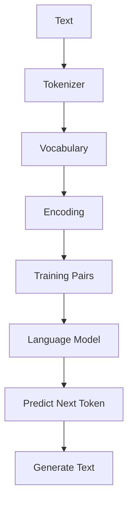

যদি তুমি **LLM-এর ভেতরের কাজ সত্যিই বুঝতে চাও**, তাহলে আমি **LangChain, Ollama, OpenAI API** দিয়ে শুরু করতে বলব না। ওগুলো LLM *ব্যবহার* করা শেখায়, LLM *কীভাবে কাজ করে* সেটা শেখায় না।

এই course-এ আমরা **শূন্য থেকে** TypeScript দিয়ে একটি ছোট **Language Model** বানাবো — কোনো TensorFlow, PyTorch বা ML library ছাড়া। শুধু Node.js, matrix math, এবং তোমার CSE background।

## আমরা কী শিখব?



প্রতিটি ধাপে তুমি **কোড রান করে** দেখবে কী হচ্ছে। শুধু theory নয় — hands-on।

## Learning Path

| Part | Topic | Status |
|------|-------|--------|
| [Part 1](/docs/part-01-tokenizer) | Tokenizer + Vocabulary + Encoding | ✅ Ready |
| [Part 2](/docs/part-02-bigram) | Bigram Language Model | ✅ Ready |
| [Part 3](/docs/part-03-neural-network) | Neural Network + Gradient Descent | 🔜 Coming soon |
| [Part 4](/docs/part-04-attention) | Self-Attention | 🔜 Coming soon |
| [Part 5](/docs/part-05-mini-gpt) | Mini GPT (Transformer) | 🔜 Coming soon |

## কোড রান করো

প্রতিটি Part-এর সাথে runnable TypeScript code আছে:

```bash
bun part-01   # Tokenizer + Vocabulary demo
bun part-02   # Bigram model train + generate
```

## কেন এই order?

অনেক tutorial উল্টোভাবে শুরু করে (Transformer → Attention)। তাই মানুষ confused হয়। আমরা **GPT যেভাবে তৈরি হয় সেই order-এ** শিখব:

```
Tokenizer → Vocabulary → Bigram → Neural Network → Attention → Transformer
```

প্রতিটি step-এ আগের step-এর উপর build হবে। কোনো magic নেই — সব কিছু হাতে-কলমে।

## শুরু করো

<Cards>
  <Card title="Part 1: Tokenizer" href="/docs/part-01-tokenizer" description="Text কে number-এ convert করা — LLM-এর প্রথম ধাপ" />
  <Card title="Part 2: Bigram Model" href="/docs/part-02-bigram" description="তোমার প্রথম Language Model — train করে text generate করো" />
</Cards>
