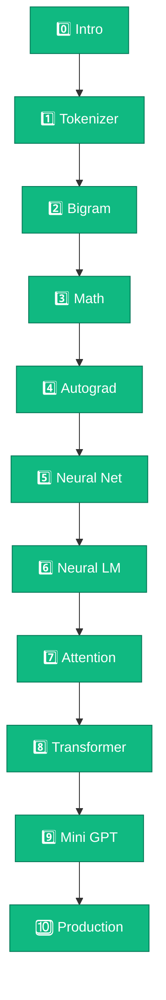

<Callout type="idea">
💡 **LangChain বা OpenAI API নয়** — এখানে তুমি LLM-এর ভেতরের engine নিজে build করবে।
</Callout>

যদি তুমি **LLM-এর ভেতরের কাজ সত্যিই বুঝতে চাও**, তাহলে আমি **LangChain, Ollama, OpenAI API** দিয়ে শুরু করতে বলব না। ওগুলো LLM *ব্যবহার* করা শেখায়, LLM *কীভাবে কাজ করে* সেটা শেখায় না।

এই course-এ আমরা **শূন্য থেকে** TypeScript দিয়ে একটি ছোট **Language Model** বানাবো — কোনো TensorFlow, PyTorch বা ML library ছাড়া। প্রতিটি lesson-এ **browser-এ সরাসরি code edit করে run** করতে পারবে। Terminal লাগবে না।

## Interactive Learning

প্রতিটি code lesson-এ built-in **Playground** আছে:

- Code editor — সরাসরি browser-এ edit করো
- **▶ Run** button — instant output
- **Reset** button — original code-এ ফিরে যাও
- Console output — `console.log` result দেখো
- Colorful diagrams, animations, structured math blocks

<Illustration name="token-pipeline" />

## Full 10-Module Path

| Module | Topic | Lessons |
|--------|-------|---------|
| [0 — Intro](/docs/part-00-intro) | What is LLM, roadmap | 3 |
| [1 — Tokenizer](/docs/part-01-tokenizer) | Data pipeline | 6 |
| [2 — Bigram](/docs/part-02-bigram) | First language model | 5 |
| [3 — Math](/docs/part-03-math) | Vectors, matrices, softmax | 5 |
| [4 — Autograd](/docs/part-04-autograd) | Computational graph | 4 |
| [5 — Neural Net](/docs/part-05-neural-network) | Neuron, MLP, XOR | 4 |
| [6 — Neural LM](/docs/part-06-neural-lm) | Embedding, training | 5 |
| [7 — Attention](/docs/part-07-attention) | Q/K/V, self-attention | 5 |
| [8 — Transformer](/docs/part-08-transformer) | Full block | 5 |
| [9 — Mini GPT](/docs/part-09-mini-gpt) | Train + generate | 5 |
| [10 — Bridge](/docs/part-10-bridge) | nanoGPT, scaling | 2 |

## শুরু করো

<Cards>
  <Card title="Module 0: Introduction" href="/docs/part-00-intro" description="LLM mental model + full roadmap" />
  <Card title="Module 1: Tokenizer" href="/docs/part-01-tokenizer" description="Text → numbers — interactive playground" />
  <Card title="Module 2: Bigram" href="/docs/part-02-bigram" description="তোমার প্রথম Language Model" />
</Cards>

**49 lessons total** — see `PRD.md` in the repo root for the full curriculum.
