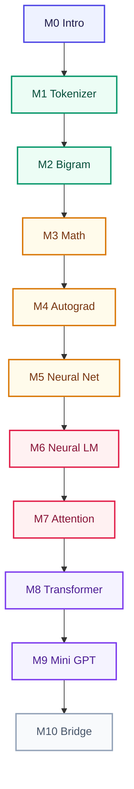

<Callout type="idea">
এখানে LangChain বা OpenAI API শেখানো হয় না। তুমি LLM-এর ভেতরের engine নিজে build করবে — ধাপে ধাপে, browser-এর ভেতরেই।
</Callout>

যদি সত্যিই বুঝতে চাও **LLM ভেতরে কী করে**, তাহলে শুরুতেই API বা framework ধরো না। ওগুলো শেখায় কীভাবে *ব্যবহার* করতে হয় — কীভাবে *কাজ করে*, সেটা নয়।

এই course-এ আমরা শূন্য থেকে TypeScript দিয়ে একটা ছোট Language Model বানাবো। প্রতিটা lesson-এ code edit করে সাথে সাথে run করতে পারবে। Terminal লাগবে না।

## কীভাবে শেখবে

পড়বে বাংলায়, technical term থাকবে English-এ। তারপর playground-এ code ছুঁয়ে দেখবে কী হচ্ছে।

- Browser-এ TypeScript editor
- **Run** চাপলেই colorful console output
- **Copy / Reset** দিয়ে নিজের মতো experiment
- Concept animation + Mermaid diagram — ধারণা চোখে দেখা

<Illustration name="token-pipeline" />

## পুরো 10-Module Path

একটার পর একটা — Tokenizer থেকে শুরু করে Mini GPT পর্যন্ত। মাঝপথেই working model পাবে; math পরে গভীর হবে।

| Module | বিষয় | Lessons |
|--------|-------|---------|
| [0 — Intro](/docs/part-00-intro) | LLM কী, কেন scratch থেকে, roadmap | 3 |
| [1 — Tokenizer](/docs/part-01-tokenizer) | Text → numbers | 6 |
| [2 — Bigram](/docs/part-02-bigram) | প্রথম language model | 5 |
| [3 — Math](/docs/part-03-math) | Vector, matrix, Softmax | 5 |
| [4 — Autograd](/docs/part-04-autograd) | Computational graph | 4 |
| [5 — Neural Net](/docs/part-05-neural-network) | Neuron, MLP, XOR | 4 |
| [6 — Neural LM](/docs/part-06-neural-lm) | Embedding, training | 5 |
| [7 — Attention](/docs/part-07-attention) | Q/K/V, self-attention | 5 |
| [8 — Transformer](/docs/part-08-transformer) | Full block | 5 |
| [9 — Mini GPT](/docs/part-09-mini-gpt) | Train + generate | 5 |
| [10 — Bridge](/docs/part-10-bridge) | nanoGPT, scaling | 2 |

## শুরু করো

প্রথম lesson থেকে এগোও — মানসিক ছবিটা পরিষ্কার হলেই Module 1-এ data pipeline শুরু।

<Cards>
  <Card title="শুরু করো — Lesson 0.1" href="/docs/part-00-intro/01-what-is-llm" description="LLM = next-token prediction — মানসিক মডেল" />
  <Card title="Module 0: পরিচিতি" href="/docs/part-00-intro" description="কেন scratch থেকে + roadmap" />
  <Card title="Module 1: Tokenizer" href="/docs/part-01-tokenizer" description="Text → numbers — interactive playground" />
</Cards>
