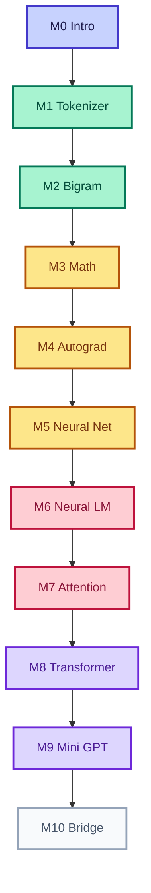

<Callout type="idea">
**LangChain বা OpenAI API নয়** — এখানে তুমি LLM-এর ভেতরের engine নিজে build করবে।
</Callout>

যদি তুমি **LLM-এর ভেতরের কাজ সত্যিই বুঝতে চাও**, তাহলে **LangChain, Ollama, OpenAI API** দিয়ে শুরু করো না। ওগুলো LLM *ব্যবহার* শেখায় — *কীভাবে কাজ করে* শেখায় না।

এই course-এ আমরা **শূন্য থেকে** TypeScript দিয়ে একটি ছোট Language Model বানাবো। প্রতিটি lesson-এ browser-এ code edit করে run করতে পারবে।

## Interactive শেখা কীভাবে

- Code editor — browser-এ edit
- **Run** — সাথে সাথে colorful console output
- **Copy / Reset** — freely experiment করো
- Concept animation + Mermaid diagram

## পুরো 10-Module Path

| Module | বিষয় | Lessons |
|--------|-------|---------|
| [0 — Intro](/docs/part-00-intro) | LLM কী, roadmap | 3 |
| [1 — Tokenizer](/docs/part-01-tokenizer) | Text → numbers | 6 |
| [2 — Bigram](/docs/part-02-bigram) | প্রথম language model | 5 |
| [3 — Math](/docs/part-03-math) | Vector, matrix, softmax | 5 |
| [4 — Autograd](/docs/part-04-autograd) | Computational graph | 4 |
| [5 — Neural Net](/docs/part-05-neural-network) | Neuron, MLP, XOR | 4 |
| [6 — Neural LM](/docs/part-06-neural-lm) | Embedding, training | 5 |
| [7 — Attention](/docs/part-07-attention) | Q/K/V, self-attention | 5 |
| [8 — Transformer](/docs/part-08-transformer) | Full block | 5 |
| [9 — Mini GPT](/docs/part-09-mini-gpt) | Train + generate | 5 |
| [10 — Bridge](/docs/part-10-bridge) | nanoGPT, scaling | 2 |

## শুরু করো

<Cards>
  <Card title="শুরু করো — Lesson 0.1" href="/docs/part-00-intro/01-what-is-llm" description="LLM = next-token prediction — mental model" />
  <Card title="Module 0: পরিচিতি" href="/docs/part-00-intro" description="কেন scratch থেকে + roadmap" />
  <Card title="Module 1: Tokenizer" href="/docs/part-01-tokenizer" description="Text → numbers — interactive playground" />
</Cards>
