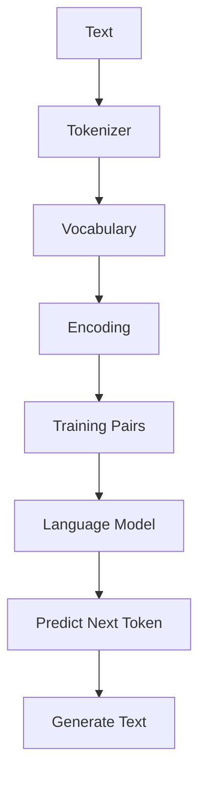

যদি তুমি **LLM-এর ভেতরের কাজ সত্যিই বুঝতে চাও**, তাহলে আমি **LangChain, Ollama, OpenAI API** দিয়ে শুরু করতে বলব না। ওগুলো LLM *ব্যবহার* করা শেখায়, LLM *কীভাবে কাজ করে* সেটা শেখায় না।

এই course-এ আমরা **শূন্য থেকে** TypeScript দিয়ে একটি ছোট **Language Model** বানাবো — কোনো TensorFlow, PyTorch বা ML library ছাড়া। প্রতিটি lesson-এ **browser-এ সরাসরি code edit করে run** করতে পারবে। Terminal লাগবে না।

## Interactive Learning

প্রতিটি code lesson-এ built-in **Playground** আছে:

- Code editor — সরাসরি browser-এ edit করো
- **Run** button — instant output
- **Reset** button — original code-এ ফিরে যাও
- Console output — `console.log` result দেখো

কোড edit করে Run চাপো — output নিচে দেখবে।

## আমরা কী শিখব?



## Learning Path

| Module | Topic | Status |
|--------|-------|--------|
| [Module 1](/docs/part-01-tokenizer) | Tokenizer + Vocabulary + Encoding | Ready |
| [Module 2](/docs/part-02-bigram) | Bigram Language Model | Ready |
| [Module 3](/docs/part-03-neural-network) | Neural Network + Gradient Descent | Coming soon |
| [Module 4](/docs/part-04-attention) | Self-Attention | Coming soon |
| [Module 5](/docs/part-05-mini-gpt) | Mini GPT (Transformer) | Coming soon |

Full curriculum: see `PRD.md` in the repo root (10 modules, 49 lessons)

## কেন এই order?

অনেক tutorial উল্টোভাবে শুরু করে (Transformer → Attention)। আমরা **GPT যেভাবে তৈরি হয় সেই order-এ** শিখব:

```
Tokenizer → Vocabulary → Bigram → Math → Neural Network → Attention → Transformer → Mini GPT
```

## শুরু করো

<Cards>
  <Card title="Module 1: Tokenizer" href="/docs/part-01-tokenizer" description="Text কে number-এ convert করা — interactive playground সহ" />
  <Card title="Module 2: Bigram Model" href="/docs/part-02-bigram" description="তোমার প্রথম Language Model — browser-এ train + generate" />
</Cards>
