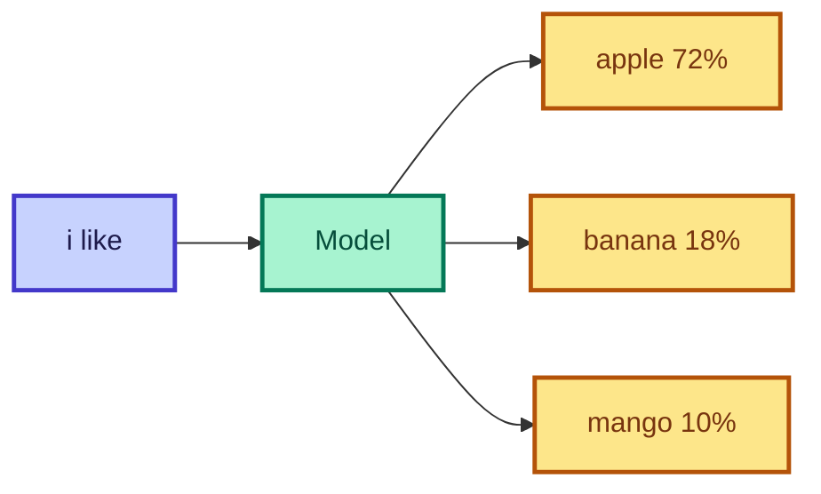

# What is an LLM?

<ConceptAnim slug="part-00-intro/01-what-is-llm" />

<Callout type="idea">
**LLM (Large Language Model)** মূলত একটা machine যেটা context দেখে **পরের token predict** করে — magic নয়, probability math।
</Callout>

## Next-token prediction

তুমি type করো: `"i like"`

Model ভাবে: `"apple"`, `"banana"`, `"mango"` — কোনটা বেশি likely? Fruit corpus থেকে roughly **72% / 18% / 10%**।

## Autoregressive generation

একটা token predict → context-এ add → আবার predict:

<StepReveal steps={[
  { title: "Start: i", body: "Seed word দিয়ে শুরু" },
  { title: "Predict: like", body: "P(like | i)" },
  { title: "Predict: apple", body: "P(apple | i like)" },
  { title: "Output: i like apple", body: "Loop until stop" }
]} />

## তুমি কী শিখলে?

- LLM = **next-token prediction** machine
- Generation = **autoregressive** loop
- Output = probability distribution over vocabulary

**পরের lesson:** [Why from scratch?](/docs/part-00-intro/02-why-from-scratch)
