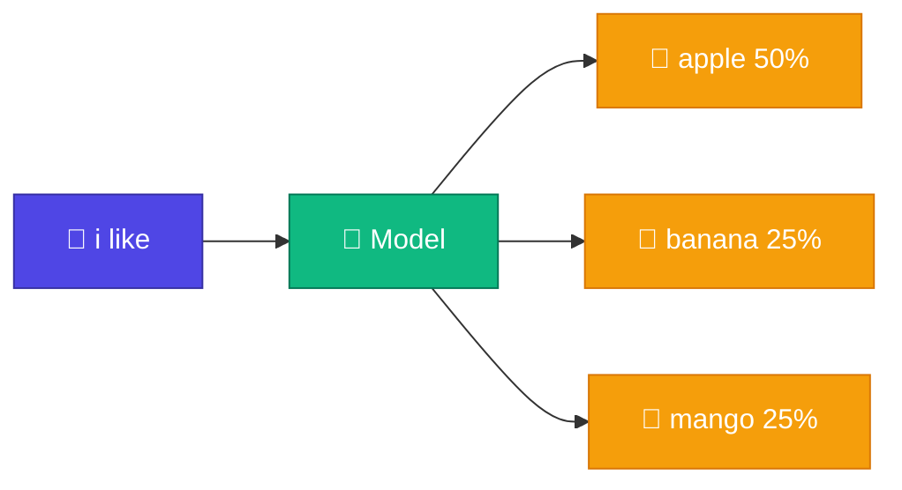

# 🤖 What is an LLM?

<Callout type="idea">
💡 **LLM (Large Language Model)** মূলত একটা machine যেটা context দেখে **পরের token predict** করে — magic নয়, probability math।
</Callout>

<Illustration name="llm-predict" />

<ConceptAnim name="next-token" caption="LLM = next token prediction — একটার পর একটা word generate" />

<TokenFlow />

## Next-token prediction

তুমি type করো: `"i like"`

Model ভাবে: `"apple"`, `"banana"`, `"mango"` — কোনটা বেশি likely?

## Autoregressive generation

একটা token predict → context-এ add → আবার predict:

<StepReveal steps={[
  { emoji: "1️⃣", title: "Start: i", body: "Seed word দিয়ে শুরু" },
  { emoji: "2️⃣", title: "Predict: like", body: "P(like | i)" },
  { emoji: "3️⃣", title: "Predict: apple", body: "P(apple | like)" },
  { emoji: "4️⃣", title: "Output: i like apple", body: "Loop until stop" }
]} />

## ✅ তুমি কী শিখলে?

- LLM = **next-token prediction** machine
- Generation = **autoregressive** loop
- Output = probability distribution over vocabulary

**পরের lesson:** [Why from scratch?](/docs/part-00-intro/02-why-from-scratch)
