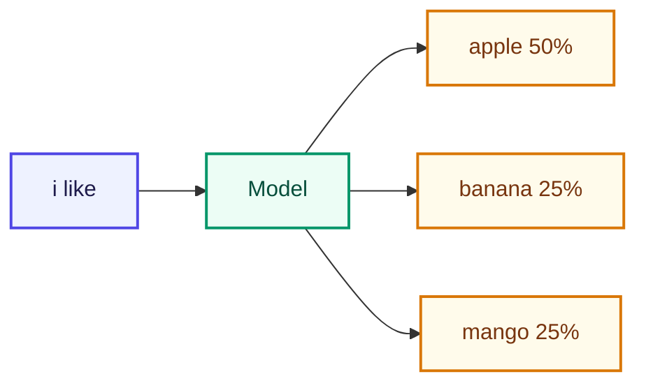

# LLM কী?

<ConceptAnim slug="part-00-intro/01-what-is-llm" />

<Callout type="idea">
**LLM (Large Language Model)** কোনো জাদু নয়। এটা একটা machine যেটা আগের text (context) দেখে **পরের token-এর probability** হিসাব করে — তারপর একটা pick করে।
</Callout>

সহজ করে বললে: তুমি একটু লিখলে, model বলে — “এর পরে কী আসা সবচেয়ে সম্ভব?” সেই guess বারবার চালালেই পুরো sentence তৈরি হয়।

## Next-token Prediction কী

ধরো তুমি লিখলে: `"i like"`

Model vocabulary-র সব সম্ভাব্য পরের word দেখে। আমাদের ছোট fruit corpus-এ `like`-এর পরে `apple` দুবার, `banana` আর `mango` একবার করে এসেছে — তাই প্রায় **৫০% / ২৫% / ২৫%**। কোনো “বুদ্ধি” নেই এখানে; শুধু pattern থেকে probability।

এই একটা ধারণা মাথায় রাখো — পুরো course জুড়ে আমরা এই prediction-কেই ধীরে ধীরে smarter করব।

## Autoregressive Generation কীভাবে চলে

একটা token predict হলেই কাজ শেষ নয়। সেটা context-এ যোগ হয়, আবার predict — এভাবে loop চলে। এই পদ্ধতিকে বলে **autoregressive** generation।

<StepReveal steps={[
  { title: "শুরু: i", body: "Seed word দিয়ে context তৈরি" },
  { title: "Predict: like", body: "P(like | i) — শুধু 'i' দেখে" },
  { title: "Predict: apple", body: "P(apple | i like) — এবার দুটো word দেখে" },
  { title: "Output: i like apple", body: "চাইলে stop, নাহলে loop চলতে থাকে" }
]} />

ChatGPT যে paragraph লেখে, ভেতরে অনেকবার এই একই loop চলে — শুধু model অনেক বড় আর context অনেক লম্বা।

## তুমি কী শিখলে?

- LLM মূলত **next-token prediction** করে
- Generation মানেই **autoregressive** loop — predict → add → আবার predict
- Output একটা fixed word নয়; vocabulary-র উপর **probability distribution**

**পরের lesson:** [কেন scratch থেকে?](/docs/part-00-intro/02-why-from-scratch)
