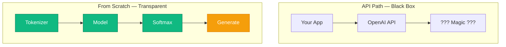

# 🔬 Why build from scratch?

<Callout type="warn">
⚡ **LangChain, Ollama, OpenAI API** দিয়ে শুরু করলে তুমি LLM *ব্যবহার* শিখবে — LLM *কীভাবে কাজ করে* সেটা নয়।
</Callout>

## Comparison

| Approach | শেখায় | Limitation |
|----------|---------|------------|
| API / LangChain | Prompt engineering, RAG | Black box |
| From scratch (this course) | Tokenizer, Attention, Training | More effort, deeper understanding |

## What you'll build

<StepReveal steps={[
  { emoji: "📦", title: "Module 1–2: Data + Bigram", body: "তোমার প্রথম working LM" },
  { emoji: "📐", title: "Module 3–5: Math + Neural Net", body: "Matrix, Autograd, XOR" },
  { emoji: "🧠", title: "Module 6–9: Transformer + Mini GPT", body: "Real GPT architecture" }
]} />

## ✅ তুমি কী শিখলে?

- API path = fast but opaque
- From scratch = every layer visible
- This course uses **pure TypeScript**, no PyTorch

**পরের lesson:** [Roadmap](/docs/part-00-intro/03-roadmap)
