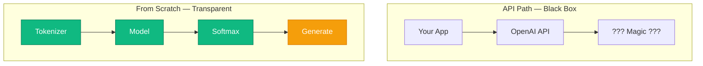

# কেন scratch থেকে?

<ConceptAnim slug="part-00-intro/02-why-from-scratch" />

<Callout type="warn">
**LangChain, Ollama, বা OpenAI API** দিয়ে শুরু করলে তুমি দ্রুত app বানাতে পারবে — কিন্তু LLM *ভেতরে* কী হচ্ছে, সেটা black box থেকে যায়।
</Callout>

দুটো পথ আলাদা কাজ করে। API path তোমাকে *ব্যবহারকারী* বানায়। Scratch path তোমাকে *builder* বানায় — Tokenizer থেকে Softmax পর্যন্ত প্রতিটা ধাপ হাতে দেখা যায়।

## দুটো approach পাশাপাশি

| Approach | কী শেখায় | Limitation |
|----------|---------|------------|
| API / LangChain | Prompt engineering, RAG, tool use | ভেতরের layer অদৃশ্য |
| From scratch (এই course) | Tokenizer, Attention, Training | বেশি সময়, কিন্তু গভীর বোঝাপড়া |

কোনোটাই “খারাপ” নয়। শুধু লক্ষ্য আলাদা। এই course ধরে নিচ্ছে — তুমি জানতে চাও model আসলে কী করে।

## তুমি কী কী বানাবে

ধাপে ধাপে একটা ছোট কিন্তু সম্পূর্ণ pipeline উঠবে। মাঝপথেই (Module 2) একটা working language model পাবে — তারপর math আর neural net দিয়ে সেটাকে বড় করবে।

<StepReveal steps={[
  { emoji: "📦", title: "Module 1–2: Data + Bigram", body: "Corpus থেকে প্রথম working LM — count দিয়েই" },
  { emoji: "📐", title: "Module 3–5: Math + Neural Net", body: "Matrix, Autograd, MLP — neural পথের ভিত্তি" },
  { emoji: "🧠", title: "Module 6–9: Transformer + Mini GPT", body: "Attention থেকে train ও generate পর্যন্ত" }
]} />

সবকিছু **pure TypeScript**-এ — PyTorch বা TensorFlow লাগবে না। Browser-এই run হবে।

## তুমি কী শিখলে?

- API path দ্রুত, কিন্তু opaque
- Scratch pathে প্রতিটা layer দেখা যায় — তাই debugging আর intuition দুটোই শক্ত হয়
- এই course framework ছাড়াই TypeScript দিয়ে এগোয়

**পরের lesson:** [কোর্স Roadmap](/docs/part-00-intro/03-roadmap)
