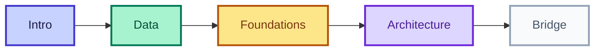

# কোর্স Roadmap

<ConceptAnim slug="part-00-intro/03-roadmap" />



## সব Module

| Module | বিষয় | Lessons |
|--------|-------|---------|
| [0](/docs/part-00-intro) | Introduction | 3 |
| [1](/docs/part-01-tokenizer) | Tokenizer | 6 |
| [2](/docs/part-02-bigram) | Bigram LM | 5 |
| [3](/docs/part-03-math) | Math Foundations | 5 |
| [4](/docs/part-04-autograd) | Autograd | 4 |
| [5](/docs/part-05-neural-network) | Neural Network | 4 |
| [6](/docs/part-06-neural-lm) | Neural LM | 5 |
| [7](/docs/part-07-attention) | Attention | 5 |
| [8](/docs/part-08-transformer) | Transformer Block | 5 |
| [9](/docs/part-09-mini-gpt) | Mini GPT | 5 |
| [10](/docs/part-10-bridge) | Production Bridge | 2 |

## শেখার ক্রম

```
Tokenizer → Vocabulary → Bigram → Math → Autograd → NN → Neural LM → Attention → Transformer → Mini GPT
```

**আগে run, পরে math** — Module 2-এ working model, Module 3-এ math deepen।

## তুমি কী শিখলে?

- পুরো 10-module path map হয়ে গেছে
- End goal: **browser-এ Mini GPT**

**শুরু করো:** [LLM কী?](/docs/part-00-intro/01-what-is-llm)
