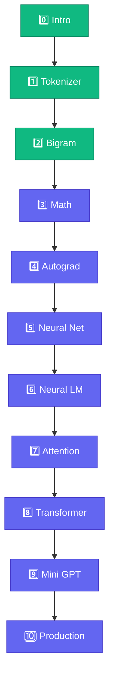

# 🗺️ Course Roadmap

<ConceptAnim name="llm-pipeline" caption="10-module path to Mini GPT" />



## All 10 Modules

| Module | Topic | Lessons | Status |
|--------|-------|---------|--------|
| 0 | Introduction | 3 | ✅ Ready |
| 1 | Data Pipeline | 6 | ✅ Ready |
| 2 | Bigram LM | 5 | ✅ Ready |
| 3 | Math Foundations | 5 | ✅ Ready |
| 4 | Autograd | 4 | ✅ Ready |
| 5 | Neural Network | 4 | ✅ Ready |
| 6 | Neural LM | 5 | ✅ Ready |
| 7 | Attention | 5 | ✅ Ready |
| 8 | Transformer Block | 5 | ✅ Ready |
| 9 | Mini GPT | 5 | ✅ Ready |
| 10 | Production Bridge | 2 | ✅ Ready |

## Learning order (why this sequence)

```
Tokenizer → Vocabulary → Bigram → Math → Autograd → NN → Neural LM → Attention → Transformer → Mini GPT
```

**Run early, math later** — Module 2-এ working model, Module 3-এ math deepen।

## ✅ তুমি কী শিখলে?

- Full 10-module path mapped
- Modules 1–2 interactive playgrounds ready
- End goal: **Mini GPT in browser**

**শুরু করো:** [Module 1 — Tokenizer](/docs/part-01-tokenizer)
