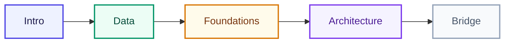

# কোর্স Roadmap

<ConceptAnim slug="part-00-intro/03-roadmap" />

নিচের মানচিত্রটা পুরো journey। Intro দিয়ে মানসিক ছবি তৈরি → data pipeline → foundations → architecture → শেষে production-এর সেতু। এক Module শেষ না করে পরেরটাতে ঝাঁপ দিও না — প্রতিটার উপর পরেরটা দাঁড়ায়।



## সব Module

| Module | বিষয় | Lessons |
|--------|-------|---------|
| [0](/docs/part-00-intro) | পরিচিতি — LLM কী ও কেন scratch | 3 |
| [1](/docs/part-01-tokenizer) | Tokenizer — text → numbers | 6 |
| [2](/docs/part-02-bigram) | Bigram LM — প্রথম working model | 5 |
| [3](/docs/part-03-math) | Math Foundations | 5 |
| [4](/docs/part-04-autograd) | Autograd | 4 |
| [5](/docs/part-05-neural-network) | Neural Network | 4 |
| [6](/docs/part-06-neural-lm) | Neural LM | 5 |
| [7](/docs/part-07-attention) | Attention | 5 |
| [8](/docs/part-08-transformer) | Transformer Block | 5 |
| [9](/docs/part-09-mini-gpt) | Mini GPT | 5 |
| [10](/docs/part-10-bridge) | Production Bridge | 2 |

## শেখার ক্রম

```
Tokenizer → Vocabulary → Bigram → Math → Autograd → NN → Neural LM → Attention → Transformer → Mini GPT
```

মনে রাখার একটা নীতি: **আগে run, পরে math**। Module 2-এই working model পাবে; Module 3 থেকে সেই intuition-কে গণিত দিয়ে শক্ত করবে। শেষে browser-এ Mini GPT train ও generate করতে পারবে।

## তুমি কী শিখলে?

- পুরো 10-module path এখন মাথায় আছে
- End goal: browser-এ নিজের **Mini GPT**

**শুরু করো:** [LLM কী?](/docs/part-00-intro/01-what-is-llm)
