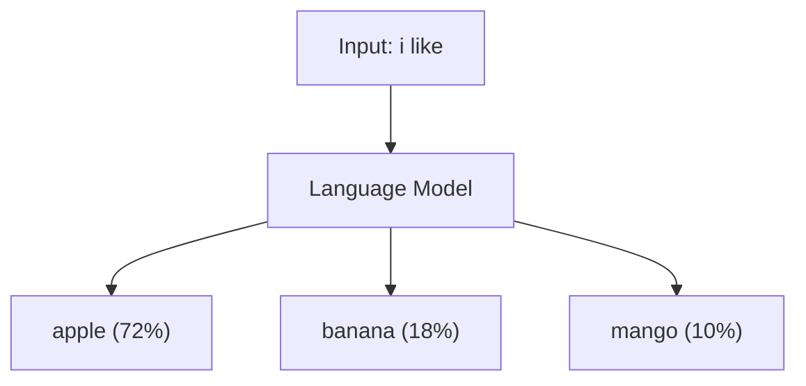
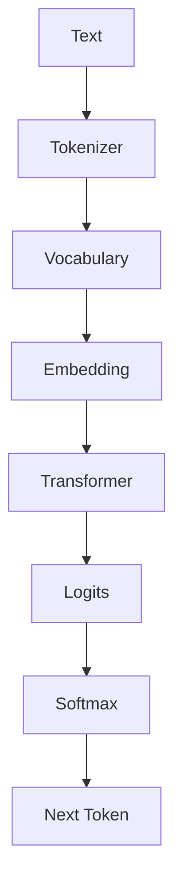

# LLM কীভাবে কাজ করে?

একটা LLM আসলে **"next token prediction machine"**।

মানে, তুমি কিছু text দিলে সে বলে: "পরেরটা কী হওয়া উচিত?"



## উদাহরণ

তুমি লিখলে:

```
i like
```

Model ভাবে:

```
apple   → 72% chance
banana  → 18% chance
mango   → 10% chance
```

তারপর একটা pick করে → `apple`

আবার:

```
i like apple
```

Model ভাবে:

```
is → 100% chance
```

এভাবে একটার পর একটা word generate করে পুরো sentence তৈরি হয়।

## পুরো Pipeline



আমরা এখন **শুধু প্রথম ২টা step** করব (Tokenizer + Vocabulary)। বাকিগুলো পরের Part-এ।

## GPT-4 vs আমাদের Model

| | GPT-4 | আমাদের Tiny Model |
|---|---|---|
| Training data | Trillions of tokens | ~30 words |
| Vocabulary | ~100,000 tokens | 12 words |
| Parameters | Billions | ~144 (Part 2-তে) |
| Architecture | Transformer | Bigram (Part 2) |

স্কেল আলাদা, কিন্তু **idea একই**: আগের text দেখে next token predict করা।

## তুমি কী শিখলে?

- LLM = next token prediction machine
- Input text → Model → Probability distribution → Pick one token
- আমরা ছোট scale-এ same idea implement করব

**পরের lesson:** [Dataset তৈরি করো](/docs/part-01-tokenizer/02-dataset)
