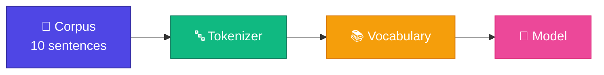

# Dataset (Training Corpus)

<ConceptAnim name="llm-pipeline" caption="10 fruit sentences corpus" />

Model কোনো magic দিয়ে শেখে না। সে **data দেখে** শেখে। এই data-কে বলে **corpus** বা **training dataset**।



## আমাদের Dataset

মাত্র ১০টা sentence:

```text
i like apple
i like banana
i like mango
you like apple
you eat mango
he eats banana
apple is fruit
banana is fruit
mango is fruit
fruit is healthy
```

বাস্তব GPT-4 **trillions of tokens** দেখে train হয়। আমরা মাত্র ~৩০টা word দিয়ে শুরু করছি — same idea, ছোট scale।

## কোড

`code/shared/data.ts`:

<CodeRun title="Fruit dataset" height={220} editable={false}>{`export const dataset = [
  'i like apple',
  'i like banana',
  'i like mango',
  'you like apple',
  'you eat mango',
  'he eats banana',
  'apple is fruit',
  'banana is fruit',
  'mango is fruit',
  'fruit is healthy',
];

console.log('=== Fruit Dataset ===');
console.log('Sentences:', dataset.length);
for (const s of dataset) console.log('  -', s);`}</CodeRun>

## কেন এত ছোট?

| কারণ | ব্যাখ্যা |
|-------|---------|
| Debug করা সহজ | ১০টা sentence মনে রাখা যায় |
| Output বোঝা যায় | Model কী শিখলো manually verify করা যায় |
| Fast training | Milliseconds-এ train হয় |
| Same concept | GPT-4-ও same process, শুধু scale বড় |

## Dataset থেকে কী শেখা যায়?

Model এই data থেকে pattern শিখবে:

```
i → like        (৩ বার)
like → apple    (২ বার)
like → banana   (১ বার)
apple → is      (১ বার)
fruit → is      (১ বার)
```

এই pattern-ই পরে **prediction**-এ ব্যবহার হবে।

## তুমি কী শিখলে?

- **Corpus** = model যা দেখে শেখে
- ছোট dataset দিয়েও LLM-এর core idea বোঝা যায়
- Dataset `code/shared/data.ts`-এ আছে — সব Part এটাই ব্যবহার করবে

**পরের lesson:** [Tokenizer](/docs/part-01-tokenizer/03-tokenizer)
