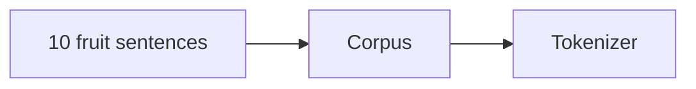

# Dataset (Training Corpus)

<ConceptAnim slug="part-01-tokenizer/02-dataset" />

আগের lesson-এ দেখেছি model next token predict করে। এখন প্রশ্ন হলো — সে সেই pattern কোথা থেকে পায়? Model কোনো magic দিয়ে শেখে না। সে **data দেখে** শেখে। এই data-কে বলে **corpus** বা **training dataset**।



## আমাদের Dataset

আমরা শুরু করছি মাত্র ১০টা sentence দিয়ে — fruit আর like/eat নিয়ে একটা ছোট জগত:

```text
i like apple
i like banana
i like mango
you like apple
you eat mango
he eats banana
apple is fruit
banana is fruit
mango is fruit
fruit is healthy
```

বাস্তব GPT-4 **trillions of tokens** দেখে train হয়। আমরা মাত্র ~৩০টা word দিয়ে শুরু করছি — same idea, ছোট scale। তাই debug করা যায়, আউটপুট মনে রাখা যায়, আর প্রতিটা ধাপ হাতে যাচাই করা যায়।

## কোডে দেখো

নীচের snippet চালিয়ে corpus কেমন দেখায়, সেটা দেখো:

<CodeRun title="Fruit dataset" height={220}>{`const dataset = [
  'i like apple',
  'i like banana',
  'i like mango',
  'you like apple',
  'you eat mango',
  'he eats banana',
  'apple is fruit',
  'banana is fruit',
  'mango is fruit',
  'fruit is healthy',
];

log.step('Fruit Dataset');
log.data('Sentences', dataset.length);
for (const s of dataset) console.log('  -', s);
log.ok('Corpus ready');`}</CodeRun>

## কেন এত ছোট?

কেউ হয়তো ভাববে — এত ছোট dataset দিয়ে কী শেখা যায়? উত্তরটা সহজ:

| কারণ | ব্যাখ্যা |
|-------|---------|
| Debug করা সহজ | ১০টা sentence মনে রাখা যায় |
| Output বোঝা যায় | Model কী শিখলো manually verify করা যায় |
| Fast training | Milliseconds-এ train হয় |
| Same concept | GPT-4-ও same process, শুধু scale বড় |

ছোট corpus মানে দুর্বল idea নয় — মানে idea-টা পরিষ্কার রাখা।

## Dataset থেকে কী শেখা যায়?

Module 2-এর একটা ছোট preview: model এই data থেকে pair গুনে pattern শিখবে —

```
i → like        (৩ বার)
like → apple    (২ বার)
like → banana   (১ বার)
```

এখনই count model বানাবো না। আগে corpus কে token আর number-এ আনতে হবে — এখান থেকেই পরের ধাপ Tokenizer।

## তুমি কী শিখলে?

- **Corpus** মানেই model যা দেখে শেখে — আমাদের ক্ষেত্রে ১০টা fruit sentence
- ছোট dataset দিয়েও LLM-এর core idea বোঝা যায়; scale পরে বাড়ানো যায়

**পরের lesson:** [Tokenizer](/docs/part-01-tokenizer/03-tokenizer)
