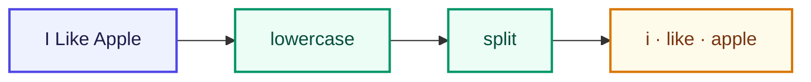

# Tokenizer

<ConceptAnim slug="part-01-tokenizer/03-tokenizer" />

Corpus তৈরি হয়ে গেছে। এখন প্রশ্ন হলো — computer পুরো sentence string হিসেবে কীভাবে কাজে লাগাবে? প্রথম step: sentence কে **token**-এ ভাগ করা। এই কাজটাই করে **Tokenizer**।

## আমাদের Tokenizer

সবচেয়ে simple version — whitespace দিয়ে split + lowercase। তিনটা ছোট ধাপ:

1. **lowercase** — `"I"` → `"i"` (model-এর কাছে same word)
2. **trim** — আগে-পিছে space সরানো
3. **split** — space দিয়ে ভাগ

তাহলে Input: `"I Like Apple"` → Output: `["i", "like", "apple"]`। কোনো জটিল parser নেই — শুধু পরিষ্কার ভাগ।

## Real LLM-এ কী হয়?

আমাদের word-level split শেখার জন্য যথেষ্ট। Real system-এ কয়েকটা level দেখা যায়:

| Level | Example | Used by |
|-------|---------|---------|
| Character | `["a","p","p","l","e"]` | Char-level Neural LM (Module 6) |
| Word | `["i","like","apple"]` | আমরা এখন (Module 1–2) |
| Subword (BPE) | `["i"," like"," app","le"]` | GPT, Llama |

GPT **BPE (Byte Pair Encoding)** ব্যবহার করে — idea same: text → tokens। পরে subword-এ যাব; এখন word-level দিয়ে intuition গড়ে তুলি।

## কোড চেষ্টা করো

Whitespace split + lowercase — নীচের snippet চালাও, তারপর Playground-এ নিজের sentence try করো।

<CodeRun title="Tokenizer" height={200}>{`// Sentence কে token-এ ভাগ করো
function tokenize(text: string): string[] {
  return text.trim().toLowerCase().split(/\\s+/).filter(Boolean);
}

const input = 'I Like Apple';
log.step('Tokenizer');
log.data('Input', input);
log.data('Tokens', tokenize(input));
log.ok('lowercase + split সম্পন্ন');`}</CodeRun>

<Playground id="part-01/tokenizer" title="Tokenizer Demo" />

Token list পেলেই কি model বুঝে ফেলল? এখনও না — পরের lesson-এ প্রতিটা token-কে একটা ID দেব।

## তুমি কী শিখলে?

- **Tokenizer** text কে list of tokens-এ ভাগ করে — আমাদের version: whitespace split + lowercase
- Real LLM-এ প্রায়ই subword tokenization (BPE) ব্যবহার হয়, কিন্তু মূল ধারণা একই
- Token list এখনও string; number mapping-এর জন্য Vocabulary লাগবে

**পরের lesson:** [Vocabulary](/docs/part-01-tokenizer/04-vocabulary)
