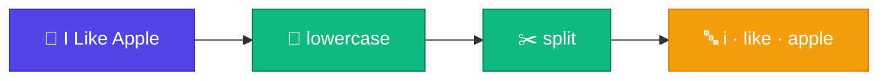

# 🔤 Tokenizer

<Callout type="idea">
💡 Computer string বুঝে না — প্রথম step: sentence কে **token**-এ ভাগ করা।
</Callout>

<ConceptAnim name="tokenizer-split" caption="Tokenizer: sentence → lowercase → whitespace split → tokens" />



Computer string বুঝে না। তাই প্রথম কাজ: sentence কে ছোট ছোট **token**-এ ভাগ করা।

## আমাদের Tokenizer

সবচেয়ে simple version — whitespace দিয়ে split:

## উদাহরণ

Input:

```
"I Like Apple"
```

Output:

```
["i", "like", "apple"]
```

তিনটা কাজ করলো:
1. **lowercase** — `"I"` → `"i"` (model-এর কাছে same word)
2. **trim** — আগে-পিছে space সরানো
3. **split** — space দিয়ে ভাগ

## Real LLM-এ কী হয়?

| Level | Example | Used by |
|-------|---------|---------|
| Character | `["a","p","p","l","e"]` | আমাদের Part 3 reference |
| Word | `["i","like","apple"]` | আমরা এখন (Part 1-2) |
| Subword (BPE) | `["i"," like"," app","le"]` | GPT, Llama |

GPT **BPE (Byte Pair Encoding)** ব্যবহার করে — rare word-কে ছোট piece-এ ভাগ করে। কিন্তু idea same: text → tokens।

## Interactive Demo

<Playground id="part-01/tokenizer" title="Tokenizer Demo" />

## তুমি কী শিখলে?

- **Tokenizer** = text → list of tokens
- আমাদের version: whitespace split + lowercase
- Real LLM-এ subword tokenization (BPE) ব্যবহার হয়

**পরের lesson:** [Vocabulary](/docs/part-01-tokenizer/04-vocabulary)
