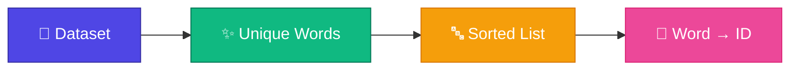

# Vocabulary

<ConceptAnim slug="part-01-tokenizer/04-vocabulary" />

Tokenizer sentence কে word-এ ভাগ করল। এখন প্রশ্ন: model কীভাবে এই word-গুলো বুঝবে?

উত্তর: **number দিয়ে**।

## Vocabulary তৈরি

Dataset-এর সব unique word collect করো, তারপর প্রতিটাকে একটা ID দাও:

## আমাদের Vocabulary

| Word | ID |
|------|----|
| apple | 0 |
| banana | 1 |
| eat | 2 |
| eats | 3 |
| fruit | 4 |
| he | 5 |
| healthy | 6 |
| i | 7 |
| is | 8 |
| like | 9 |
| mango | 10 |
| you | 11 |

মোট **12টা unique word** = Vocabulary size = 12

## কোড

`code/part-01/vocabulary.ts`:

দুটো map:
- **stoi** (string → int): `"apple"` → `0`
- **itos** (int → string): `0` → `"apple"`

## GPT-এর Vocabulary

| Model | Vocab Size |
|-------|-----------|
| আমাদের | 12 |
| GPT-2 | 50,257 |
| GPT-4 | ~100,000 |

স্কেল আলাদা, concept same।

## Interactive Demo

<Playground id="part-01/vocabulary" title="Vocabulary Demo" />

## তুমি কী শিখলে?

- **Vocabulary** = সব unique token-এর list + ID mapping
- Model শুধু number বুঝে, string নয়
- `stoi` এবং `itos` দুটো direction-এ lookup

**পরের lesson:** [Encoding](/docs/part-01-tokenizer/05-encoding)
