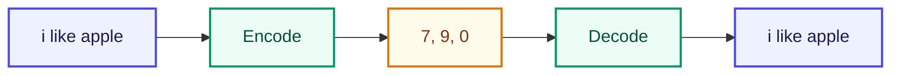

# Encoding / Decoding

<ConceptAnim slug="part-01-tokenizer/05-encoding" />

Vocabulary আছে। এখন sentence কে number list-এ convert করব — এটাই **Encoding**। উল্টোটা **Decoding**।



## Encoding

Sentence → Number list

```
"i like apple"  →  [7, 9, 0]
"fruit is healthy"  →  [4, 8, 5]
```

প্রতিটা word-কে তার vocabulary ID-তে map করা।

## Decoding

Number list → Sentence (উল্টো)

```
[4, 8, 5]  →  "fruit is healthy"
```

## গুরুত্বপূর্ণ বোঝাপড়া

> Model এখনও word বুঝে না। শুধু **number** বুঝে।
>
> `"apple"` দেখে না → `0` দেখে
> `"like"` দেখে না → `9` দেখে

এটাই Tokenizer + Vocabulary + Encoding-এর মূল উদ্দেশ্য।

## Interactive Demo

<Playground id="part-01/encoding" title="Encoding / Decoding Demo" />

## তুমি কী শিখলে?

- **Encode** = text → numbers
- **Decode** = numbers → text
- Model শুধু number array নিয়ে কাজ করে

**পরের lesson:** [Training Pairs](/docs/part-01-tokenizer/06-training-pairs)
