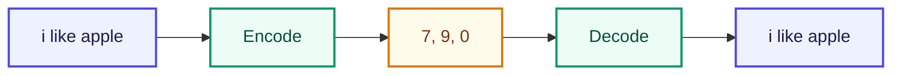

# Encoding / Decoding

<ConceptAnim slug="part-01-tokenizer/05-encoding" />

Vocabulary আছে — প্রতিটা word-এর একটা ID। এখন sentence কে number list-এ convert করব; এটাই **Encoding**। উল্টোটা **Decoding** — number থেকে আবার পড়ার মতো text। দুটো মিলেই Tokenizer pipeline সম্পূর্ণ হয়।



## Encoding

Sentence → Number list। প্রতিটা word-কে তার vocabulary ID-তে map করা:

```
"i like apple"  →  [7, 9, 0]
"fruit is healthy"  →  [4, 8, 6]
```

দেখো — `"i"` হয়ে গেল `7`, `"like"` হয়ে গেল `9`, `"apple"` হয়ে গেল `0`। Model এখন থেকে এই সংখ্যাগুলোই দেখবে।

## Decoding

Number list → Sentence (উল্টো পথ):

```
[4, 8, 6]  →  "fruit is healthy"
```

Generate করার পর মানুষকে দেখাতে আবার text লাগে — তাই decode ছাড়া pipeline অসম্পূর্ণ।

## গুরুত্বপূর্ণ বোঝাপড়া

> Model এখনও word বুঝে না। শুধু **number** বুঝে।
>
> `"apple"` দেখে না → `0` দেখে
> `"like"` দেখে না → `9` দেখে

এটাই Tokenizer + Vocabulary + Encoding-এর মূল উদ্দেশ্য: text-কে model-এর ভাষায় আনা। এখান থেকেই পরের ধাপ — এই number sequence থেকে training pair কাটা।

## Interactive Demo

<Playground id="part-01/encoding" title="Encoding / Decoding Demo" />

## তুমি কী শিখলে?

- **Encode** = text → numbers; **Decode** = numbers → text — দুটোই একই Vocabulary ব্যবহার করে
- Model শুধু number array নিয়ে কাজ করে; string দেখে না
- Encoding শেষ হলে data প্রায় ready — শুধু training pair বানাতে হবে

**পরের lesson:** [Training Pairs](/docs/part-01-tokenizer/06-training-pairs)
