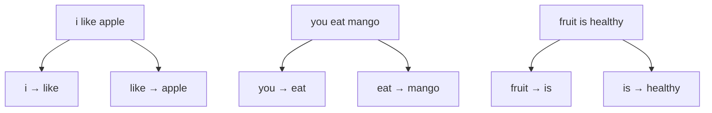
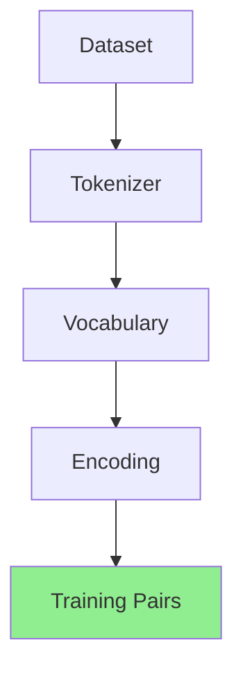

# Training Pairs

এখন সবচেয়ে গুরুত্বপূর্ণ প্রশ্ন: **Model কী শেখে?**

উত্তর: **Next word prediction**।

## Idea

প্রতিটা sentence-এ, একটা word দেখে পরেরটা predict করতে শেখাও:

```
"i like apple"
```

এটা থেকে ২টা training pair:

```
"i"      →  "like"
"like"   →  "apple"
```

আরেকটা example:

```
"apple is fruit"
```

```
"apple"  →  "is"
"is"     →  "fruit"
```

## পুরো Dataset থেকে



মোট **~20টা pair** তৈরি হবে ১০টা sentence থেকে।

## কোড

```ts
export function buildTrainingPairs(): TrainingPair[] {
  const pairs: TrainingPair[] = [];

  for (const sentence of dataset) {
    const words = tokenize(sentence);
    for (let i = 0; i < words.length - 1; i++) {
      pairs.push([words[i], words[i + 1]]);
    }
  }

  return pairs;
}
```

## Real World Scale

| | আমাদের | GPT-4 |
|---|---|---|
| Pairs | ~20 | Trillions |
| Source | 10 sentences | Internet |

Same process, বিশাল scale।

## Interactive Demo

<Playground id="part-01/training-pairs" title="Training Pairs Demo" />

## Part 1 শেষ — তুমি কী শিখলে?



✅ Text → Tokens → Numbers → Training Pairs

এখনও কোনো AI নেই। শুধু data preparation। কিন্তু এটাই **সব LLM-এর প্রথম ধাপ**।

**পরের Part:** [Part 2 — Bigram Language Model](/docs/part-02-bigram)
