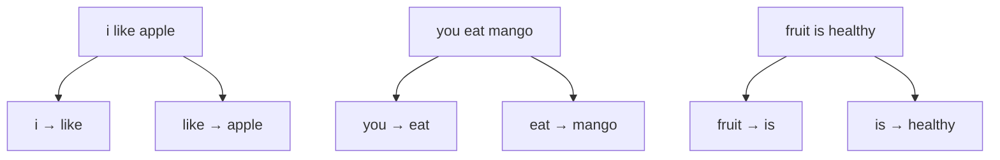
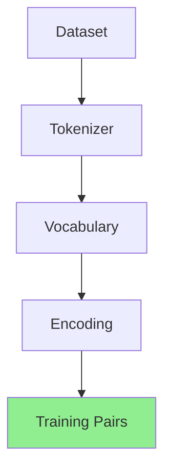

# Training Pairs

<ConceptAnim slug="part-01-tokenizer/06-training-pairs" />

Encoding পর্যন্ত এসেছি — text এখন number। এখন সবচেয়ে গুরুত্বপূর্ণ প্রশ্ন: **Model কী শেখে?** উত্তরটা আবার সেই পরিচিত ধারণা: **Next word prediction**। মানে প্রতিটা জায়গায় “এর পরে কী আসে?” — সেই pair-গুলোই training data।

## মূল Idea

প্রতিটা sentence-এ, একটা word দেখে পরেরটা predict করতে শেখাও। ধরো:

```
"i like apple"
```

এটা থেকে ২টা training pair:

```
"i"      →  "like"
"like"   →  "apple"
```

আরেকটা example:

```
"apple is fruit"
```

```
"apple"  →  "is"
"is"     →  "fruit"
```

তাহলে কী হয়? একটা লম্বা sentence ভেঙে অনেক ছোট “(current → next)” উদাহরণে পরিণত হয় — model ঠিক এগুলোই গুনে শেখে।

## পুরো Dataset থেকে

কয়েকটা sentence দিয়ে pair কেমন হয়, সেটা flowchart-এ দেখো:



মোট **~20টা pair** তৈরি হবে ১০টা sentence থেকে। ছোট সংখ্যা — তাই Module 2-এ count table খুলে দেখা যাবে কোন pair কতবার এসেছে।

## কোড

প্রতিটি sentence থেকে `(current → next)` pair বানানো — নীচের playground-এ live দেখো।

## Real World-এ Scale

| | আমাদের | GPT-4 |
|---|---|---|
| Pairs | ~20 | Trillions |
| Source | 10 sentences | Internet |

Same process, বিশাল scale। GPT-ও মূলত অসংখ্য “(context → next token)” pair দেখে শেখে — শুধু context অনেক লম্বা।

## নিজে চেষ্টা করো

<Playground id="part-01/training-pairs" title="Training Pairs Demo" />

## Part 1 শেষ — তুমি কী শিখলে?

পুরো Module 1 এক নজরে:



Text → Tokens → Numbers → Training Pairs — এই চার ধাপই data preparation। এখনও কোনো AI নেই; কিন্তু এটাই **সব LLM-এর প্রথম ধাপ**। এখান থেকেই পরের Module: এই pair গুনে প্রথম Bigram Language Model বানাবো।

**পরের Part:** [Part 2 — Bigram Language Model](/docs/part-02-bigram)
