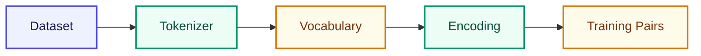

# Module 1: Tokenizer + Vocabulary

এই Module-এ আমরা **কোনো AI বানাবো না**। শুধু data prepare করব — যেটা না বুঝলে পরের কিছুই পরিষ্কার হবে না।

## এই Module-এ কী শিখবে?

| Lesson | Topic |
|--------|-------|
| [01](/docs/part-01-tokenizer/01-llm-kivabe-kaj-kore) | LLM আসলে কী করে? |
| [02](/docs/part-01-tokenizer/02-dataset) | Dataset / Corpus |
| [03](/docs/part-01-tokenizer/03-tokenizer) | Tokenizer |
| [04](/docs/part-01-tokenizer/04-vocabulary) | Vocabulary |
| [05](/docs/part-01-tokenizer/05-encoding) | Encoding / Decoding |
| [06](/docs/part-01-tokenizer/06-training-pairs) | Training Pairs |

প্রতিটি code lesson-এ **interactive Playground** আছে — browser-এ edit করে run করো।

## মনে রাখো

> Model কখনো `"apple"` string দেখে না। শুধু `2` (একটা number) দেখে। Tokenizer-এর কাজ হলো এই conversion করা।

**শুরু করো:** [Lesson 01 — LLM কীভাবে কাজ করে](/docs/part-01-tokenizer/01-llm-kivabe-kaj-kore)
