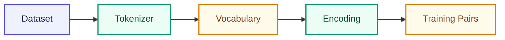

# Module 1: Tokenizer + Vocabulary

Module 0-এ আমরা দেখেছি LLM আসলে next-token prediction করে। এখন প্রশ্ন হলো — সেই prediction শুরুই হয় কীভাবে? উত্তরটা জাদু নয়: আগে text কে এমন রূপে আনতে হয় যেটা computer গুনতে পারে। এই Module-এ আমরা **কোনো AI বানাবো না** — শুধু data prepare করব। কিন্তু এই ধাপটা না বুঝলে পরের Bigram বা Transformer কিছুই পরিষ্কার হবে না।

## এই Module-এ কী শিখবে?

একটা ছোট pipeline — corpus থেকে শুরু করে training pair পর্যন্ত:

| Lesson | Topic |
|--------|-------|
| [01](/docs/part-01-tokenizer/01-llm-kivabe-kaj-kore) | LLM আসলে কী করে? |
| [02](/docs/part-01-tokenizer/02-dataset) | Dataset / Corpus |
| [03](/docs/part-01-tokenizer/03-tokenizer) | Tokenizer |
| [04](/docs/part-01-tokenizer/04-vocabulary) | Vocabulary |
| [05](/docs/part-01-tokenizer/05-encoding) | Encoding / Decoding |
| [06](/docs/part-01-tokenizer/06-training-pairs) | Training Pairs |

প্রতিটি code lesson-এ **interactive Playground** আছে — browser-এ edit করে run করো; বই পড়ার মতো নয়, হাতে দেখার মতো।

## মনে রাখো

> Model কখনো `"apple"` string দেখে না। শুধু `2` (একটা number) দেখে। Tokenizer-এর কাজ হলো এই conversion করা — আর Vocabulary সেই number-এর dictionary।

এখান থেকেই পরের ধাপ: প্রথমে বুঝি LLM কী করে, তারপর ছোট corpus নিয়ে পুরো pipeline চালাই।

**শুরু করো:** [Lesson 01 — LLM কীভাবে কাজ করে](/docs/part-01-tokenizer/01-llm-kivabe-kaj-kore)
