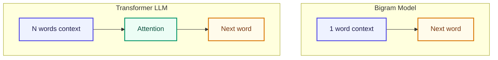

# Bigram কী?

<ConceptAnim slug="part-02-bigram/01-bigram-concept" />

Part 1-এর শেষে আমরা training pair বানিয়েছিলাম — `(i → like)`, `(like → apple)` ইত্যাদি। এখন সেই pair-এর নাম দিয়ে ভাবি: **Bigram** মানে দুটো consecutive word-এর pair। Model আর কিছু দেখে না — শুধু **একটা word দেখে পরেরটা guess** করে।

```
"i like apple"
```

Model এটা দেখে শুধু এগুলো রাখে:

```
(i → like)
(like → apple)
```

কোনো পুরো sentence memory নেই, কোনো Attention নেই — শুধু “আগেরটা X হলে পরেরটা কী?”।

## আরেকটা Example

```
"apple is fruit"
```

একইভাবে ভেঙে যায়:

```
apple → is
is → fruit
```

তাহলে কী হয়? লম্বা text ভেঙে অনেক ছোট “এক ধাপ সামনে” প্রশ্নে পরিণত হয় — আর Bigram model ঠিক সেই প্রশ্নের উত্তর গুনে শেখে।

## Bigram vs Full LLM — তফাত

স্কেল আর context আলাদা, কিন্তু মূল কাজ একই — next word predict:



| | Bigram | GPT |
|---|---|---|
| Context | শুধু ১টা আগের word | হাজার হাজার token |
| Memory | Count table | Neural network |
| Smart? | না | হ্যাঁ |

Bigram “dumb”, কিন্তু **same core idea**: আগের text দেখে next token predict। পরে Attention এলে context লম্বা হবে — এখন counting দিয়েই intuition গড়ি।

## Training Data থেকে Pattern

Part 1-এ যে pairs তৈরি করেছিলাম, সেখান থেকেই pattern দেখা যায়:

```
"i" → "like"     (৩ বার দেখেছে)
"like" → "apple"  (২ বার)
"like" → "banana" (১ বার)
"like" → "mango"  (১ বার)
```

Model শিখবে: `i`-এর পরে প্রায়ই `like` আসে, আর `like`-এর পরে `apple` সবচেয়ে বেশি (প্রায় 50%)। পরের lesson-এ ঠিক এই গোনাটাই table-এ তুলব।

## তুমি কী শিখলে?

- **Bigram** = ১টা word context দিয়ে next word predict — GPT-ও same idea, শুধু context অনেক বড় + neural network
- Counting দিয়েই প্রথম language model বানানো যায়; neural net এখনও লাগবে না
- আমাদের fruit pairs-ই পরের count table-এর কাঁচামাল

**পরের lesson:** [Count Model](/docs/part-02-bigram/02-count-model)
