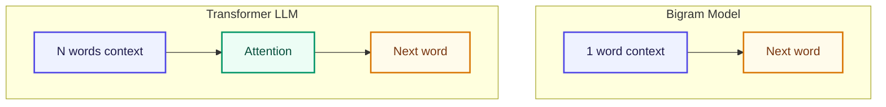

# 🔗 Bigram কী?

<ConceptAnim slug="part-02-bigram/01-bigram-concept" />

**Bigram** মানে দুটো consecutive word-এর pair।

```
"i like apple"
```

Model এটা দেখে:

```
(i → like)
(like → apple)
```

আর কিছু না। শুধু **একটা word দেখে পরেরটা guess**।

## আরেকটা Example

```
"apple is fruit"
```

```
apple → is
is → fruit
```

## Bigram vs Full LLM



| | Bigram | GPT |
|---|---|---|
| Context | শুধু ১টা আগের word | হাজার হাজার token |
| Memory | Count table | Neural network |
| Smart? | না | হ্যাঁ |

Bigram dumb, কিন্তু **same core idea**: আগের text দেখে next token predict।

## Training Data থেকে Pattern

Part 1-এ যে pairs তৈরি করেছিলাম:

```
"i" → "like"     (৩ বার দেখেছে)
"like" → "apple"  (২ বার)
"like" → "banana" (১ বার)
"like" → "mango"  (১ বার)
```

Model শিখবে:
- `i`-এর পরে সবসময় `like` আসে
- `like`-এর পরে `apple` সবচেয়ে বেশি (50%)

## তুমি কী শিখলে?

- **Bigram** = ১টা word context দিয়ে next word predict
- GPT-ও same idea, শুধু context অনেক বড় + neural network
- Counting দিয়েই প্রথম language model বানানো যায়

**পরের lesson:** [Count Model](/docs/part-02-bigram/02-count-model)
