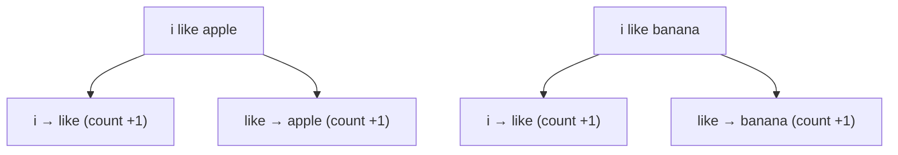

# Count-based Training

Bigram model-এর training খুব simple: **গুনে রাখো** কোন word-এর পরে কোন word কতবার এসেছে।

## Training Process



## Step by Step

**Sentence 1:** `i like apple`

```
i → like: count = 1
like → apple: count = 1
```

**Sentence 2:** `i like banana`

```
i → like: count = 2  (আগে ১ ছিল)
like → banana: count = 1
```

**Sentence 3:** `i like mango`

```
i → like: count = 3
like → mango: count = 1
```

## Final Count Table

```
i       → { like: 3 }
like    → { apple: 2, banana: 1, mango: 1 }
you     → { like: 1, eat: 1 }
apple   → { is: 1 }
fruit   → { is: 1 }
is      → { fruit: 3, healthy: 1 }
...
```

## কোড

`code/part-02/bigram.ts`:

```ts
export class BigramModel {
  table = new Map<string, Map<string, number>>();

  train(): void {
    for (const sentence of dataset) {
      const words = tokenize(sentence);
      for (let i = 0; i < words.length - 1; i++) {
        const current = words[i];
        const next = words[i + 1];
        // ... count increment
      }
    }
  }
}
```

Data structure: `Map<currentWord, Map<nextWord, count>>`

## Probability Formula

Count থেকে probability বের করা:

$$P(\text{next} \mid \text{current}) = \frac{\text{count(current, next)}}{\sum_w \text{count(current, w)}}$$

Example:

$$P(\text{like} \mid \text{i}) = \frac{3}{3} = 1.0$$

$$P(\text{apple} \mid \text{like}) = \frac{2}{2+1+1} = 0.5$$

## Interactive Demo

<Playground id="part-02/count-model" title="Count Model Training" />

## তুমি কী শিখলে?

- Training = counting how often each pair appears
- Count table = model-এর "memory"
- Count থেকে probability বের করা যায়

**পরের lesson:** [Predict](/docs/part-02-bigram/03-predict)
