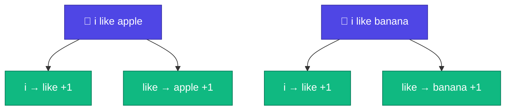

# Count-based Training

<ConceptAnim name="bigram-scan" caption="Scanner sentence traverse করে — প্রতিটি bigram pair count +1" />

Bigram model-এর training খুব simple: **গুনে রাখো** কোন word-এর পরে কোন word কতবার এসেছে।

## Training Process



## Step by Step

**Sentence 1:** `i like apple`

```
i → like: count = 1
like → apple: count = 1
```

**Sentence 2:** `i like banana`

```
i → like: count = 2  (আগে ১ ছিল)
like → banana: count = 1
```

**Sentence 3:** `i like mango`

```
i → like: count = 3
like → mango: count = 1
```

## Final Count Table

```
i       → { like: 3 }
like    → { apple: 2, banana: 1, mango: 1 }
you     → { like: 1, eat: 1 }
apple   → { is: 1 }
fruit   → { is: 1 }
is      → { fruit: 3, healthy: 1 }
...
```

## Data Structure

`Map<currentWord, Map<nextWord, count>>` — `code/part-02/bigram.ts` ও নিচের playground-এ same idea।

## Probability Formula

<MathLesson title="Bigram Probability">
  <MathIntuition>
    Count বেশি হলে probability বেশি — কিন্তু সব probability যোগ করলে 1 হতে হবে (normalize)।
  </MathIntuition>
  <SymbolTable symbols={[
    { sym: "P(next | current)", meaning: "current word দেখে next word-এর probability" },
    { sym: "count(a, b)", meaning: "pair (a → b) কতবার দেখা গেছে" }
  ]} />
  <Formula>
    {`$$P(\\text{next} \\mid \\text{current}) = \\frac{\\text{count(current, next)}}{\\sum_w \\text{count(current, w)}}$$`}
  </Formula>
  <WorkedExample>
    P(like | i) = 3/3 = 1.0{'\n'}
    P(apple | like) = 2/(2+1+1) = 0.5
  </WorkedExample>
  <CodeLink>Playground-এ count table run করো ↓</CodeLink>
</MathLesson>

## Interactive Demo

<Playground id="part-02/count-model" title="Count Model Training" />

## তুমি কী শিখলে?

- Training = counting how often each pair appears
- Count table = model-এর "memory"
- Count থেকে probability বের করা যায়

**পরের lesson:** [Predict](/docs/part-02-bigram/03-predict)
