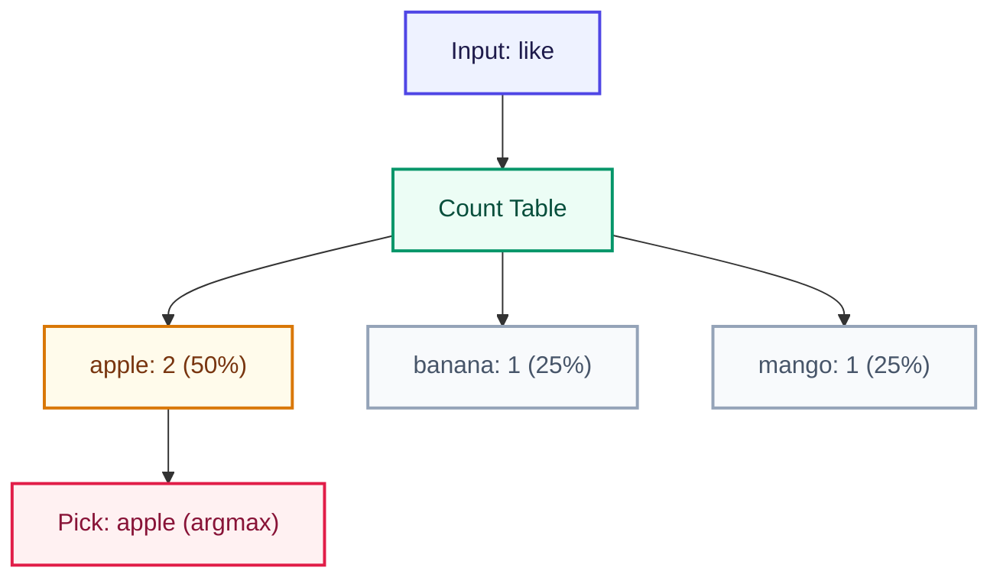

# Predict (Argmax)

<ConceptAnim slug="part-02-bigram/03-predict" />

Training শেষ। এখন model দিয়ে **predict** করব — মানে next word বলব।

## Argmax = সবচেয়ে বেশি count

সবচেয়ে simple strategy: যার count সবচেয়ে বেশি, সেটাই pick করো।

```
predict("i")     →  "like"    (count=3, একমাত্র option)
predict("like")  →  "apple"   (count=2, সবচেয়ে বেশি)
predict("apple") →  "is"      (count=1)
predict("fruit") →  "is"      (count=1)
```

## Probability সহ



## কোড

Count table থেকে probability বের করে argmax pick — নীচের snippet ও Playground-এ input দিয়ে next word দেখো।

<CodeRun title="Argmax predict" height={220}>{`// Count table থেকে সবচেয়ে বেশি count pick
const counts = {
  i: { like: 3 },
  like: { apple: 2, banana: 1, mango: 1 },
};

function predict(word: string): string {
  const row = counts[word as keyof typeof counts] ?? {};
  let best = '';
  let bestCount = -1;
  for (const [w, c] of Object.entries(row)) {
    if (c > bestCount) {
      best = w;
      bestCount = c;
    }
  }
  return best;
}

log.step('Argmax predict');
for (const w of ['i', 'like']) {
  log.data(w + ' →', predict(w));
}
log.ok('highest count pick');`}</CodeRun>

## কোড চেষ্টা করো

<Playground id="part-02/predict" title="Predict (argmax)" />

## তুমি কী শিখলে?

- **Predict** = count table থেকে সবচেয়ে likely next word
- **Argmax** = highest probability/count pick করা
- Model এখন training data-র pattern follow করে

**পরের lesson:** [Generate](/docs/part-02-bigram/04-generate)
