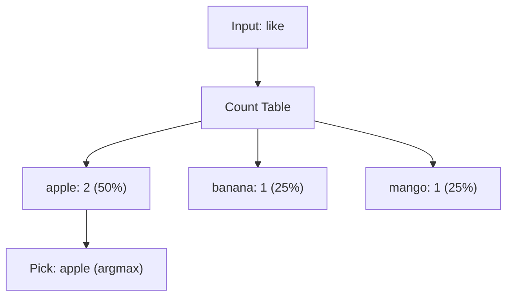

# Predict (Argmax)

<ConceptAnim name="next-token" caption="Argmax prediction from counts" />

Training শেষ। এখন model দিয়ে **predict** করব — মানে next word বলব।

## Argmax = সবচেয়ে বেশি count

সবচেয়ে simple strategy: যার count সবচেয়ে বেশি, সেটাই pick করো।

```
predict("i")     →  "like"    (count=3, একমাত্র option)
predict("like")  →  "apple"   (count=2, সবচেয়ে বেশি)
predict("apple") →  "is"      (count=1)
predict("fruit") →  "is"      (count=1)
```

## Probability সহ



## Interactive Demo

<Playground id="part-02/predict" title="Predict (argmax)" />

## তুমি কী শিখলে?

- **Predict** = count table থেকে সবচেয়ে likely next word
- **Argmax** = highest probability/count pick করা
- Model এখন training data-র pattern follow করে

**পরের lesson:** [Generate](/docs/part-02-bigram/04-generate)
