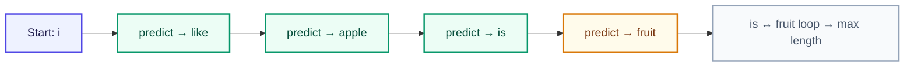

# Sentence Generate

<ConceptAnim slug="part-02-bigram/04-generate" />

একটা word predict করতে শিখেছি। এখন সবচেয়ে মজার অংশ — model দিয়ে **নতুন sentence generate** করা। ধারণাটা Module 0-এর autoregressive loop-ই: একটা seed দিয়ে শুরু, predict, context-এ যোগ, আবার predict।

## Idea: Autoregressive Generation

একটা word দিয়ে শুরু করো, তারপর বারবার predict করো:



Result: `"i like apple is fruit is fruit ..."` — argmax একটা loop-এ আটকে যায়। কেন, সেটা নিচে ধাপে ধাপে দেখো।

## Step by Step

Sentence বাড়ে, কিন্তু **bigram শুধু শেষ word** দেখে predict করে:

```
Step 1:  context="i"      → P(?|i)      → "like"  → "i like"
Step 2:  context="like"   → P(?|like)   → "apple" → "i like apple"
Step 3:  context="apple"  → P(?|apple)  → "is"    → "i like apple is"
Step 4:  context="is"     → P(?|is)     → "fruit" → "i like apple is fruit"
Step 5:  context="fruit"  → P(?|fruit)  → "is"    → "… fruit is"
Step 6:  context="is"     → P(?|is)     → "fruit" → "… is fruit is fruit"  (loop)
```

`is`-এর সবচেয়ে বড় count `fruit` (৩ বার), আর `fruit → is` — তাই argmax `is ↔ fruit`-এ আটকে যায়। তাই max length (এখানে ১০ step) পর্যন্ত চলে থামে; `null` prediction পেলে আগে থামত। এটা bug নয় — ছোট corpus + argmax-এর স্বাভাবিক ফল।

## কোড

Loop-এর চারটা ধাপ মনে রাখো:

1. **শেষ word** নাও (bigram context = last token)
2. Predict করো
3. নতুন word যোগ করো
4. Repeat (অথবা আর predict না পেলে stop)

Playground-এ seed বদলে দেখো আউটপুট কীভাবে বদলায় — argmax হলে একই seed-এ সবসময় same string।

## Interactive Demo

<Playground id="part-02/generate" title="Sentence Generate" />

Argmax দিয়ে generate করলে **সবসময় same output** — কারণ সবসময় highest count pick করে। পরের lesson-এ দেখব কীভাবে probability অনুযায়ী random pick করলে বৈচিত্র্য আসে।

## GPT-ও same process

```
Input: "The capital of France is"
→ predict → "Paris"
→ predict → "."
→ predict → (stop)
```

শুধু GPT-এর prediction অনেক বেশি smart (Transformer + Attention) — loop-এর কাঠামো একই।

## তুমি কী শিখলে?

- **Generate** = বারবার next word predict করে sentence বানানো
- **Autoregressive** মানে আগের output-ই পরের input — Bigram-এ সেটা শুধু last token
- Argmax generate deterministic: একই seed → সবসময় same output, কখনো loop-এও আটকে যেতে পারে

**পরের lesson:** [Sampling vs Argmax](/docs/part-02-bigram/05-sampling-vs-argmax)
