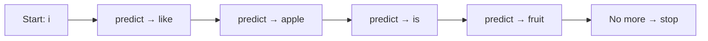

# Sentence Generate

<ConceptAnim name="next-token" caption="Generate: i like apple …" />

এখন সবচেয়ে মজার অংশ — model দিয়ে **নতুন sentence generate** করা।

## Idea: Autoregressive Generation

একটা word দিয়ে শুরু করো, তারপর বারবার predict করো:



Result: `"i like apple is fruit"`

## Step by Step

```
Step 1:  "i"           → predict → "like"     → "i like"
Step 2:  "i like"      → predict → "apple"    → "i like apple"
Step 3:  "i like apple"→ predict → "is"       → "i like apple is"
Step 4:  ...apple is"  → predict → "fruit"    → "i like apple is fruit"
Step 5:  ...is fruit"  → predict → "is"       → "i like apple is fruit is"
Step 6:  ...fruit is"  → predict → ???        → stop (no more data)
```

## কোড

Loop:
1. শেষ word নাও
2. Predict করো
3. নতুন word যোগ করো
4. Repeat (অথবা আর predict না পেলে stop)

## Interactive Demo

<Playground id="part-02/generate" title="Sentence Generate" />

Argmax দিয়ে generate করলে **সবসময় same output** — কারণ সবসময় highest count pick করে।

## GPT-ও same process

```
Input: "The capital of France is"
→ predict → "Paris"
→ predict → "."
→ predict → (stop)
```

শুধু GPT-এর prediction অনেক বেশি smart (Transformer + Attention)।

## তুমি কী শিখলে?

- **Generate** = repeatedly predict next word
- **Autoregressive** = আগের output পরের input
- Argmax generate = deterministic (সবসময় same)

**পরের lesson:** [Sampling vs Argmax](/docs/part-02-bigram/05-sampling-vs-argmax)
