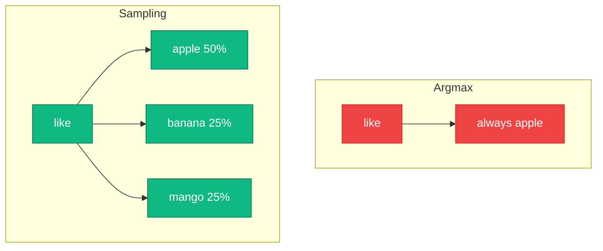
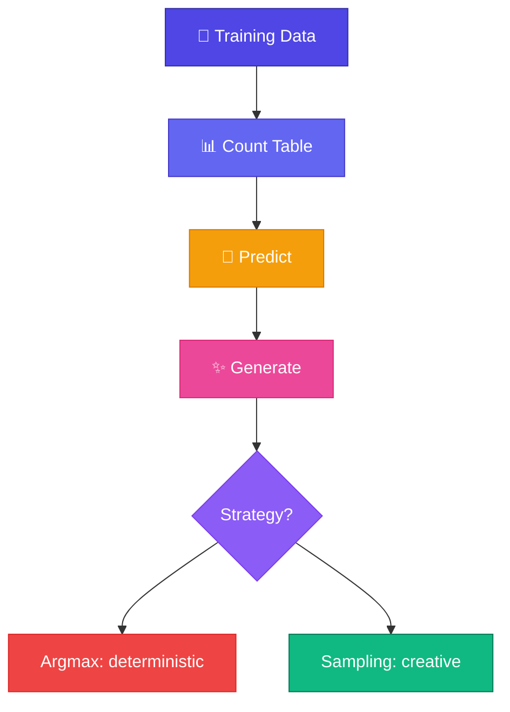

# Sampling vs Argmax

<ConceptAnim name="softmax-bars" caption="Sampling vs always picking max" />

আগের lesson-এ দেখলাম argmax দিয়ে generate করলে **সবসময় same output**। কিন্তু ChatGPT তো প্রতিবার আলাদা answer দেয় — কেন?

## Argmax Problem

```
Input: "like"

Probabilities:
  apple:  50%
  banana: 25%
  mango:  25%

Argmax → সবসময় "apple" (highest)
```

বারবার same thing — boring!

## Sampling Solution

Probability অনুযায়ী **random pick** করো:

```
Input: "like"

Random number: 0.6

  apple:  50% → cumulative: 0.50 → 0.6 > 0.50 → skip
  banana: 25% → cumulative: 0.75 → 0.6 < 0.75 → PICK banana!
```

পরের বার random number ভিন্ন হলে ভিন্ন word pick হবে।

## Comparison



| | Argmax | Sampling |
|---|---|---|
| Output | সবসময় same | প্রতিবার different |
| Strategy | Highest probability | Random by probability |
| Used by | Search / deterministic demos | ChatGPT, creative writing |

## Interactive Demo

<Playground id="part-02/sampling" title="Argmax vs Sampling" />

Run বারবার চাপলে sampling output প্রতিবার আলাদা হবে!

## GPT-তে Temperature

Sampling-এ আরেকটা knob আছে: **Temperature**

$$P_i = \frac{e^{z_i / T}}{\sum_j e^{z_j / T}}$$

- $T = 0$: argmax (deterministic)
- $T = 1$: normal sampling
- $T > 1$: more random/creative

আমাদের Bigram model-এ temperature নেই, কিন্তু concept same — Module 9-এ দেখবে।

## Part 2 শেষ — তুমি কী শিখলে?



🎉 তুমি তোমার **প্রথম Language Model** বানালে, train করলে, এবং text generate করলে!

কিন্তু Bigram model-এর limitation আছে — সে শুধু **১টা আগের word** দেখে। Real LLM **পুরো context** দেখে। পরের modules-এ math → neural net → attention → Mini GPT।

**পরের Module:** [Module 3 — Math Foundations](/docs/part-03-math)
