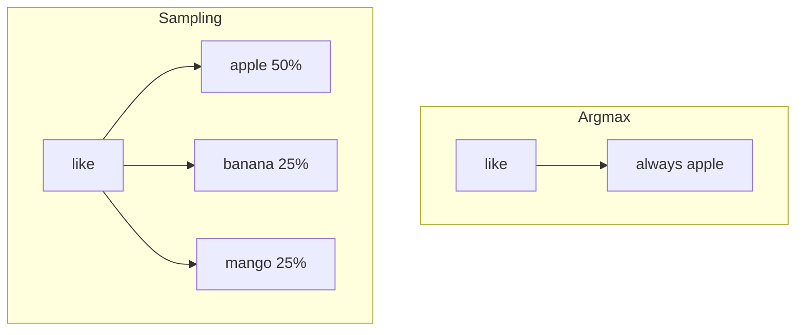
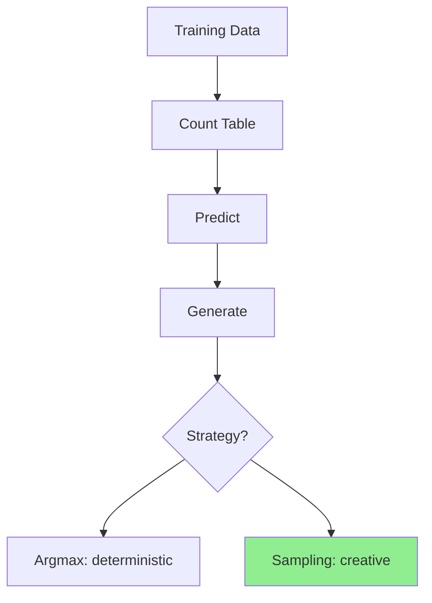

# Sampling vs Argmax

আগের lesson-এ দেখলাম argmax দিয়ে generate করলে **সবসময় same output**। কিন্তু ChatGPT তো প্রতিবার আলাদা answer দেয় — কেন?

## Argmax Problem

```
Input: "like"

Probabilities:
  apple:  50%
  banana: 25%
  mango:  25%

Argmax → সবসময় "apple" (highest)
```

বারবার same thing — boring!

## Sampling Solution

Probability অনুযায়ী **random pick** করো:

```
Input: "like"

Random number: 0.6

  apple:  50% → cumulative: 0.50 → 0.6 > 0.50 → skip
  banana: 25% → cumulative: 0.75 → 0.6 < 0.75 → PICK banana!
```

পরের বার random number ভিন্ন হলে ভিন্ন word pick হবে।

## কোড

```ts
sample(word: string): string | null {
  const probs = this.probabilities(word);
  const r = Math.random();
  let cumulative = 0;

  for (const [next, prob] of probs) {
    cumulative += prob;
    if (r < cumulative) return next;
  }

  return last option;
}
```

## Comparison



| | Argmax | Sampling |
|---|---|---|
| Output | সবসময় same | প্রতিবার different |
| Strategy | Highest probability | Random by probability |
| Used by | Search engines | ChatGPT, creative writing |

## Run করো

```bash
bun part-02
```

Output:

```
--- Generate (sampling) ---
  i like mango is fruit is healthy
  i like banana is fruit is healthy
  i like apple is fruit is healthy
```

প্রতিবার আলাদা! কারণ `like`-এর পরে apple/banana/mango randomly pick হয়।

## GPT-তে Temperature

Sampling-এ আরেকটা knob আছে: **Temperature**

$$P_i = \frac{e^{z_i / T}}{\sum_j e^{z_j / T}}$$

- $T = 0$: argmax (deterministic)
- $T = 1$: normal sampling
- $T > 1$: more random/creative

আমাদের model-এ temperature নেই, কিন্তু concept same।

## Part 2 শেষ — তুমি কী শিখলে?



🎉 তুমি তোমার **প্রথম Language Model** বানালে, train করলে, এবং text generate করলে!

কিন্তু Bigram model-এর limitation আছে — সে শুধু **১টা আগের word** দেখে। Real LLM **পুরো context** দেখে। সেটা Part 3-5-এ।

**পরের Part:** [Part 3 — Neural Network](/docs/part-03-neural-network)
