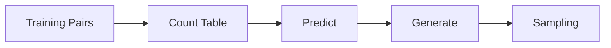

# Part 2: Bigram Language Model

Part 1-এ আমরা data prepare করলাম। এখন **প্রথম সত্যিকারের Language Model** বানাবো।

এটা LLM না — **Bigram Language Model**। কিন্তু GPT-এর foundation বুঝার জন্য এটা সবচেয়ে গুরুত্বপূর্ণ।

## এই Part-এ কী শিখবে?



| Lesson | Topic |
|--------|-------|
| [01](/docs/part-02-bigram/01-bigram-concept) | Bigram কী? |
| [02](/docs/part-02-bigram/02-count-model) | Count-based Training |
| [03](/docs/part-02-bigram/03-predict) | Predict (argmax) |
| [04](/docs/part-02-bigram/04-generate) | Sentence Generate |
| [05](/docs/part-02-bigram/05-sampling-vs-argmax) | Sampling vs Argmax |

## কোড রান করো

```bash
bun part-02
```

## মনে রাখো

> Bigram মানে: **একটা word দেখে পরেরটা guess করা**। কোনো neural network নেই — শুধু counting। কিন্তু idea same: training data থেকে pattern শেখা।

<Cards>
  <Card title="Lesson 01: Bigram Concept" href="/docs/part-02-bigram/01-bigram-concept" />
</Cards>
