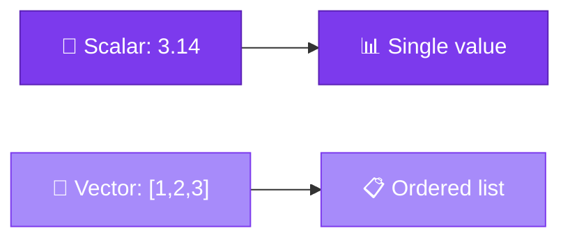
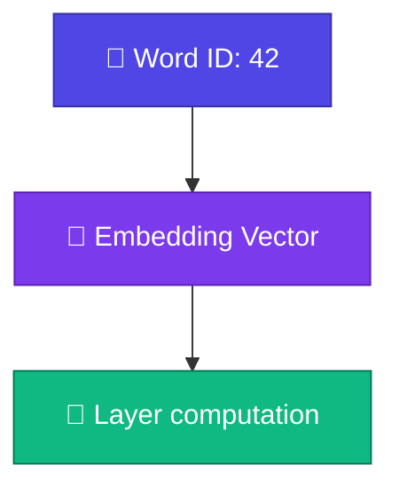

# Scalar ও Vector

<ConceptAnim slug="part-03-math/01-scalar-vector" />

<Callout type="idea">
**Scalar** = একটা number। **Vector** = number-এর ordered list। Embedding, weight — LLM-এর প্রায় সবকিছুই vector বা matrix format-এ store হয়।
</Callout>

আগের Module-এ আমরা word গুনেছিলাম — সেটা সহজ। এখন neural network-এর দিকে যাব, আর সেখানে data আর একটা সংখ্যা নয়। শুরুটা হোক সবচেয়ে ছোট unit দিয়ে: scalar আর vector।

## Scalar কী?

**Scalar** মানে শুধু একটা number — magnitude আছে, direction নেই। Temperature, learning rate, loss — এগুলো সব scalar।

```
temperature = 36.5
learning_rate = 0.01
loss = 2.34
```

Neural network-এ দুটো scalar প্রায়ই দেখবে:
- **loss** — model কত ভুল করছে (একটা number)
- **learning rate** — weight update-এর step size

একটা সংখ্যা দিয়েই কাজ চলে যখন “কত?” জানতে চাও — কিন্তু “কোন দিকে, কোন বৈশিষ্ট্য?” জানতে চাইলে আরও লাগে।

## Vector কী?

**Vector** = number-এর ordered list। Position matter করে — প্রথম slot আর দ্বিতীয় slot আলাদা অর্থ বহন করে।

```
v = [1.0, 2.0, 3.0]
     ↑     ↑     ↑
   dim0  dim1  dim2
```

Word embedding-এ প্রতিটা word একটা vector হয়ে যায়। GPT-তে এটা প্রায় ৭৬৮ dimension — মানে প্রতিটা word ৭৬৮টা সংখ্যার list:

```
"apple"  → [0.2, -0.5, 0.8, ...]   (768 dimensions in GPT)
"banana" → [0.1, -0.3, 0.9, ...]
```



সহজ করে বললে: scalar = একটা বাক্স; vector = সাজানো বাক্সের সারি।

## Vector Operations

আমাদের `Vector` class কয়েকটা basic operation support করবে — যোগ, scale, length। এগুলোই পরে layer computation-এর ভিত্তি।

| Operation | Example | Meaning |
|-----------|---------|---------|
| Add | `[1,2] + [3,4] = [4,6]` | Element-wise যোগ |
| Scale | `2 × [1,2] = [2,4]` | প্রতিটা element × scalar |
| Length | `‖[3,4]‖ = 5` | Euclidean norm |

<StepReveal steps={[
  { emoji: "➕", title: "add(other)", body: "Same dimension হলে element-wise যোগ" },
  { emoji: "✖️", title: "scale(n)", body: "প্রতিটা element-কে n দিয়ে multiply" },
  { emoji: "📏", title: "length()", body: "√(sum of squares) — vector-এর magnitude" }
]} />

## Vector Class (Skeleton)

`add`, `scale`, `length` — এই operations নীচের Playground-এ live try করো; পুরো `Vector` class সেখানেই implement করা আছে। Number বদলে দেখো কী হয় — তাতেই intuition তৈরি হবে।

## LLM-এ কেন দরকার?

কেন এত ঝামেলা? কারণ LLM প্রতিটা token-কে সংখ্যার list-এ রূপান্তর করে, তারপর সেই list দিয়েই হিসাব চালায়।



Token → **embedding vector** (lookup table থেকে)। Layer-এর input/output সব **vector**। আর Attention-এ similarity মাপা হয় **dot product** দিয়ে — সেটা পরের কয়েকটা lesson-এ আসবে।

## কোড চেষ্টা করো

<Playground id="part-03/scalar-vector" title="Vector Operations" />

## তুমি কী শিখলে?

- **Scalar** = একটা number (loss, learning rate)
- **Vector** = number-এর ordered list (embedding, activation)
- Vector operations: add, scale, length — element-wise কাজ করে
- LLM-এ প্রতিটা token একটা high-dimensional vector হয়ে যায়

**আগের lesson:** [Module 3 Overview](/docs/part-03-math)

**পরের lesson:** [Matrices](/docs/part-03-math/02-matrix)
