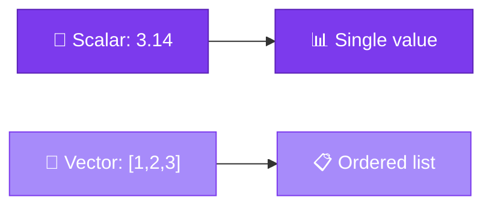
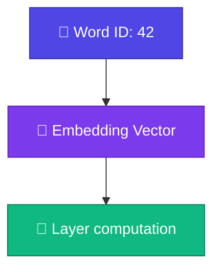

# 🔢 Scalars and Vectors

<ConceptAnim name="llm-pipeline" caption="Vectors = building blocks" />

<Callout type="idea">
💡 **Scalar** = একটা number। **Vector** = number-এর ordered list। Embedding, weight — সব vector/matrix format-এ store হয়।
</Callout>

<Illustration name="matrix-grid" />

## Scalar কী?

**Scalar** মানে শুধু একটা number — magnitude আছে, direction নেই।

```
temperature = 36.5
learning_rate = 0.01
loss = 2.34
```

Neural network-এ scalar examples:
- **loss** — model কত ভুল করছে (একটা number)
- **learning rate** — weight update-এর step size

## Vector কী?

**Vector** = number-এর ordered list। Position matter করে।

```
v = [1.0, 2.0, 3.0]
     ↑     ↑     ↑
   dim0  dim1  dim2
```

Word embedding-এ প্রতিটা word একটা vector:

```
"apple"  → [0.2, -0.5, 0.8, ...]   (768 dimensions in GPT)
"banana" → [0.1, -0.3, 0.9, ...]
```



## Vector Operations

আমাদের `Vector` class basic operations support করবে:

| Operation | Example | Meaning |
|-----------|---------|---------|
| Add | `[1,2] + [3,4] = [4,6]` | Element-wise যোগ |
| Scale | `2 × [1,2] = [2,4]` | প্রতিটা element × scalar |
| Length | `‖[3,4]‖ = 5` | Euclidean norm |

<StepReveal steps={[
  { emoji: "➕", title: "add(other)", body: "Same dimension হলে element-wise যোগ" },
  { emoji: "✖️", title: "scale(n)", body: "প্রতিটা element-কে n দিয়ে multiply" },
  { emoji: "📏", title: "length()", body: "√(sum of squares) — vector-এর magnitude" }
]} />

## LLM-এ কেন দরকার?



- Token → **embedding vector** (lookup table থেকে)
- Layer input/output সব **vector**
- Attention-এ similarity = **dot product** (পরের lesson)

## Interactive Demo

<Playground id="part-03/scalar-vector" title="Vector Operations" />

## ✅ তুমি কী শিখলে?

- **Scalar** = single number (loss, learning rate)
- **Vector** = ordered list of numbers (embedding, activations)
- Vector operations: add, scale, length
- LLM-এ প্রতিটা token একটা high-dimensional vector

**আগের lesson:** [Module 3 Overview](/docs/part-03-math)

**পরের lesson:** [Matrices](/docs/part-03-math/02-matrix)
