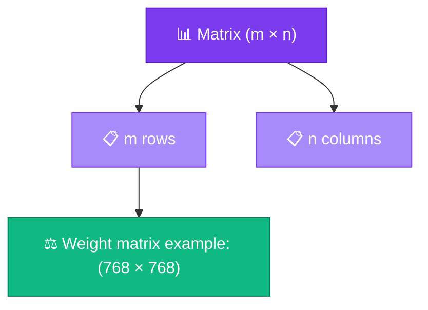

# Matrix

<ConceptAnim slug="part-03-math/02-matrix" />

<Callout type="idea">
**Matrix** = number-এর 2D table। Neural network-এর **weight matrix** প্রতিটা layer-এর core data structure — এখানেই model “শেখে”।
</Callout>

আগের lesson-এ vector দেখেছি — এক সারি সংখ্যা। এখন দেখি যখন অনেকগুলো vector একসাথে সাজাই, কী হয়। সেটাই matrix, আর neural network-এর weight ঠিক এই format-এ থাকে।

## Matrix কী?

**Matrix** = row × column grid of numbers। Shape বললেই বোঝা যায় কতগুলো row আর column আছে।

```
A = | 1  2  3 |
    | 4  5  6 |
    
Shape: 2 rows × 3 columns → (2, 3)
```

Indexing: `A[row][col]` — row আগে, column পরে। Python/TypeScript-এও একই convention।



## LLM-এ Matrix কোথায়?

LLM পুরোটাই প্রায় matrix-এর খেলা। কয়েকটা উদাহরণ:

| Matrix | Shape | Role |
|--------|-------|------|
| Embedding | `(vocab_size, embed_dim)` | Word → vector lookup |
| Weight W | `(input_dim, output_dim)` | Layer transformation |
| Attention Q/K/V | `(seq_len, head_dim)` | Self-attention |

GPT-3-এ **175 billion** parameters — প্রতিটা parameter কোনো না কোনো matrix-এর একটা cell। তাই shape বোঝা শুধু exam-এর জন্য নয়; পুরো model-এর memory আর compute shape দিয়েই নির্ধারিত হয়।

## Matrix Class

`get` / `set` / `zeros` — নীচের Playground-এ matrix class চালিয়ে shape ও cell access দেখো। শুরুতে zeros দিয়ে initialize করাটা common — পরে random init শিখব।

## Shape Rules (Preview)

Matrix operations-এ **shape compatibility** critical। Matmul-এর নিয়ম এক লাইনে:

```
(m × n) @ (n × p) = (m × p)   ← matmul (lesson 3.4)
```

Inner dimensions match করতে হবে — না হলে runtime error। এই rule মাথায় রাখো; পরের দুই lesson পুরোটাই এর উপর দাঁড়িয়ে।

<StepReveal steps={[
  { emoji: "📐", title: "Shape (rows, cols)", body: "Matrix size define করে" },
  { emoji: "🔍", title: "get / set", body: "Individual cell access" },
  { emoji: "0️⃣", title: "zeros()", body: "Initialize weights to zero" },
  { emoji: "⚠️", title: "Shape mismatch", body: "Wrong shape = runtime error" }
]} />

## Visual Example

নীচের visualization-এ একটা ছোট 2×3 matrix দেখো — row/column label সহ।

<MatrixViz
  matrix={[[1, 2, 3], [4, 5, 6]]}
  rowLabels={["r0", "r1"]}
  colLabels={["c0", "c1", "c2"]}
  title="2×3 Matrix"
/>

## কোড চেষ্টা করো

<Playground id="part-03/matrix" title="Matrix Class" />

## তুমি কী শিখলে?

- **Matrix** = number-এর 2D array, shape `(rows, cols)`
- Neural network-এর weight = matrix
- `get/set` দিয়ে cell access, `zeros()` দিয়ে initialize
- Shape compatibility matmul-এ critical

**আগের lesson:** [Scalars & Vectors](/docs/part-03-math/01-scalar-vector)

**পরের lesson:** [Dot Product](/docs/part-03-math/03-dot-product)
