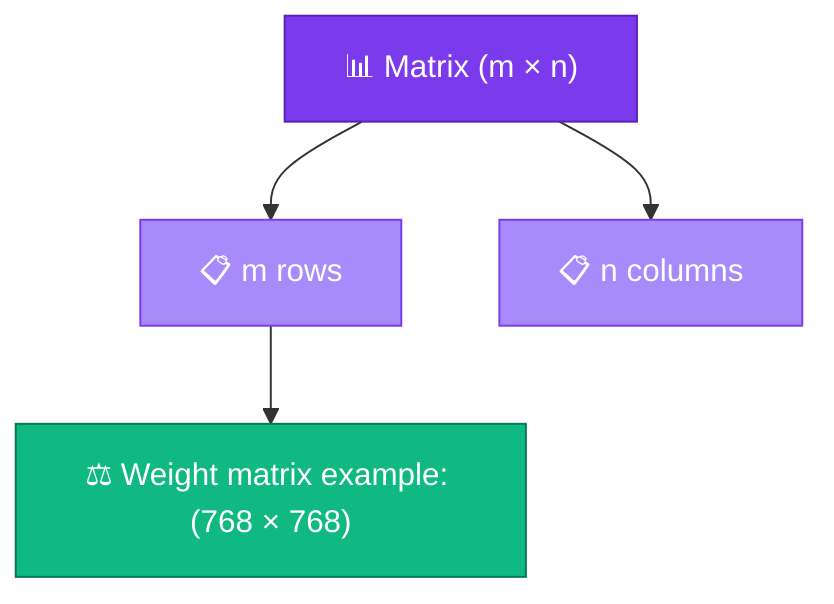

# 📊 Matrices

<ConceptAnim slug="part-03-math/02-matrix" />

<Callout type="idea">
💡 **Matrix** = number-এর 2D table। Neural network-এর **weight matrix** সব layer-এর core data structure।
</Callout>

## Matrix কী?

**Matrix** = row × column grid of numbers:

```
A = | 1  2  3 |
    | 4  5  6 |
    
Shape: 2 rows × 3 columns → (2, 3)
```

Indexing: `A[row][col]` — row আগে, column পরে।



## LLM-এ Matrix Examples

| Matrix | Shape | Role |
|--------|-------|------|
| Embedding | `(vocab_size, embed_dim)` | Word → vector lookup |
| Weight W | `(input_dim, output_dim)` | Layer transformation |
| Attention Q/K/V | `(seq_len, head_dim)` | Self-attention |

GPT-3-এ **175 billion** parameters — প্রতিটা parameter matrix-এর একটা cell।

## Matrix Class

## Shape Rules (Preview)

Matrix operations-এ **shape compatibility** critical:

```
(m × n) @ (n × p) = (m × p)   ← matmul (lesson 3.4)
```

Inner dimensions match করতে হবে — না হলে error।

<StepReveal steps={[
  { emoji: "📐", title: "Shape (rows, cols)", body: "Matrix size define করে" },
  { emoji: "🔍", title: "get / set", body: "Individual cell access" },
  { emoji: "0️⃣", title: "zeros()", body: "Initialize weights to zero" },
  { emoji: "⚠️", title: "Shape mismatch", body: "Wrong shape = runtime error" }
]} />

## Visual Example

<MatrixViz
  matrix={[[1, 2, 3], [4, 5, 6]]}
  rowLabels={["r0", "r1"]}
  colLabels={["c0", "c1", "c2"]}
  title="2×3 Matrix"
/>

## Interactive Demo

<Playground id="part-03/matrix" title="Matrix Class" />

## ✅ তুমি কী শিখলে?

- **Matrix** = 2D array of numbers with shape `(rows, cols)`
- Neural network weights = matrices
- `get/set` দিয়ে cell access, `zeros()` দিয়ে initialize
- Shape compatibility matmul-এ critical

**আগের lesson:** [Scalars & Vectors](/docs/part-03-math/01-scalar-vector)

**পরের lesson:** [Dot Product](/docs/part-03-math/03-dot-product)
