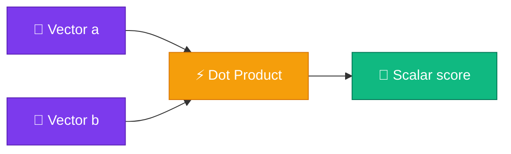

# Dot Product

<ConceptAnim slug="part-03-math/03-dot-product" />

<Callout type="idea">
**Dot product** দুটো vector-কে একটা **scalar**-এ compress করে। Value বেশি মানে vectors “aligned” — Attention-এ exactly এটাই measure হয়।
</Callout>

Matrix দেখেছি, vector দেখেছি। এখন প্রশ্ন: দুটো vector কতটা “একই রকম”? LLM-এ এই প্রশ্নটা Attention-এর কেন্দ্রে। উত্তর দেয় **dot product**।

## Formula

দুটো same-length vector `a` ও `b` নাও। Corresponding element গুণ করে সব যোগ করলেই একটা scalar পাও — সেটাই similarity score।

<MathLesson title="Dot Product">
  <MathIntuition>
    একই জায়গায় বড় সংখ্যা থাকলে গুণফলও বড় হয় — তাই aligned vectors-এ positive score, উল্টো দিকে negative। সহজ কথায়: একই প্যাটার্ন = বেশি similarity।
  </MathIntuition>
  <SymbolTable symbols={[
    { sym: "a · b", meaning: "dot product — a ও b-এর similarity score" },
    { sym: "a_i, b_i", meaning: "প্রতিটা vector-এর i-তম element" },
    { sym: "n", meaning: "vector dimension (length)" }
  ]} />
  <Formula>
    {`$$\\mathbf{a} \\cdot \\mathbf{b} = \\sum_{i=1}^{n} a_i \\cdot b_i$$`}
  </Formula>
  <MathPractical title="গণনা দেখো (ধাপে ধাপে)">
    <div>১. দেওয়া: <code>a = [1, 2, 3]</code>, <code>b = [4, 5, 6]</code></div>
    <div>২. জোড়ায় গুণ: <code>1×4 = 4</code>, <code>2×5 = 10</code>, <code>3×6 = 18</code></div>
    <div>৩. সব যোগ: <code>4 + 10 + 18 = 32</code></div>
    <div>৪. ফল: <code>a · b = 32</code> (একটা scalar — similarity score)</div>
  </MathPractical>
  <CodeLink>Playground-এ different vectors try করো ↓</CodeLink>
</MathLesson>

## Geometric Intuition — ছবি দিয়ে

শুধু সংখ্যা নয় — জ্যামিতি দিয়েও বোঝা যায়। দুটো vector-এর কোণ ছোট হলে dot product বড় হয়।



Geometric formula:

```
a · b = ‖a‖ × ‖b‖ × cos(θ)
```

- **θ = 0°** (same direction) → maximum positive
- **θ = 90°** (perpendicular) → zero
- **θ = 180°** (opposite) → negative

মানে কোণ ০ হলে সবচেয়ে “মিল”, ৯০ হলে কোনো সম্পর্ক নেই, ১৮০ হলে উল্টো।

## Similarity উদাহরণ

Embedding space-এ একই অর্থের word-গুলো কাছাকাছি থাকে — তাই তাদের dot productও বেশি হয়:

```
apple  = [0.8, 0.2, 0.1]
fruit  = [0.7, 0.3, 0.0]
car    = [0.1, 0.9, 0.8]

apple · fruit = 0.62  ← high (similar meaning)
apple · car   = 0.34  ← low (different meaning)
```

এখানেই দেখা যায় কেন embedding দরকার — শব্দের অর্থ সংখ্যায় ধরা পড়ে, আর similarity গণনাযোগ্য হয়ে যায়।

<StepReveal steps={[
  { emoji: "✖️", title: "Element-wise multiply", body: "a[i] × b[i] for each i" },
  { emoji: "➕", title: "Sum all products", body: "Single scalar result" },
  { emoji: "🔗", title: "Attention link", body: "Q · K^T = attention scores" }
]} />

## Attention-এর সাথে Connection

Self-attention-এ এই একই হিসাব চলে:

```
score(i, j) = Query[i] · Key[j]
```

Query token `i` Key token `j`-কে কত “relevant” মনে করে — সেটা dot product দিয়ে measure। Module 7-এ Attention build করলে এই লাইনটা আবার দেখবে।

## কোড চেষ্টা করো

<Playground id="part-03/dot-product" title="Dot Product Calculator" />

## তুমি কী শিখলে?

- **Dot product** = element-wise multiply + sum → একটা scalar
- High dot product মানে vectors similar / aligned
- Attention score = Query · Key-এর dot product
- একই dimension লাগে — না হলে error

**আগের lesson:** [Matrices](/docs/part-03-math/02-matrix)

**পরের lesson:** [Matrix Multiplication](/docs/part-03-math/04-matmul)
