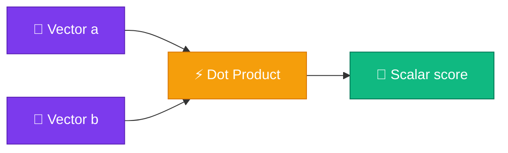

# ⚡ Dot Product

<Callout type="idea">
💡 **Dot product** দুটো vector-কে একটা **scalar**-এ compress করে। Value বেশি = vectors "aligned" — attention-এ exactly এটাই measure হয়।
</Callout>

## Formula

দুটো same-length vector `a` ও `b`:

<MathLesson title="Dot Product">
  <MathIntuition>
    Corresponding elements multiply করে যোগ করলে similarity score পাও — aligned vectors-এ positive, opposite direction-এ negative।
  </MathIntuition>
  <SymbolTable symbols={[
    { sym: "a · b", meaning: "dot product of vectors a and b" },
    { sym: "a_i, b_i", meaning: "i-th element of each vector" },
    { sym: "n", meaning: "vector dimension (length)" }
  ]} />
  <Formula>
    {`$$\\mathbf{a} \\cdot \\mathbf{b} = \\sum_{i=1}^{n} a_i \\cdot b_i$$`}
  </Formula>
  <WorkedExample>
    a = [1, 2, 3], b = [4, 5, 6]{'\n'}
    a · b = (1×4) + (2×5) + (3×6) = 4 + 10 + 18 = 32
  </WorkedExample>
  <CodeLink>Playground-এ different vectors try করো ↓</CodeLink>
</MathLesson>

## Geometric Intuition



Geometric formula:

```
a · b = ‖a‖ × ‖b‖ × cos(θ)
```

- **θ = 0°** (same direction) → maximum positive
- **θ = 90°** (perpendicular) → zero
- **θ = 180°** (opposite) → negative

## Similarity Example

```
apple  = [0.8, 0.2, 0.1]
fruit  = [0.7, 0.3, 0.0]
car    = [0.1, 0.9, 0.8]

apple · fruit = 0.65  ← high (similar meaning)
apple · car   = 0.25  ← low (different meaning)
```

Embedding space-এ semantically similar words-এর dot product বেশি হয়।

## Code

```ts
export function dot(a: number[], b: number[]): number {
  if (a.length !== b.length) {
    throw new Error('Vectors must have same length');
  }
  return a.reduce((sum, val, i) => sum + val * b[i], 0);
}
```

<StepReveal steps={[
  { emoji: "✖️", title: "Element-wise multiply", body: "a[i] × b[i] for each i" },
  { emoji: "➕", title: "Sum all products", body: "Single scalar result" },
  { emoji: "🔗", title: "Attention link", body: "Q · K^T = attention scores" }
]} />

## Attention Connection

Self-attention-এ:

```
score(i, j) = Query[i] · Key[j]
```

Query token `i` Key token `j`-কে কত "relevant" মনে করে — dot product দিয়ে measure।

## Interactive Demo

<Playground id="part-03/dot-product" title="Dot Product Calculator" />

## ✅ তুমি কী শিখলে?

- **Dot product** = element-wise multiply + sum → single scalar
- High dot product = vectors are similar / aligned
- Attention scores = Query · Key dot products
- Same dimension required — otherwise error

**আগের lesson:** [Matrices](/docs/part-03-math/02-matrix)

**পরের lesson:** [Matrix Multiplication](/docs/part-03-math/04-matmul)
