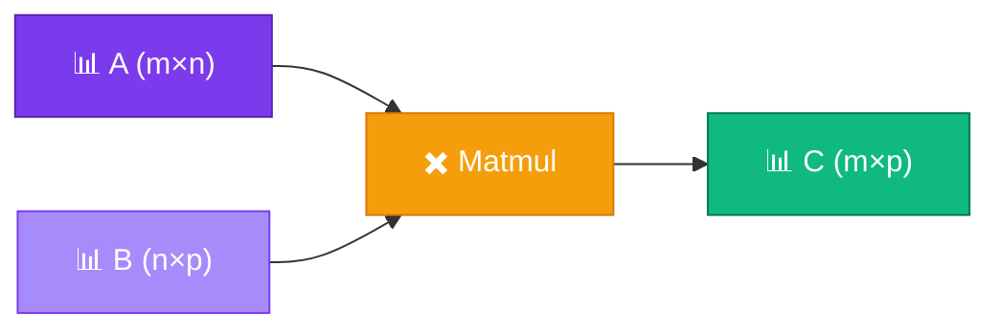

# ✖️ Matrix Multiplication

<ConceptAnim name="llm-pipeline" caption="Matmul in attention and FFN" />

<Callout type="idea">
💡 **Matrix multiplication (matmul)** = batch dot products। Neural network-এর প্রতিটা layer মূলত `output = input @ W + b`।
</Callout>

<Illustration name="matrix-grid" />

## Shape Rule

```
(m × n) @ (n × p) = (m × p)
         ↑
    inner dims must match!
```



## How It Works

Output cell `C[i][j]` = row `i` of A · column `j` of B:

```
A = | 1  2 |     B = | 5  6 |
    | 3  4 |         | 7  8 |

C[0][0] = (1×5) + (2×7) = 19
C[0][1] = (1×6) + (2×8) = 22
C[1][0] = (3×5) + (4×7) = 43
C[1][1] = (3×6) + (4×8) = 50

C = | 19  22 |
    | 43  50 |
```

<StepReveal steps={[
  { emoji: "📋", title: "Pick row from A", body: "Row i of left matrix" },
  { emoji: "📋", title: "Pick col from B", body: "Column j of right matrix" },
  { emoji: "⚡", title: "Dot product", body: "Row · Column = C[i][j]" },
  { emoji: "🔁", title: "Repeat for all cells", body: "m × p output cells" }
]} />

## Visual Example

<MatrixViz
  matrix={[[19, 22], [43, 50]]}
  rowLabels={["r0", "r1"]}
  colLabels={["c0", "c1"]}
  title="A(2×2) @ B(2×2) = C(2×2)"
/>

## Neural Network Layer

```
input:  x shape (1, 4)    ← 4 features
weight: W shape (4, 3)    ← 4 inputs → 3 outputs
output: y = x @ W         ← shape (1, 3)
```

একটা matmul = **3টা neuron parallel compute** (weighted sum)।

## Attention Matmul

Transformer-এ:

```
Attention = softmax(Q @ K^T / √d) @ V
                  ↑ matmul      ↑ matmul
```

Module 7-এ attention build করলে এই matmul directly use হবে।

## Code

## Interactive Demo

<Playground id="part-03/matmul" title="Matrix Multiplication" />

## ✅ তুমি কী শিখলে?

- **Matmul** shape: `(m×n) @ (n×p) = (m×p)`
- Each output cell = dot product of row × column
- Neural layer = input @ weight matrix
- Attention = matmul of Q, K, V matrices

**আগের lesson:** [Dot Product](/docs/part-03-math/03-dot-product)

**পরের lesson:** [Softmax](/docs/part-03-math/05-softmax)
