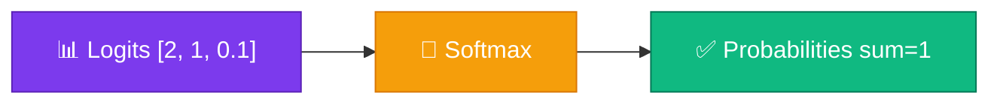
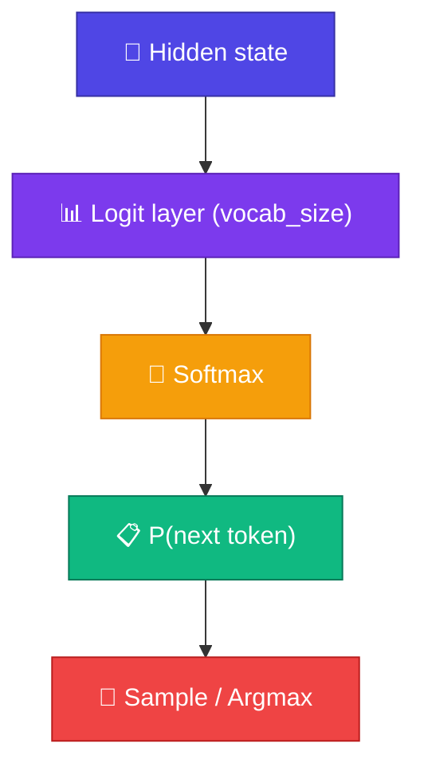

# Softmax

<ConceptAnim slug="part-03-math/05-softmax" />

<Callout type="idea">
Model raw **logits** output করে — Softmax সেগুলো **probability**-তে convert করে যেখানে সব যোগ করলে exactly **1** হয়।
</Callout>

Part 2-এ Bigram model-এ count normalize করেছিলাম — যোগ ১ করার জন্য। Neural network-এও একই দরকার, কিন্তু এবার raw output আসে **logits** হিসেবে। Softmax সেই কাজটা করে।

## কেন Softmax?

ধরো model দিলে:

```
logits = [2.0, 1.0, 0.1]
```

এগুলো probability নয় — negative হতে পারে, যোগ করে ১ও হয় না। **Softmax** ঠিক করে:

```
softmax = [0.659, 0.242, 0.099]   ← sum = 1.0 ✓
```



এখন sample বা argmax করা যায় — ঠিক Bigram-এর মতো, শুধু উৎস এবার neural net।

## পুরো Formula

Idea সহজ: exp দিয়ে সব positive করো, তারপর total দিয়ে ভাগ করে normalize করো।

<MathLesson title="Softmax">
  <MathIntuition>
    বড় logit → বেশি probability। কিন্তু শুধু বড় হলেই চলবে না — সব মিলিয়ে sum = 1 রাখতে হবে। exp() সব positive করে, তারপর divide by total — তাই valid distribution পাও।
  </MathIntuition>
  <SymbolTable symbols={[
    { sym: "z_i", meaning: "logit — class/token i-এর raw model output" },
    { sym: "e^{z_i}", meaning: "exponential — সব মান positive করে" },
    { sym: "Σ_j e^{z_j}", meaning: "সব exponential-এর যোগ (normalizer)" },
    { sym: "n", meaning: "class সংখ্যা / vocabulary size" }
  ]} />
  <Formula>
    {`$$\\text{softmax}(z_i) = \\frac{e^{z_i}}{\\sum_{j=1}^{n} e^{z_j}}$$`}
  </Formula>
  <MathPractical title="গণনা দেখো (ধাপে ধাপে)">
    <div>১. দেওয়া logits: <code>z = [2.0, 1.0, 0.0]</code></div>
    <div>২. প্রতিটাতে exponential: <code>e^z ≈ [7.389, 2.718, 1.000]</code></div>
    <div>৩. সব exp যোগ: <code>sum = 7.389 + 2.718 + 1.000 = 11.107</code></div>
    <div>৪. প্রতিটা ÷ sum: <code>softmax ≈ [0.665, 0.245, 0.090]</code></div>
    <div>৫. চেক: <code>0.665 + 0.245 + 0.090 = 1.000</code> ✓</div>
  </MathPractical>
  <CodeLink>Playground-এ same numbers run করো ↓</CodeLink>
</MathLesson>

## ধাপে ধাপে

<StepReveal steps={[
  { emoji: "📈", title: "exp(z_i)", body: "প্রতিটা logit-এ exponential — সব positive" },
  { emoji: "➕", title: "সব exp যোগ", body: "Normalizer = Σ e^z_j" },
  { emoji: "➗", title: "প্রতিটা ÷ sum", body: "Probability distribution তৈরি" },
  { emoji: "✅", title: "চেক: sum = 1", body: "Sampling / loss-এর জন্য দরকার" }
]} />

## Numerical Stability কেন দরকার

একটা ফাঁদ আছে। Direct `exp(1000)` = overflow! Production code-এ তাই **max trick** ব্যবহার হয়:

```
z_stable = z - max(z)
softmax(z) = softmax(z_stable)   ← same result, no overflow
```

সব logit থেকে max বাদ দিলে গণিত একই থাকে, কিন্তু exp আর ফেটে যায় না। Playground-এ stable versionই implement করা আছে।

## LLM-এ Softmax

LLM-এর last step প্রায়ই এটাই — vocab_size logits → Softmax → next-token probability:



Last layer → vocab_size logits। Softmax → সব token-এর উপর probability। তারপর sample বা argmax দিয়ে next token বেছে নাও — Part 0-এর next-token prediction-এরই neural version।

## কোড চেষ্টা করো

নীচের snippet-এ stable softmax চালাও — তারপর Playground-এ নিজের logits try করো।

<CodeRun title="Softmax" height={240}>{`// Logits → probability (max-subtraction = numerical stability)
function softmax(z: number[]): number[] {
  const max = Math.max(...z);
  const exps = z.map((v) => Math.exp(v - max));
  const sum = exps.reduce((a, b) => a + b, 0);
  return exps.map((v) => v / sum);
}

const logits = [2.0, 1.0, 0.1];
log.step('Softmax');
log.data('Logits', logits);
const probs = softmax(logits);
log.data('Probs', probs.map((p) => Number(p.toFixed(3))));
log.data('Sum', Number(probs.reduce((a, b) => a + b, 0).toFixed(4)));
log.ok('sum ≈ 1 ✓');`}</CodeRun>

<Playground id="part-03/softmax" title="Softmax Calculator" viz="softmax" />

## তুমি কী শিখলে?

- **Softmax** logits-কে valid probability distribution-এ convert করে
- Formula: `exp(z_i) / Σ exp(z_j)`
- বড় logit → বেশি probability
- LLM output layer প্রায়ই Softmax দিয়ে শেষ হয়
- Numerical stability-এর জন্য max-subtraction trick ব্যবহার করো

**আগের lesson:** [Matrix Multiplication](/docs/part-03-math/04-matmul)

**পরের Module:** [Module 4 — Autograd](/docs/part-04-autograd/01-computational-graph)
